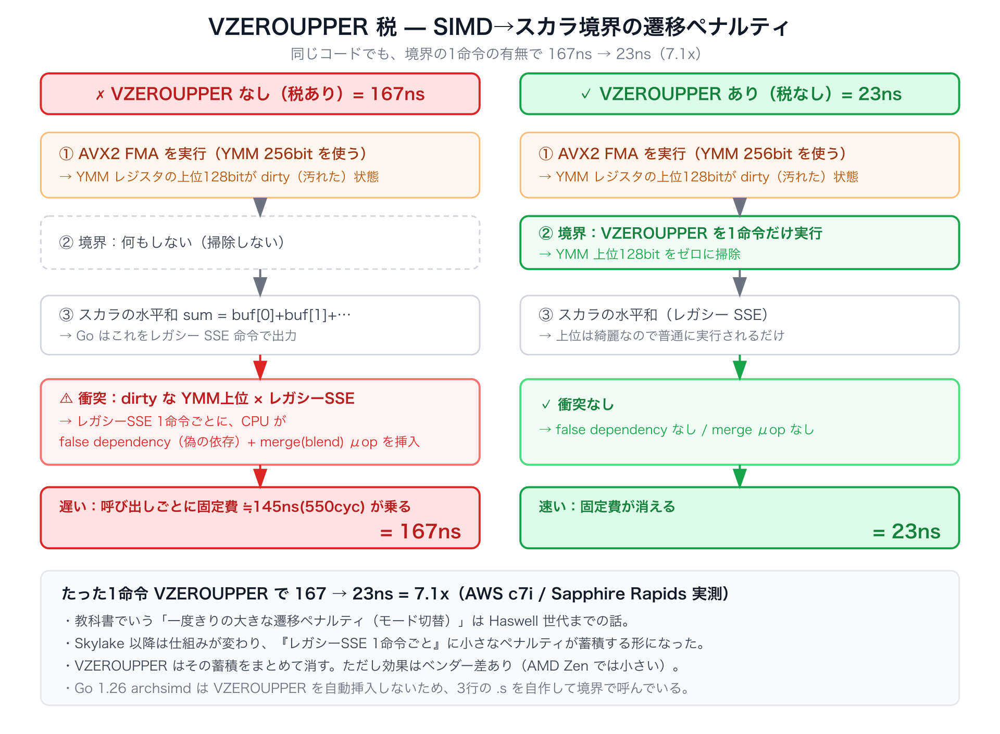
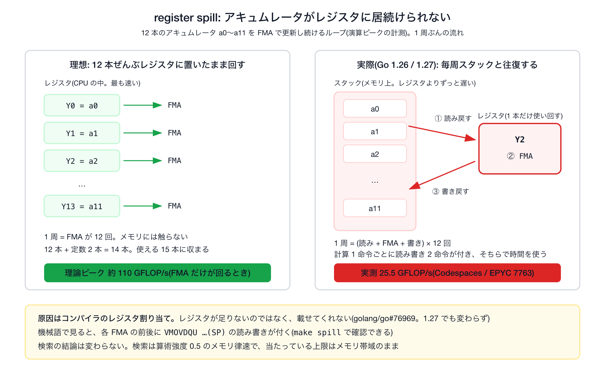
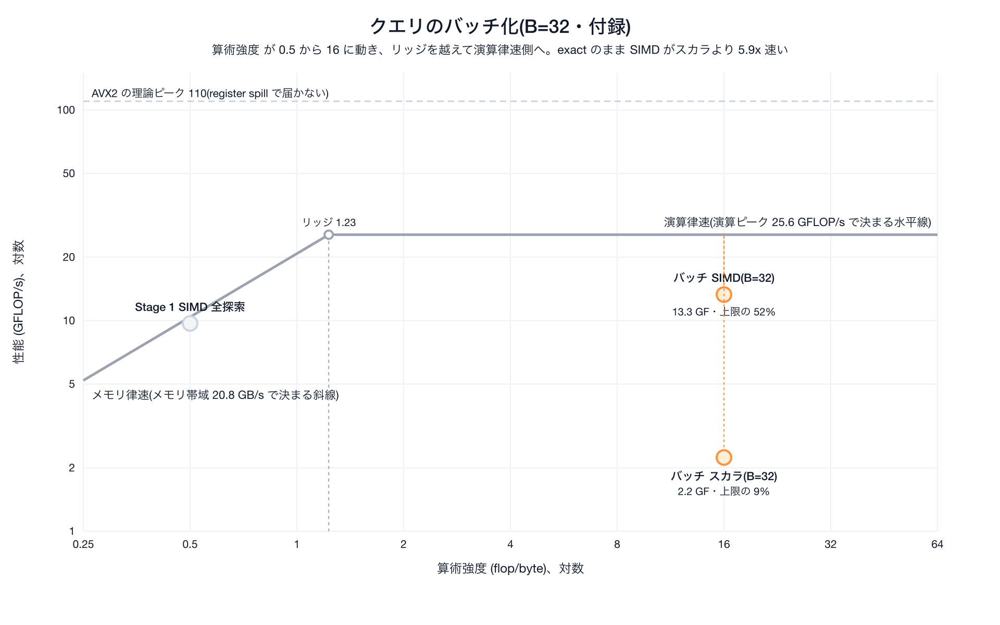

# 付録

本編([../workshop/workshop.md](../workshop/workshop.md))の 40 分には入らない、実装の裏側と調査の記録です。本編を読んだあとに、興味のある節から読めます。数値は計測した機械ごとに違うので、各節の冒頭に計測環境を書いてあります。


| 節                                                               | 内容                                                  | こんなときに                                            |
| --------------------------------------------------------------- | --------------------------------------------------- | ------------------------------------------------- |
| [1. Go の SIMD の性能上限に関する調査](#1-go-の-simd-の性能上限に関する調査)            | VZEROUPPER の遷移ペナルティと register spill                 | 「演算ピークが理論値の 1/3〜1/4 で止まるのはなぜか」を知りたい               |
| [2. 演算ピークとメモリ帯域の測り方](#2-演算ピークとメモリ帯域の測り方)                        | 演算ピークとメモリ帯域を測るベンチのコード                               | 本編 §04 の `make roofline-ceiling` の数字がどう出ているかを知りたい |
| [3. クエリのバッチ化](#3-クエリのバッチ化再利用で算術強度を上げる)                          | B=32 で算術強度を 16 に上げ、exact のまま SIMD をスカラの 5.9x 効かせる   | 算術強度を上げるもう 1 つの方法(再利用)の実測を見たい                     |
| [4. goroutine で並列化すればいいのでは？への回答](#4-goroutine-で並列化すればいいのではへの回答) | メモリ律速はマシン全体の帯域、演算律速は物理コア数で頭打ちになる実測                  | 並列化がどの上限に効くかを知りたい                                 |
| [5. いろんなベクトル量子化](#5-いろんなベクトル量子化)                                | SQ / BQ / PQ / ScaNN / RaBitQ / TurboQuant を本編の軸で整理 | Stage 2〜4 の量子化の先にある手法を知りたい                        |
| [6. AVX-512 の SIMD popcount](#6-avx-512-の-simd-popcount)        | AVX-512 の SIMD popcount を試して速くならなかった実測              | Stage 3 の「SIMD 版 popcount は効かない」の根拠を見たい           |


---

## 1. Go の SIMD の性能上限に関する調査

この節では、VZEROUPPER の遷移ペナルティと register spill という 2 つの隠れた上限を扱います。本編とは独立した読み物で、Go 1.26 / 1.27 の archsimd が出す機械語の現状に踏み込みたい人向けです。どちらもハードの限界ではなく、Go のコード生成がまだ発展途上であることが原因です。

この調査は AWS c7i(Intel Xeon 8488C / Sapphire Rapids)で行いました。本編の Codespaces(AMD EPYC 7763)とは CPU が違うので注意してください。


| 現象                    | Intel(c7i)                            | AMD(Codespaces の EPYC)            |
| --------------------- | ------------------------------------- | --------------------------------- |
| ① VZEROUPPER の遷移ペナルティ | 出現する。1 命令の有無で 167.4ns と 23.4ns        | 出現しない                             |
| ② register spill      | 出現する。アキュムレータ 4 本で 23、12 本で 39 GFLOP/s | 出現する。4 本で 13.4、12 本で 25.6 GFLOP/s |


### 隠れた上限①: VZEROUPPER の遷移ペナルティ

最初に私が内積を SIMD 化した時、全探索の見かけの帯域が 5.7 GB/s と低く、内積単体も 167.4ns で頭打ちでした。SIMD からスカラへ戻す際に `VZEROUPPER` を 1 命令置くだけで 23.4ns(7.1x)まで速くなり、見かけの帯域の上限も消えました。この節ではこの原因を解説します。

何が起きているかを次の図にまとめました。



原因は YMM レジスタです。YMM レジスタ(256bit)は、下位 128bit を古い XMM レジスタと共有しています。AVX2 命令(`Float32x8` の FMA など)は 256bit 全体に書くので、実行後は上位 128bit に値が残ります。この状態を dirty と呼びます。

一方、SIMD ループの直後にある水平和 `sum = buf[0]+buf[1]+…` はスカラの float32 計算で、Go はこれをレガシー SSE 命令(下位 128bit しか知らない古い命令)で出力します。レガシー SSE 命令が XMM に書くとき、同じレジスタの上位 128bit は元の値のまま残さなければなりません。

レガシー SSE の書き込みでは、新しい下位 128bit の計算結果と古い上位 128bit の値を合成して新品に入れる必要があり、この処理が待ち時間となります。

`VZEROUPPER` は全 YMM の上位 128bit をゼロにする 1 命令です。実行後の CPU は「上位は全部ゼロ」と分かっているので、処理するものが無く、以降のレガシー SSE は追加の処理なしで走ります。境界で一度呼ぶだけでよく、命令自体のコストは小さいので、差し引きで速度面でもメリットがあります。

ペナルティの仕組みは CPU の世代で違います(出典: Agner Fog, [The microarchitecture of Intel, AMD and VIA CPUs](https://www.agner.org/optimize/microarchitecture.pdf))。


| CPU                                         | ペナルティの仕組み                                                                           | VZEROUPPER の効果            |
| ------------------------------------------- | ----------------------------------------------------------------------------------- | ------------------------- |
| Intel Sandy Bridge〜Haswell                  | 一度きりの大きなモード切替(上位状態を保存して復元する)                                                        | 切替そのものを防ぎます               |
| Intel Skylake 以降(c7i の Sapphire Rapids を含む) | 上位状態は保存せず、dirty 状態で実行するレガシー SSE 命令 1 個ごとに false dependency(偽の依存)とマージ μop が挿入されて蓄積する | 蓄積をまとめて消します。c7i の実測で 7.1x |
| AMD Zen                                     | Intel 型の遷移ペナルティは基本的に無い                                                              | 効果はありません(呼んでも害はありません)     |


教科書でよく語られるのは上の行の「一度きりの大きな遷移ペナルティ」ですが、今回実験している c7i は真ん中の行です。実測した「呼び出しごとの固定費 約 145ns(550 サイクル)」という命令ごとのペナルティを VZEROUPPER がまとめて消せます。

Go の archsimd はこの VZEROUPPER を自動挿入しません(1.26、1.27 とも)。本来はコンパイラが境界を管理して入れるべきもので、[golang/go#77647](https://github.com/golang/go/issues/77647) でも問われましたが、対応予定なしで閉じられています。現状、境界に何も置かないと生成コードに VZEROUPPER は 1 個も出ません。回避策は標準 API の `archsimd.ClearAVXUpperBits()` を境界で呼ぶことです。doc コメントにも「将来コンパイラが自動生成するかもしれない」と書かれています。本リポジトリも当初は 3 行の自作アセンブリを使っていましたが、この標準 API に置き換えました。

### 隠れた上限②: なぜ FMA は理論ピークの 1/3〜1/4 で止まるか(register spill)

演算ピークを測るベンチ(`make roofline-ceiling`)では、独立なアキュムレータを 12 本持って FMA を回し続けます。理論上はメモリに触らず FMA だけが並ぶはずですが、実測は理論値の 1/3〜1/4 で止まります。


|              | c7i(Sapphire Rapids) | Codespaces(EPYC 7763) | M3 Pro(Neon) |
| ------------ | -------------------- | --------------------- | ------------ |
| 理論ピーク        | 約 120 GFLOP/s        | 約 110 GFLOP/s         | 未算出          |
| アキュムレータ 4 本  | 23 GFLOP/s           | 13.4 GFLOP/s          | 未計測          |
| アキュムレータ 12 本 | 39 GFLOP/s           | 25.6 GFLOP/s          | 32 GFLOP/s   |


※ 理論ピークは 2 FMA/cycle × 8 レーン × 2 flop × クロック(c7i は 3.75GHz、EPYC 7763 は単コアブーストの約 3.5GHz)。検索の内積は算術強度 0.5 の深いメモリ律速なので、この低さは検索の結論を変えませんが、原因を見ておくと勉強になります。

レジスタは CPU の中にある一番速い値の置き場で、SIMD 用(YMM)には 16 本、そのうち Go が使えるのは 15 本です。スタックはメモリ上の作業領域で、レジスタよりずっと遅い置き場所です。期待どおりなら、アキュムレータ 12 本はレジスタに置いたまま回りマスが、実際はそうなっていません。



図の右側は機械語で確かめられます。[`go tool objdump`](https://pkg.go.dev/cmd/objdump) で内側ループを見ると、12 本のアキュムレータが全部レジスタに置けず、毎回スタックへ退避されて、同じ 1 本のレジスタを使い回していました。これが register spill(レジスタに収まらない、または置けない値をメモリへ追い出すこと)です。FMA 1 個ごとに load と store が発生するので、まず load/store ポートが飽和し、さらに次の周回の load が store を待ちます。アキュムレータを増やすほどこの待ち時間が隠れるので、アキュムレータを増やす方が速くなります。

今回の問題はレジスタが足りないのではなく、コンパイラが載せてくれないのが原因です。これはハードの限界ではなく、Go の archsimd のレジスタ割り当てが発展途上であることによるものです。既知 issue [golang/go#76969](https://github.com/golang/go/issues/76969)(closed / not planned)であり、[#78753](https://github.com/golang/go/issues/78753)(AVX-512 の上位 16 本の ZMM が割り当てられない件)は Go 1.27 で閉じましたが、この 12 本 AVX2 ループの spill は Go 1.27.1 でも残っています。

実際の出力からアキュムレータ 1 本ぶんを抜き出すと次のとおりで、FMA の前後に読み書きが付いています。

```text
// go tool objdump で見た内側ループ(アキュムレータ 1 本ぶん)
0x..7e   c5fe6f9424b8010000   VMOVDQU 0x1b8(SP), Y2    ← スタックからレジスタへ load
0x..87   c4e27da8d1           VFMADD213PS Y1, Y0, Y2   ← FMA(積和)
0x..8c   c5fe7f9424b8010000   VMOVDQU Y2, 0x1b8(SP)    ← レジスタからスタックへ store
```

読み方は 2 点だけです。

- 1 行は「アドレス / 命令のバイト列 / 命令名 オペランド」です。`(SP)` はスタック上の場所を指します
- `VMOVDQU` はベクトルのコピー(メモリとレジスタの間)、`VFMADD213PS` が FMA です

ループ内で演算ごとに「`(SP)` からの load」と「`(SP)` への store」がセットで並んでいたら、値をレジスタに保持できず毎回スタックを往復している証拠です。理想は load と store が消えて FMA だけが並ぶ状態です。

---

## 2. 演算ピークとメモリ帯域の測り方

本編の [04. 性能の上限を測る](../workshop/workshop.md#04-性能の上限を測る)で `make roofline-ceiling` が出す数字を、どんなコードで測っているかを説明します。数値は 4 コア Codespace(AMD EPYC 7763(Zen3 世代)・1 コア)のものです。測り方が分かっていれば、自分のマシンで出た数字が読めます。

### FMA をレジスタ上で連打して演算ピークを見る

演算ピークは「メモリも依存連鎖(前の計算が終わるまで次の計算を待つこと)も挟まず、FMA だけを限界まで回したら何 GFLOP/s 出るか」で測れます。

そのため、独立したアキュムレータ(途中結果をためる変数)を 12 本用意し、レジスタ上だけで FMA を連打します。コードは [`internal/vec/ceiling_flop_test.go`](../../internal/vec/ceiling_flop_test.go) にあります。次はその主要部分です。

```go
// 12本の独立アキュムレータ。漸化式 a = a*m + c はメモリにも触れない
m := archsimd.BroadcastFloat32x8(0.9999)   // Broadcast は全 8 レーンに同じ値を配る
c := archsimd.BroadcastFloat32x8(1.0)
a0, a1, /* … */ a11 := archsimd.BroadcastFloat32x8(0.5), /* … */, archsimd.BroadcastFloat32x8(11.5)
for b.Loop() {
    for j := 0; j < inner; j++ {
        a0 = a0.MulAdd(m, c)   // ← FMA。互いに独立なので 12本が並んで走る
        a1 = a1.MulAdd(m, c)
        /* … a2 〜 a11 も同様 … */
    }
}
flop := float64(iters) * inner * 12 * 8 * 2  // 12acc × 8lane × 2flop/FMA
b.ReportMetric(flop/sec/1e9, "GFLOP/s")      // ← これが 25.59
```

実測は 25.6 GFLOP/s です。試しにアキュムレータを 4 本に減らした `BenchmarkPeakFLOP_AVX2_4acc`(`roofline-ceiling` には含まれないので `go test ./internal/vec -run - -bench 'BenchmarkPeakFLOP_AVX2_4acc$' -benchtime 2s` で単体実行)を測ると 13.4 GFLOP/s まで落ちます(本数を減らすと遅くなる)。理論ピークは約 110 GFLOP/s で、実測はその約 1/4 です。なぜ 1/4 で止まるのか、なぜ本数を減らすと遅くなるのかは、[1. Go の SIMD の性能上限に関する調査](#1-go-の-simd-の性能上限に関する調査)の隠れた上限②(register spill)で説明しています。

### 巨大な配列を流し読みしてメモリ帯域の上限を見る

メモリ帯域は「DRAM から 1 スレッドで流し読みしたら何 GB/s 出るか」で測ります。キャッシュに収まると DRAM を測れないので、256MB(最後段のキャッシュ L3 を確実に溢れる)の配列を先頭から末尾まで順番に読みます。コードは [`internal/vec/ceiling_mem_simd_test.go`](../../internal/vec/ceiling_mem_simd_test.go)(配列の準備は同 `ceiling_mem_test.go`)にあります。次はその主要部分です。実コードの Triad は 4 組ずつ展開してありますが、やることは同じです。

```go
const memN = 1 << 26  // 67,108,864 float32 = 256 MB(L3 溢れ確実)

// read 帯域: 検索の内積と同じ 256bit ロード(8本のアキュムレータ)で
// DRAM 読みを飽和させる。スカラ縮約だと足し算の発行律速で過小評価するため SIMD で測る
for b.Loop() {
    var a0 archsimd.Float32x8 /* … a7 まで … */
    for len(x) >= 64 {
        a0 = archsimd.LoadFloat32x8(x).Add(a0)   /* … x[8:] 〜 x[56:] も … */
        x = x[64:]
    }
}
b.ReportMetric(gb, "read-GB/s")    // ← 20.80

// Triad(STREAM 標準): a = b + s*c。read b + read c + write a で3配列ぶん(SIMD)
for len(aa) >= 8 {
    archsimd.LoadFloat32x8(cc).MulAdd(s, archsimd.LoadFloat32x8(bb)).Store(aa)
    aa, bb, cc = aa[8:], bb[8:], cc[8:]
}
b.ReportMetric(gb, "triad-GB/s")   // ← 17.36
```

帯域の数字が 2 つあるのは、測り方が違うためです。`BenchmarkPeakReadBW`(約 20 GB/s)は読むだけの帯域で、検索の内積と同じ SIMD のロードで測っています。`BenchmarkPeakTriadBW`(17.4 GB/s)は [STREAM](https://www.cs.virginia.edu/stream/) という標準ベンチで、読み書き両方を含むぶん少し低くなります。本編の検索は DB ベクトルを読むだけなので、メモリ帯域の上限には読むだけの約 20 GB/s を使っています。SIMD 全探索の達成 19.4 GB/s がこの値とほぼ一致します。

---

## 3. クエリのバッチ化(再利用で算術強度を上げる)

本編のStage 1 でメモリ帯域の上限に達したあと、算術強度を上げる方法は再利用とバイト削減の 2 つがあり、本編はバイト削減(Stage 2〜)で進みました。この節では残る 1 つ、クエリの再利用(バッチ化)を実測します。計測は 4 コア Codespace(AMD EPYC 7763)です。

本編の検索は、1 本のクエリのために DB ベクトル 10 万本を DRAM から順に運び、それぞれと内積を 1 回取って、捨てます。クエリが 32 本あれば、同じ 10 万本を 32 回運び直すことになります。

運ぶ回数を減らす方法があります。クエリを 32 本まとめて持っておき、DB ベクトルを 1 本運ぶたびに、32 本のクエリ全部と内積を取ってから捨てます。運ぶ量は 1 クエリのときと同じで、計算だけが 32 倍になります。

```text
1 本ずつ:   DB ベクトル 1 本を運ぶ → 内積 1 回        算術強度 0.5
32 本まとめ: DB ベクトル 1 本を運ぶ → 内積 32 回       算術強度 0.5 × 32 = 16
```

算術強度 16 はリッジ(1.2)より右なので、点は演算律速側に移ります。そこなら SIMD が効く見込みです。1 つ 1 つの内積は Stage 1 と同じ計算なので、結果は正確なままです。

なお、この形は行列と行列の掛け算そのものです(DB ベクトルを並べた行列 × クエリを並べた行列)。数値計算ライブラリや Faiss のバッチ検索が速いのも、同じ考え方で運ぶ回数を減らしているからです。

```go
// internal/index/index.go: B 本のクエリを 1 パスで処理(d のロードを再利用)
func (ix *Index) SearchBatchSIMD(qs [][]float32, k int) [][]Result {
    tops := make([]*topK, len(qs))
    for b := range tops { tops[b] = newTopK(k) }
    for id := 0; id < ix.N; id++ {
        d := ix.Vec(id)                          // ① d を1回ロード
        for b := range qs {                      // ② B本のクエリで使い回す(d はキャッシュ常駐)
            tops[b].push(id, vec.Dot(qs[b], d))   // SIMD内積
        }
    }
    /* 各 tops[b].results() を返す */
}
```

```bash
$ make roofline-batch    # B=1(全探索) vs B=32(バッチ)、scalar vs SIMD (EPYC 7763 実測)
B=1   SearchSIMD         7.95 ms/query   9.66 GF   ← AI 0.5・メモリ帯域の上限(Stage 1)
B=32  SearchBatchNaive  34.24 ms/query   2.24 GF   ← AI 16・scalar
B=32  SearchBatchSIMD    5.79 ms/query  13.26 GF   ← AI 16・SIMD で 5.9x。演算律速・exact
```



図: バッチ化で 算術強度が 0.5 から 16 と右へ動き、演算律速側に乗った(exact・精度そのまま)。

演算律速側では SIMD がスカラの 5.9x です(scalar batch 34.2 ms/query に対し SIMD batch 5.79 ms/query。GFLOP/s は 2.24 と 13.3)。Stage 1 では 4.5x で頭打ちだった SIMD が、算術強度を上げると効きます。1 クエリあたりの時間も 7.9 ms から 5.8 ms に縮みます。

「クエリが 32 本まとめて来る」という前提は、実戦にもあります。[ColBERT](https://arxiv.org/abs/2004.12832) のようにクエリを複数のベクトルで表す検索方式では、DB ベクトル 1 本に対して複数の内積を取ることが方式そのものに含まれていて、最初から演算律速です。

---

## 4. goroutine で並列化すればいいのでは？への回答

本編は全部 1 コアで測っています。goroutine で複数コアに分ければ速くなるのか、実測で確かめます。DB を workers 個に分けて goroutine で分担し、最後に各 goroutine の上位 k 件を 1 つにまとめます([`internal/index/parallel.go`](../../internal/index/parallel.go))。

```go
for w := 0; w < workers; w++ {
    lo := w * ix.N / workers          // 端数が全 worker に均される割り方
    hi := (w + 1) * ix.N / workers
    go func(t *topK, lo, hi int) {   // 各 worker は自分のチャンクだけ走査
        defer wg.Done()
        for id := lo; id < hi; id++ {
            t.push(id, vec.Dot(q, ix.Vec(id)))
        }
    }(tops[w], lo, hi)
}
wg.Wait()
// worker ごとの top-k をマージ(チャンクは互いに素なので重複なし)
```

メモリ律速の全探索と、演算律速のバッチの両方を、workers = 1/2/4 で測ります。

```bash
$ make bench-parallel    # 4 vCPU Codespace(表示は整形。別の回の実測で、Stage 1 やバッチの絶対値とは 2 割ほど違う。見るのは各行の倍率)
SearchParallel/workers=1        9.4 ms      16.4 GB/s   ← メモリ律速(B=1)
SearchParallel/workers=2        5.74 ms     26.8 GB/s   ← 1.6x
SearchParallel/workers=4        5.2 ms      29.5 GB/s   ← 1.8x で頭打ち = マシン全体の帯域の上限
SearchBatchParallel/workers=1   6.7 ms/query            ← 演算律速(B=32)
SearchBatchParallel/workers=2   4.5 ms/query            ← 1.5x
SearchBatchParallel/workers=4   3.5 ms/query            ← 1.9x = 物理コア数の上限
```

どちらも workers を 4 にしても 4 倍にはなりません。

全探索(B=1)は 1.8x で止まりました。workers を 1、2、4 と増やすと、全部の goroutine が使う帯域の合計は 16、27、30 GB/s と増えますが、2 から 4 では 10% しか伸びていません。マシン全体で DRAM から運べる量に上限があり、goroutine はそれを取り合っているだけです。メモリ律速の処理は、コアを足しても速くなりません。

バッチ(B=32)は 1.9x で止まりました。この Codespace の 4 vCPU は、物理コア 2 個に SMT で 2 スレッドずつ載せたものです(`lscpu` で確認できます)。SMT(Simultaneous Multithreading。同時マルチスレッディング)は 1 つの物理コアを 2 つの CPU として見せる仕組みで、Intel の Hyper-Threading と同じものです。同じ物理コアの 2 スレッドは FMA の実行ユニットを共有するので、計算で詰まっている処理は物理コアの数までしか速くなりません。

---

## 5. いろんなベクトル量子化

本編で使った量子化は 2 つでした。int8 のスカラ量子化(Stage 2)と、1bit のバイナリ量子化 (Stage 3/4)です。この節では、ベクトル検索で使われる量子化を系譜として整理します。どの手法も狙いは同じで、運ぶバイトを減らして算術強度を上げ、距離計算を軽い演算に置き換えることです。違いは、ビットの割り当て方と、誤差をどう抑えるかにあります。

### スカラ量子化(SQ)

次元ごとに独立に低ビットへ丸めます。本編 Stage 2 の対称 int8 量子化がこれで、float16 / int8 / int4 などビット幅に選択肢があります。単純で誤差も小さく、[Faiss](https://arxiv.org/abs/2401.08281) の SQ、[Qdrant](https://qdrant.tech/documentation/guides/quantization/)、Lucene/Elasticsearch の int8 インデックスなど実装も広い一方、圧縮率は 1/2〜1/8 程度までです。

### バイナリ量子化(BQ)

符号だけを残す 1bit 量子化です(本編 Stage 3)。起源は [SimHash(Charikar, STOC 2002)](https://dl.acm.org/doi/10.1145/509907.509965)で、ランダムな超平面に対する符号がコサイン類似度を近似的に保存するという結果に遡ります。1/32 まで縮み、距離は XOR + popcount のハミング距離になりますが、単体では精度が落ちるので rerank と組みます(Stage 4)。

### 直積量子化(PQ)

ベクトルを M 個の部分ベクトルに分け、それぞれを k-means で作ったコードブック(典型は 256 セントロイド = 8bit)のセントロイド番号に置き換えます([Jégou, Douze, Schmid, TPAMI 2011](https://dl.acm.org/doi/10.1109/TPAMI.2010.57))。距離は部分ごとに事前計算した距離表を引いて足すだけです(ADC)。回転を学習して部分空間への割り当てを最適化する OPQ(Ge ら、CVPR 2013)などの改良があります。SIMD との相性も深く掘られていて、4bit コードにすると距離表が SIMD レジスタに載り、シャッフル命令(VPSHUFB)1 発で 16〜32 個の表引きが同時にできます([fast scan。André ら、VLDB 2015](https://dl.acm.org/doi/10.14778/2856318.2856324)。[Faiss の FastScan](https://github.com/facebookresearch/faiss/wiki/Fast-accumulation-of-PQ-and-AQ-codes-%28FastScan%29))。本編の語彙で言えば、バイトを 1/16〜1/64 に減らしつつ、距離計算を表引きという軽い演算に置き換える手法です。

### 回転 + 理論保証: RaBitQ 系

[RaBitQ(Gao &amp; Long, SIGMOD 2024)](https://dl.acm.org/doi/10.1145/3654970)は、ランダム回転してから 1bit 量子化すると、距離推定の誤差に理論保証が付くことを示しました。結果 D 次元を D bit に変換します。多ビット拡張の Extended RaBitQ(SIGMOD 2025。[実装](https://github.com/VectorDB-NTU/RaBitQ-Library))は 2〜6bit の帯域で特に強く、rerank なしでも高い Recall に届きます。Elasticsearch/Lucene の [BBQ](https://www.elastic.co/search-labs/blog/better-binary-quantization-lucene-elasticsearch) はこの系譜の実装です。本編 Stage 3 の素朴な符号 1bit と比べると、「量子化の前にランダム回転を入れる」だけで同じ 1bit でも精度が大きく変わるのが非常に面白いです。

### オンライン・データ非依存: TurboQuant

[TurboQuant(Zandieh ら、2025)](https://arxiv.org/abs/2504.19874)は、データ分布を事前に学習しない(データ非依存でオンライン適用できる)量子化で、MSE と内積の両方の歪みについて近最適のレートを達成すると主張します。ランダム回転で座標の分布を集中させて座標ごとに最適なスカラー量子化を当て、残差に 1bit の変換を重ねて内積推定を不偏にします。ベクトル検索のほか、LLM の KV キャッシュ量子化(2.5〜3.5bit)への応用を示しています。

---

## 6. AVX-512 の SIMD popcount

本編の Stage 3 で、1bit 量子化後のハミング距離は通常の POPCNT 命令で足り、SIMD 版の popcount(AVX-512 の VPOPCNT)を使っても速くならないと書きました。この節では、その根拠になった実測を載せます。

[`vec.HammingSIMD`](../../internal/vec/hamming_simd.go) は、`Uint64x4.OnesCount`(VPOPCNTQ 命令)で 4 つの uint64 をまとめて popcount します。この命令は AVX-512 の拡張(AVX512VPOPCNTDQ)で、Codespaces に割り当てられる AMD EPYC 7763 にはありません。AVX-512 のある機械(AWS の c7i など)を自分で用意すれば `make bench-bonus` で測れます(通常版と並べるなら `make bench2` も)。


| 機械                     | 通常版 `SearchBinary`(POPCNT) | SIMD 版 `SearchBinarySIMD`(VPOPCNT)               |
| ---------------------- | -------------------------- | ------------------------------------------------ |
| c7i(AVX-512 あり)        | 0.68 ms                    | 0.75 ms                                          |
| Codespaces(AVX-512 なし) | 0.77 ms                    | 1.0 ms(機能チェックの分岐と、インライン化されない関数呼び出し越しに通常版へ回るぶん遅い) |


AVX-512 のある c7i でも SIMD 版の方がわずかに遅い結果です。理由は 2 つあります。

- 量子化後の DB(4.8 MB)はキャッシュに乗っていて、popcount の計算で時間を使っていない
- 1bit 量子化後の 1 ベクトルは uint64 6 個ぶん(384bit)しかなく、まとめて処理する利点が少ない。VPOPCNTQ は uint64 を 4 個まとめて数える命令なので、6 個では 1 回使えるだけで、残り 2 個はどのみちスカラで数えることになる

