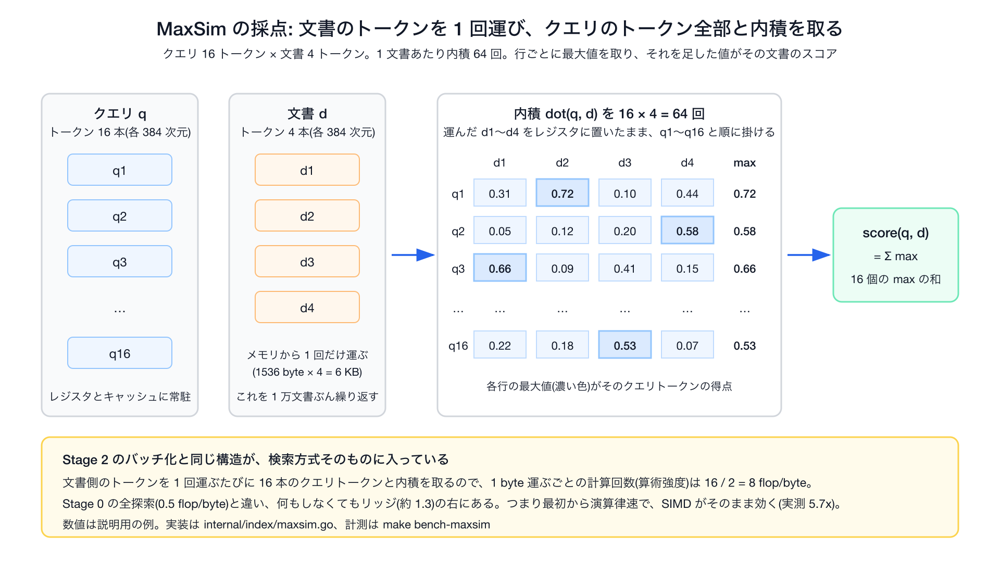
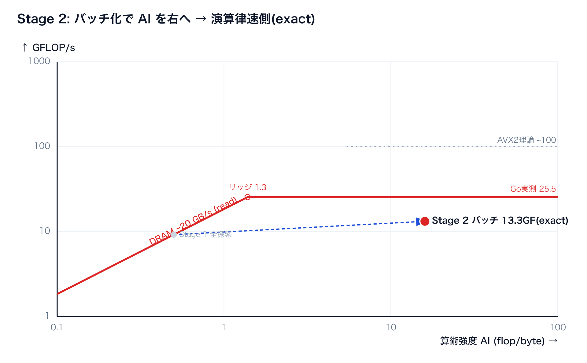

# 付録

本編([../workshop/workshop.md](../workshop/workshop.md))の 40 分には入らない、実装の裏側と調査の記録です。本編を読んだあとに、興味のある節から読めます。数値は計測した機械ごとに違うので、各節の冒頭に計測環境を書いてあります。

| 節 | 内容 | こんなときに |
|---|---|---|
| [1. Go の SIMD の 2 つの隠れた性能上限](#1-go-の-simd-の-2-つの隠れた性能上限) | VZEROUPPER の遷移ペナルティと register spill | 「演算ピークが理論値の 1/3〜1/4 で止まるのはなぜか」を知りたい |
| [2. MaxSim](#2-maxsim) | 最初から演算律速な検索方式(late interaction)での SIMD の効き | Stage 2 の考え方を別の検索方式で見たい |
| [3. AVX-512 の SIMD popcount](#3-avx-512-の-simd-popcount) | AVX-512 の SIMD popcount を試して速くならなかった実測 | Stage 4 の「SIMD 版 popcount は効かない」の根拠を見たい |
| [4. 実行環境の調査](#4-実行環境の調査) | Apple Silicon、Rosetta、Docker、amd64 実機で SIMD がどう動くか | 手元の Mac や Docker で数字が出ない理由を知りたい |
| [5. 上限ベンチの中身](#5-上限ベンチの中身演算ピークとメモリ帯域の測り方) | 演算ピークとメモリ帯域を測るベンチのコード | 本編 §05 の `make roofline-ceiling` の数字がどう出ているかを知りたい |
| [6. SIMD が効く境界はデータサイズの軸にもある](#6-simd-が効く境界はデータサイズの軸にもあるmake-bench-nsweep) | DB 件数を 1k〜1M に振って SIMD の倍率が落ちる境界を実測 | Stage 1 の内積単体 6.3x と全探索 4.5x の差を深掘りしたい |
| [7. Stage 2: クエリのバッチ化](#7-stage-2-クエリのバッチ化再利用で算術強度を上げる) | B=32 で算術強度を 16 に上げ、exact のまま SIMD をスカラの 5.9x 効かせる | 算術強度を上げるもう 1 つの方法(再利用)の実測を見たい |
| [8. goroutine で並列化すればいいのでは](#8-goroutine-で並列化すればいいのではmake-bench-parallel) | メモリ律速はマシン全体の帯域、演算律速は物理コア数で頭打ちになる実測 | 並列化がどの上限に効くかを知りたい |

---

## 1. Go の SIMD の 2 つの隠れた性能上限

VZEROUPPER の遷移ペナルティと register spill の話です。本編の Stage 0〜5 とは独立した読み物で、Go 1.26 / 1.27 の archsimd が出す機械語の現状に踏み込みたい人向けです。どちらもハードの限界ではなく、Go のコード生成がまだ発展途上であることが原因です。

この調査は AWS c7i(Intel Xeon 8488C / Sapphire Rapids)で行いました。本編の Codespaces(AMD EPYC 7763)とは CPU のメーカーが違うので、2 つの現象の出方も違います。

| 現象 | Intel(c7i) | AMD(Codespaces の EPYC) |
|---|---|---|
| ① VZEROUPPER の遷移ペナルティ | 出ます。1 命令の有無で 167ns と 23ns | 基本的に出ません。呼んでも無害です |
| ② register spill | 出ます。アキュムレータ 4 本で 23、12 本で 39 GFLOP/s | 出ます。4 本で 13.4、12 本で 25.5 GFLOP/s |

本実装が境界で `archsimd.ClearAVXUpperBits()`(中身は VZEROUPPER 1 命令)を呼ぶのは Intel 機での保険で、AMD では何も起きないだけです。

### 隠れた上限①: VZEROUPPER の遷移ペナルティ(SIMD からスカラへ戻る境界で起きる)

内積を SIMD 化したのに、全探索の見かけの帯域が 5.7 GB/s と低く、内積単体も 167ns で頭打ちでした。SIMD からスカラへ戻る境界に `VZEROUPPER` を 1 命令置くだけで 23ns(7.1x)まで速くなり、見かけの帯域の上限も消えました。

次の図は、同じ SIMD 内積を VZEROUPPER なし(左)とあり(右)で実行したときに CPU の中で何が起きるかを、上から順に追ったものです。


原因は YMM レジスタの上位半分です。AVX2 命令(`Float32x8` の FMA など)を使うと、YMM レジスタ(256bit)の上位 128bit が「dirty(汚れた)」状態になります。その直後の水平和 `sum = buf[0]+buf[1]+…` はスカラの float32 計算で、Go はこれをレガシー SSE 命令(128bit だけを扱う古い命令)で出力します。上位が dirty なままレガシー SSE を実行すると CPU にペナルティが発生します。`VZEROUPPER` は上位 128bit をゼロに掃除する 1 命令で、境界で一度呼べばこのペナルティは消えます。命令自体のコストは小さいので、差し引きで大きく得をします。

ペナルティの仕組みは CPU の世代で違います(出典: Agner Fog, [The microarchitecture of Intel, AMD and VIA CPUs](https://www.agner.org/optimize/microarchitecture.pdf))。

| CPU | ペナルティの仕組み | VZEROUPPER の効果 |
|---|---|---|
| Intel Sandy Bridge〜Haswell | 一度きりの大きなモード切替(上位状態を保存して復元する) | 切替そのものを防ぎます |
| Intel Skylake 以降(c7i の Sapphire Rapids を含む) | 上位状態は保存せず、dirty 状態で実行するレガシー SSE 命令 1 個ごとに false dependency(偽の依存)とマージ μop が挿入されて蓄積する | 蓄積をまとめて消します。c7i の実測で 7.1x |
| AMD Zen | Intel 型の遷移ペナルティは基本的に無い | 効果はありません(呼んでも害はありません) |

教科書でよく語られるのは上の行の「一度きりの大きな遷移ペナルティ」ですが、c7i は真ん中の行です。実測した「呼び出しごとの固定費 約 145ns(550 サイクル)」は、命令ごとのペナルティの蓄積を VZEROUPPER がまとめて消していると読むのが正確です。

Go の archsimd はこの VZEROUPPER を自動挿入しません(1.26、1.27 とも)。本来はコンパイラが境界を管理して入れるべきもので、[golang/go#77647](https://github.com/golang/go/issues/77647) でも問われましたが、対応予定なしで閉じられています。現状、境界に何も置かないと生成コードに VZEROUPPER は 1 個も出ません。回避策は標準 API の `archsimd.ClearAVXUpperBits()` を境界で呼ぶことです。doc コメントにも「将来コンパイラが自動生成するかもしれない」と書かれています。本リポも当初は 3 行の自作アセンブリを使っていましたが、この標準 API に置き換えました。

この説明のうち実測で確かめたのは「VZEROUPPER 1 命令で同一コードが 7 倍速くなった」という事実だけです。ただし効果の大きさはメーカーと世代に依存し、ここの値は Sapphire Rapids のものです。また 550 サイクルの固定費を命令単位まで分解したわけではありません。次元数を変えて固定費を分離し、VZEROUPPER を入れて 7 倍を確認した、という状況証拠による特定です。

### 隠れた上限②: なぜ FMA は理論ピークの 1/3〜1/4 で止まるか(register spill)

演算ピークを測るベンチ(`make roofline-ceiling`)では、独立なアキュムレータを 12 本持って FMA を回し続けます。理論上はメモリに触らず FMA だけが並ぶはずですが、実測は理論値の 1/3〜1/4 で止まります。

| | c7i(Sapphire Rapids) | Codespaces(EPYC 7763) | M3 Pro(Neon) |
|---|---|---|---|
| 理論ピーク | 約 120 GFLOP/s | 約 110 GFLOP/s | 未算出 |
| アキュムレータ 4 本 | 23 GFLOP/s | 13.4 GFLOP/s | 未計測 |
| アキュムレータ 12 本 | 39 GFLOP/s | 25.5 GFLOP/s | 32 GFLOP/s |

※ 理論ピークは 2 FMA/cycle × 8 レーン × 2 flop × クロック(c7i は 3.75GHz、EPYC 7763 は単コアブーストの約 3.5GHz)。検索の内積は算術強度 0.5 の深いメモリ律速なので、この低さは検索の結論を変えません。ただし原因は見ておく価値があります。

言葉を 2 つ定義します。レジスタは CPU の中にある一番速い値の置き場で、SIMD 用(YMM)は 16 本、そのうち Go が使えるのは 15 本です。スタックはメモリ上の作業領域で、レジスタよりずっと遅い場所です。

原因は機械語を見ると分かります。[`go tool objdump`](https://pkg.go.dev/cmd/objdump) で内側ループを見ると、12 本のアキュムレータが全部レジスタに置けず、毎回スタックへ退避されて、同じ 1 本のレジスタを使い回していました。これが register spill(レジスタに収まらない、または置けない値をメモリへ追い出すこと)です。FMA 1 個ごとに load と store が必ず付くので、まず load/store ポートが飽和し、さらに次の周回の load が今回の store を待ちます(store-to-load forwarding、5〜7 サイクル)。アキュムレータを増やすほどこの待ち時間が隠れるので、4 本より 12 本の方が速くなります。待ち時間で律速しているときの典型的な傾向です。


本数が多すぎるわけではありません。12 本のアキュムレータに定数の 2 本を足した 14 本は、使える 15 本に収まります。レジスタが足りないのではなく、コンパイラが載せてくれないのが原因です。これはハードの限界ではなく、Go の archsimd のレジスタ割り当てが発展途上であることによるものです(VZEROUPPER を自動挿入しないのと共通の課題)。既知 issue [golang/go#76969](https://github.com/golang/go/issues/76969)(closed / not planned)と同件です。[#78753](https://github.com/golang/go/issues/78753)(AVX-512 の上位 16 本の ZMM が割り当てられない件)は Go 1.27 で閉じましたが、この 12 本 AVX2 ループの spill は Go 1.27.1 でも残っています(`make spill GO=go1.27.1` で `VMOVDQU …(SP)` が 40 行余り出ます。amd64 向けにクロスコンパイルするだけなので mac でも動きます)。arm64(Neon)でも同じで、M3 Pro の 12 本 FMLA ループは `FMOVQ …(SP)` に挟まれます。将来このピークは上がる見込みですが、1.27 ではまだです。

この節で確認できているのは「spill が存在する」こと(objdump で 4 本、12 本とも FMA に load と store が付く)と、メモリポート律速の見積り(約 0.6 FMA/cycle)が実測 0.65 とほぼ一致することまでです。「spill さえ消せば理論ピークに届く」は未検証です。Go 1.26 / 1.27 の archsimd は常に spill し、Go コードでは消せないため、VZEROUPPER のような「1 命令足したら 7 倍」の決定的な介入実験ができていません。本節は状況証拠による推定です。

その `go tool objdump` の出力の一部です。アキュムレータ 1 本ぶんで、FMA の前後に読み書きが付いています(`make spill` はコンパイラの `-S` 出力を使うので、同じ往復が `VFMADD213PS` の正名で見えます)。

```text
// go tool objdump で見た内側ループ(アキュムレータ 1 本ぶん)
0x..e3   c5fe6f9424...   VMOVDQU 0x398(SP), X2   ← スタックからレジスタへ load
0x..74   c4e27da8d1      TESTL $0xd1, AL         ← 実は VFMADD213PS(FMA)。go tool objdump の誤訳
0x..79   c5fe7f9424...   VMOVDQU X2, 0x398(SP)   ← レジスタからスタックへ store
```

読み方は 3 点だけです。

- 1 行は「アドレス / 命令のバイト列 / 命令名 オペランド」です。`(SP)` はスタック上の場所を指します
- `VMOVDQU` はベクトルのコピー(メモリとレジスタの間)、`VFMADD…PS` が FMA です
- `go tool objdump` は新しめの命令(VEX 系)を誤訳し、FMA が `TESTL $0xd1, AL` のように化けます。本当の命令は左のバイト列(`c4e2…`)で分かります。Linux の `objdump -d` なら正しく表示されます

ループ内で演算ごとに「`(SP)` からの load」と「`(SP)` への store」がセットで並んでいたら、値をレジスタに保持できず毎回スタックを往復している証拠です。理想は load と store が消えて FMA だけが並ぶ状態です。

---

## 2. MaxSim

MaxSim(late interaction)は、最初から演算律速な検索方式です。[7 節の Stage 2(クエリのバッチ化)](#7-stage-2-クエリのバッチ化再利用で算術強度を上げる)の考え方を、この方式に当てはめた実測です。`make bench-maxsim` で再現できます(Codespaces、AMD EPYC 7763)。

Stage 2 は「クエリが 32 本まとめて来る」状況を利用して、DB ベクトルを 1 回運ぶたびに 32 本と内積を取り、算術強度を上げました。MaxSim([ColBERT](https://arxiv.org/abs/2004.12832) 系)は、クエリと文書をそれぞれ複数のトークンベクトルで表し、クエリトークンごとに文書トークンとの最大内積を取って足し合わせる検索方式です。次の図は 1 文書を採点する流れです。



文書側のトークンを 1 回運ぶたびにクエリトークン全部と内積を取るので、Stage 2 と同じ構造が検索方式そのものに含まれています。クエリのトークン数を Tq とすると算術強度は Tq/2 で、Tq = 16 なら 8 flop/byte です。何もしなくても最初からリッジ(約 1.2)の右にあります。

1 万文書 × 4 トークン、クエリ 16 トークンで測った結果です。

| | 1 クエリ | GFLOP/s | 算術強度 |
|---|---|---|---|
| スカラ(`SearchMaxSimNaive`) | 239 ms | 2.06 | 8.0 flop/byte |
| SIMD(`SearchMaxSimSIMD`) | 42 ms | 11.7 | 8.0 flop/byte |

SIMD 化だけで 5.7x です。Stage 1 の全探索(算術強度 0.5)ではメモリ帯域の上限に当たって 4.5x で止まりましたが、MaxSim は演算律速なので SIMD がそのまま効きます。Stage 2 で行った「算術強度を上げる工夫」が、この検索方式では最初から組み込まれています。実装は [`internal/index/maxsim.go`](../../internal/index/maxsim.go) にあります。

---

## 3. AVX-512 の SIMD popcount

本編の Stage 4 で、1bit 量子化後のハミング距離は通常の POPCNT 命令で足り、SIMD 版の popcount(AVX-512 の VPOPCNT)を使っても速くならないと書きました。その実測です。

[`vec.HammingSIMD`](../../internal/vec/hamming_simd.go) は、`Uint64x4.OnesCount`(VPOPCNTQ 命令)で 4 つの uint64 をまとめて popcount します。この命令は AVX-512 の拡張(AVX512VPOPCNTDQ)で、Codespaces に割り当てられる AMD EPYC 7763 にはありません。AVX-512 のある機械(AWS の c7i など)を自分で用意すれば `make bench-bonus` で測れます。

| 機械 | 通常版 `SearchBinary`(POPCNT) | SIMD 版 `SearchBinarySIMD`(VPOPCNT) |
|---|---|---|
| c7i(AVX-512 あり) | 0.68 ms | 0.75 ms |
| Codespaces(AVX-512 なし) | 0.77 ms | 1.0 ms(機能チェックで通常版に切り替わる分岐のぶん遅い) |

AVX-512 のある c7i でも SIMD 版の方がわずかに遅い結果です。理由は 2 つあります。

- 量子化後の DB(4.8 MB)はキャッシュに乗っていて、popcount の計算で時間を使っていない
- 1 ベクトルが 6 語(uint64 × 6)と短く、SIMD で 4 語ずつまとめる利点が出る前に終わる

計算で詰まっていない所に SIMD を足しても速くならない、という本編の主張の実測例として残してあります。

---

## 4. 実行環境の調査

Apple Silicon、Rosetta、Docker、amd64 実機で SIMD がどう動くかを調べた記録です。2026-06-11 に Go 1.26.4 で調査し、2026-09-05 に Go 1.27.1 で再確認しました。調査コマンドは `make isa-report`、`make test`、ベンチ 1 回実行です。CPU 機能の意味は [simd/archsimd のドキュメント](https://pkg.go.dev/simd/archsimd)、Rosetta の仕様は [Apple のドキュメント](https://developer.apple.com/documentation/apple-silicon/about-the-rosetta-translation-environment)を参照しています。

### 結論

| 環境 | 正しさのテスト | スカラ実装(Stage 0/4) | Stage 1 SIMD 内積 | 付録 AVX-512 | 本編ベンチ再現 |
|---|---|---|---|---|---|
| arm64 ネイティブ(Apple M3 Pro) | ✅ `make test` | ✅ | ✅ Neon 128bit(Go 1.27 から。1.26 はスカラに落ちる) | ❌ | △ 動くが本編(AVX2)とは別の点 |
| Rosetta(`GOARCH=amd64`) | ✅ | ✅ | ❌ FMA=false でスカラに落ちる | ❌ AVX-512 非対応 | △ 量子化は再現、SIMD 内積は不可 |
| Docker `linux/amd64`(Apple Silicon 上) | ❌ ビルドクラッシュ / CPUID 全 false | △ バイナリ実行のみ | ❌ | ❌ | ❌ 使わない |
| amd64 実機(Codespaces / AWS c7i) | ✅ | ✅ | ✅ | c7i のみ ✅ | ✅ `make bench` |

本編で使う SIMD は AVX2 + FMA だけなので、参加者の数字は GitHub Codespaces 一本で全ステージ取れます(当たる CPU のメーカーと世代を問わず再現)。AVX-512 VPOPCNT は本編フロー外の付録(上の 3 節)で、AVX-512 のある機械を用意した場合だけ実機確認します。Apple Silicon の手元では、Go 1.27 なら Neon 版の SIMD が走るので `make test` と `make bench1` は動きます。ただし本編の数字とは別物です(M3 Pro の実測は [../workshop/setup.md](../workshop/setup.md) の「Apple Silicon で動かす場合」)。

### やりたいことごとの環境の選び方

| やりたいこと | 環境 | コマンド |
|---|---|---|
| 正しさだけ確認したい | Apple Silicon(arm64) | `make test` |
| Neon 版の SIMD を手元で見たい | Apple Silicon(arm64) | `make GO=$(go env GOPATH)/bin/go1.27.1 bench1`(本編の数字とは別物) |
| amd64 側の SIMD パスのコンパイル確認をしたい | Apple Silicon(Rosetta) | `GOARCH=amd64 GOEXPERIMENT=simd go1.27.1 test ./...`(FMA 非対応なので実行はスカラ) |
| 本編の最終形(Stage 0/1/4/5)を再現したい | Codespaces / devcontainer(amd64 ホスト) | `make bench`(Stage 2/3 は `roofline-batch` / `bench-int8`) |
| AVX-512 VPOPCNT を実機で確かめたい | AVX-512 のある機械を自分で用意(AWS c7i など) | `make bench-bonus` |
| CPU 機能の有無を確認したい | どこでも | `make isa-report`(Rosetta 側は `make isa-report-amd64`) |

### 調査方法

`cmd/isa-report` が pkg.go.dev の CPU Feature 表に沿って、本リポが使う API と `archsimd.X86.*()` の対応を一覧します。arm64 では Neon 版の内積・距離関数の一覧が出ます。

```sh
make isa-report GO=$(go env GOPATH)/bin/go1.27.1         # 実行中のアーキの一覧(Mac なら arm64 = Neon 版)
make isa-report-amd64 GO=$(go env GOPATH)/bin/go1.27.1   # GOARCH=amd64(Rosetta)で amd64 側の一覧
```

SIMD 版を使うかどうかは、コード側で次のガードが決めています。

```go
// internal/vec/dot_simd.go
hasSIMD = archsimd.X86.AVX2() && archsimd.X86.FMA()

// internal/vec/hamming_simd.go
hasVPOPCNT = archsimd.X86.AVX512() && archsimd.X86.AVX512VPOPCNTDQ()
```

### arm64 ネイティブ(Apple M3 Pro)

Go 1.26 では `simd/archsimd` が amd64 専用で、ビルドタグでスカラのフォールバックに切り替わり、テストだけ通る状態でした。Go 1.27 から arm64(Neon、128bit)に対応したので、Stage 1 の SIMD 内積(`dot_arm64.go`)と Stage 3 の int8(`int8_arm64.go`)は Neon 版が走ります。レジスタ幅は 256bit から 128bit に半分になる一方、単コアのメモリ帯域は Codespaces より大きいので、ルーフライン上の点も倍率も本編とは別の位置になります。

### Rosetta(`GOARCH=amd64` on Apple Silicon)

`archsimd.X86` の isa-report 実測です(Go 1.27.1 + macOS 26 でも同じ)。

| Feature | 値 | 対応する API |
|---|---|---|
| AVX | true | `ClearAVXUpperBits`(VZEROUPPER) |
| AVX2 | true | `LoadFloat32x8`、`Uint64x4.Xor` など |
| FMA | **false** | `Float32x8.MulAdd`。Stage 1 がここで落ちる |
| AVX512 | false | Apple のドキュメントどおり非対応 |
| AVX512VPOPCNTDQ | false | `Uint64x4.OnesCount` |
| hasSIMD | false | `Dot` は `DotNaive` にフォールバック |
| hasVPOPCNT | false | `HammingSIMD` は `Hamming` にフォールバック |

Stage ごとに見ると次のとおりです。

| Stage | API | 要求 feature | Rosetta |
|---|---|---|---|
| 0 | `DotNaive` | なし(スカラ) | ✅ |
| 1 | `LoadFloat32x8` | AVX2 | ✅ |
| 1 | `Float32x8.MulAdd` | FMA | ❌ |
| 1 | `archsimd.ClearAVXUpperBits` | AVX | ✅(到達前にガードで落ちる) |
| 4 | `Hamming`(`bits.OnesCount64`) | スカラ POPCNT | ✅ |
| 5 | `SearchBinaryRerank` | binary は動く。rerank の Dot は Naive | △ |
| 付録 | `Uint64x4.OnesCount` | AVX512VPOPCNTDQ | ❌ |

ベンチ参考(Rosetta、1 クエリ、Go 1.27.1、M3 Pro、2026-09-06 に 3 回計測した中央値):

| | 1 クエリ |
|---|---|
| `SearchNaive` | 24.1 ms |
| `SearchSIMD` | 24.7 ms(`hasSIMD` が false なので `DotNaive` と同じ経路。速くならない) |
| `SearchBinary` | 0.77 ms(スカラ量子化なので SIMD 不要) |
| `SearchBinaryRerank` | 0.83 ms(rerank も `DotNaive`) |

量子化 Stage は Rosetta でも約 30 倍のオーダー感は出ます。SIMD 内積と AVX-512 は再現できません。Apple のドキュメントにあるとおり Rosetta は AVX と AVX2 を翻訳し AVX-512 は非対応ですが、FMA も CPUID で false になるのが Rosetta の制約です(以前「AVX 全体が動かない」と書いていたのは誤りで、修正済み)。

### Docker `linux/amd64`(Apple Silicon ホスト)

| 確認したこと | 結果 |
|---|---|
| `uname -m` | `x86_64` と出る |
| `/proc/cpuinfo` | ARM の機能(asimd など)が見える。ホスト CPU がそのまま露出している |
| `go test` / `go run` | ビルド中に panic や SIGSEGV で落ちる(QEMU エミュレーションの不安定さ) |
| `make isa-report` | 実行はできるが `archsimd.X86` はすべて false |

`docker run --platform linux/amd64` は Apple Silicon 上では QEMU 系のエミュレーションです([Docker のマルチプラットフォームビルド](https://docs.docker.com/build/building/multi-platform/))。x86 の CPUID を正しくエミュレートしないため `archsimd.X86` は信頼できず、ベンチと SIMD 検証には使えません。amd64 Linux の実機か Codespaces を使ってください。

### amd64 実機(Codespaces / AWS c7i)

本編の数字は Codespaces(AMD EPYC 7763、AVX2 + FMA)で取っています。AVX-512 と AVX512VPOPCNTDQ まで揃った c7i(Sapphire Rapids)の実測は `SearchNaive` 28.6 ms、`SearchBinary` 0.68 ms、`SearchBinaryRerank` 0.73 ms(Recall@10 0.87)でした。

関連ファイル: [`cmd/isa-report/main.go`](../../cmd/isa-report/main.go)(環境調査ツール)、[`Makefile`](../../Makefile)(`isa-report` ターゲット)、[../workshop/setup.md](../workshop/setup.md)(Docker と Rosetta の説明)。

---

## 5. 上限ベンチの中身(演算ピークとメモリ帯域の測り方)

本編の [05. 性能の上限を測る](../workshop/workshop.md#05-性能の上限を測る)で `make roofline-ceiling` が出す数字を、どんなコードで測っているかです。数値は 4 コア Codespace(AMD EPYC 7763(Zen3 世代)・1 コア)のものです。測り方が分かっていれば、自分のマシンで出た数字が読めます。

### FMA をレジスタ上で連打して演算ピークを見る

演算ピークは「メモリも依存連鎖(前の計算が終わるまで次の計算を待つこと)も挟まず、FMA だけを限界まで回したら何 GFLOP/s 出るか」で測れます。

そのため、独立したアキュムレータ(途中結果をためる変数)を 12 本用意し、レジスタ上だけで FMA を連打します。

```go
// 12本の独立アキュムレータ。漸化式 a = a*m + c はメモリにも触れない
m, c := fill8(0.9999), fill8(1.0)
a0, a1, /* … */ a11 := fill8(0.5), fill8(1.5), /* … */ fill8(11.5)
for b.Loop() {
    for j := 0; j < inner; j++ {
        a0 = a0.MulAdd(m, c)   // ← FMA。互いに独立なので 12本が並んで走る
        a1 = a1.MulAdd(m, c)
        /* … a2 〜 a11 も同様 … */
    }
}
flop := float64(iters) * inner * 12 * 8 * 2  // 12acc × 8lane × 2flop/FMA
b.ReportMetric(flop/sec/1e9, "GFLOP/s")      // ← これが 25.59
```

実測は 25.5 GFLOP/s です。試しにアキュムレータを 4 本に減らした `BenchmarkPeakFLOP_AVX2_4acc` を測ると 13.4 GFLOP/s まで落ちます(本数を減らすと遅くなる)。理論ピークは約 110 GFLOP/s で、実測はその約 1/4 です。なぜ 1/4 で止まるのか、なぜ本数を減らすと遅くなるのかは、[1. Go の SIMD の 2 つの隠れた性能上限](#1-go-の-simd-の-2-つの隠れた性能上限)の隠れた上限②(register spill)で説明しています。

### 巨大な配列を流し読みしてメモリ帯域の上限を見る

メモリ帯域は「DRAM から 1 スレッドで流し読みしたら何 GB/s 出るか」で測ります。キャッシュに収まると DRAM を測れないので、256MB(最後段のキャッシュ L3 を確実に溢れる)の配列を先頭から末尾まで順番に読みます。コードは [`internal/vec/ceiling_mem_simd_test.go`](../../internal/vec/ceiling_mem_simd_test.go) にあります。次はその主要部分です。実コードの Triad は 4 組ずつ展開してありますが、やることは同じです。

```go
const memN = 1 << 26  // 67,108,864 float32 = 256 MB(L3 溢れ確実)

// read 帯域: 検索の内積と同じ 256bit ロード(8本のアキュムレータ)で
// DRAM 読みを飽和させる。スカラ縮約だと足し算の発行律速で過小評価するため SIMD で測る
for b.Loop() {
    var a0 archsimd.Float32x8 /* … a7 まで … */
    for len(x) >= 64 {
        a0 = archsimd.LoadFloat32x8(x).Add(a0)   /* … x[8:] 〜 x[56:] も … */
        x = x[64:]
    }
}
b.ReportMetric(gb, "read-GB/s")    // ← 20.80

// Triad(STREAM 標準): a = b + s*c。read b + read c + write a で3配列ぶん(SIMD)
for len(aa) >= 8 {
    archsimd.LoadFloat32x8(cc).MulAdd(s, archsimd.LoadFloat32x8(bb)).Store(aa)
    aa, bb, cc = aa[8:], bb[8:], cc[8:]
}
b.ReportMetric(gb, "triad-GB/s")   // ← 17.36
```

帯域の数字が 2 つある理由です。`BenchmarkPeakReadBW`(約 20 GB/s)は読むだけの帯域で、検索の内積と同じ SIMD のロードで測っています。`BenchmarkPeakTriadBW`(17.4 GB/s)は [STREAM](https://www.cs.virginia.edu/stream/) という標準ベンチで、読み書き両方を含むぶん少し低くなります。本編の検索は DB ベクトルを読むだけなので、メモリ帯域の上限には読むだけの約 20 GB/s を使っています。SIMD 全探索の達成 19.4 GB/s がこの値とほぼ一致します。

---

## 6. SIMD が効く境界はデータサイズの軸にもある(make bench-nsweep)

本編の Stage 1 では、内積単体の SIMD 化は 6.3x なのに全探索は 4.5x で止まりました。差はデータの居場所です。内積単体のベンチはデータが L1 キャッシュに載ったままで計算の速さだけが出ますが、全探索は 154 MB を DRAM から運びます。ちなみに、この内積関数のように大量のデータへ繰り返し適用される中核ルーチンを、性能の分野では「カーネル」と呼びます(ルーフラインの文献にもこの語で出てきます)。

`make bench-nsweep` で DB 件数を 1,000 から 1,000,000 まで振ると、SIMD の倍率がキャッシュに収まらなくなる所で落ちるのが見えます(4 コア Codespace。本編とは別インスタンスの実測なので、Stage 1 本文と絶対値が少し違います)。

| DB 件数     | データ量           | naive   | SIMD    | 倍率   |
| --------- | -------------- | ------- | ------- | ---- |
| 1,000     | 1.5 MB(キャッシュ内) | 351 µs  | 61 µs   | 5.8x |
| 10,000    | 15 MB(L3)      | 3.5 ms  | 0.61 ms | 5.7x |
| 100,000   | 154 MB(DRAM)   | 34.8 ms | 8.8 ms  | 3.9x |
| 1,000,000 | 1.5 GB(DRAM)   | 347 ms  | 89.5 ms | 3.9x |

L3 に収まる間は内積単体に近い 5.7〜5.8x、DRAM に溢れた瞬間に 3.9x へ落ちて以後一定です。本編の 10 万件(154MB)は、意図的に DRAM から読む側に置いた設定です。本編は算術強度の軸で SIMD が効く境界を探しましたが、同じ境界はデータサイズの軸にも現れます。

---

## 7. Stage 2: クエリのバッチ化(再利用で算術強度を上げる)

本編の Stage 1 はメモリ帯域の上限に達し、算術強度を上げる 2 つの方法(再利用とバイト削減)のうち、本編はバイト削減(Stage 3〜)で進みました。この節はもう 1 つの再利用を実測します。本編の欠番 Stage 2 にあたります。計測は 4 コア Codespace(AMD EPYC 7763)です。

本編の検索は、1 本のクエリのために DB ベクトル 10 万本を DRAM から順に運び、それぞれと内積を 1 回取って、捨てます。クエリが 32 本あれば、同じ 10 万本を 32 回運び直すことになります。

運ぶ回数を減らす方法があります。クエリを 32 本まとめて持っておき、DB ベクトルを 1 本運ぶたびに、32 本のクエリ全部と内積を取ってから捨てます。運ぶ量は 1 クエリのときと同じで、計算だけが 32 倍になります。

```text
1 本ずつ:   DB ベクトル 1 本を運ぶ → 内積 1 回        算術強度 0.5
32 本まとめ: DB ベクトル 1 本を運ぶ → 内積 32 回       算術強度 0.5 × 32 = 16
```

算術強度 16 はリッジ(1.2)より右なので、点は演算律速側に移ります。そこなら SIMD が効く見込みです。1 つ 1 つの内積は Stage 1 と同じ計算なので、結果は正確なままです。

なお、この形は行列と行列の掛け算そのものです(DB ベクトルを並べた行列 × クエリを並べた行列)。数値計算ライブラリや Faiss のバッチ検索が速いのも、同じ考え方で運ぶ回数を減らしているからです。

```go
// internal/index/index.go: B 本のクエリを 1 パスで処理(d のロードを再利用)
func (ix *Index) SearchBatchSIMD(qs [][]float32, k int) [][]Result {
    tops := make([]*topK, len(qs))
    for b := range tops { tops[b] = newTopK(k) }
    for id := 0; id < ix.N; id++ {
        d := ix.Vec(id)                          // ① d を1回ロード
        for b := range qs {                      // ② B本のクエリで使い回す(d はキャッシュ常駐)
            tops[b].push(id, vec.Dot(qs[b], d))   // SIMD内積
        }
    }
    /* 各 tops[b].results() を返す */
}
```

```bash
$ make roofline-batch    # B=1(全探索) vs B=32(バッチ)、scalar vs SIMD (EPYC 7763 実測)
B=1   SearchSIMD         7.95 ms/query   9.66 GF   ← AI 0.5・メモリ帯域の上限(Stage 1)
B=32  SearchBatchNaive  34.24 ms/query   2.24 GF   ← AI 16・scalar
B=32  SearchBatchSIMD    5.79 ms/query  13.26 GF   ← AI 16・SIMD で 5.9x。演算律速・exact
```



図: Stage 2 の位置。バッチ化で 算術強度が 0.5 から 16 と右へ動き、演算律速側に乗った(exact・精度そのまま)。

B=32 でクエリを束ねると算術強度は 0.5 から 16 になり、リッジを越えて演算律速側に移りました。そこでは SIMD がスカラより 5.9x 速くなります。scalar batch が 34.2 ms/query、SIMD batch が 5.79 ms/query で、GFLOP/s は 2.24 から 13.3 です。Stage 1 では 4.5x で頭打ちだった SIMD が、算術強度を上げると効きます。1 クエリあたりの時間も 7.9 ms から 5.8 ms に縮みます。

ちなみに「クエリが 32 本まとめて来る」という前提は実戦でも発生します。[ColBERT](https://arxiv.org/abs/2004.12832) のようにクエリを複数のベクトルで表す検索方式では、DB ベクトル 1 本に対して複数の内積を取ることが方式そのものに含まれていて、最初から演算律速です。[2. MaxSim](#2-maxsim) で実測しています(5.7x)。

なぜ律速が入れ替わるのかは、時間の内訳で分かります。1 要素を処理する時間は、運ぶ時間と計算する時間のうち長い方でおおよそ決まります。計算する時間は要素あたり 2 flop で同じですが、バッチ化は運ぶ時間だけを 1/32 にします。そのため時間のかかっているポイントが、運ぶ時間から計算する時間に入れ替わります。下の図は本編 §05 で測った演算ピーク 25.6 GFLOP/s と read 帯域 20.8 GB/s から計算したものです。


図: Go 実測の上限から計算した時間内訳。Stage 1(算術強度 0.5)はメモリ時間が演算の約 2.5 倍でメモリ律速、Stage 2(算術強度 16)はメモリ時間が演算の約 1/13 に縮んで演算律速へ反転。`make roofline-decompose` で自分の上限から再生成できる。この「メモリ vs 演算」の内訳は CPU プロファイラ(pprof / trace)では出せず、ルーフラインが与えるもの。

---

## 8. goroutine で並列化すればいいのでは(make bench-parallel)

本編は全部 1 コアで測っています。goroutine で複数コアに分ければ速くなるのか、実測で確かめます。DB を workers 個に分けて goroutine で分担し、最後に各 goroutine の上位 k 件を 1 つにまとめます([`internal/index/parallel.go`](../../internal/index/parallel.go))。

```go
for w := 0; w < workers; w++ {
    go func(t *topK, lo, hi int) {   // 各 worker は自分のチャンクだけ走査
        defer wg.Done()
        for id := lo; id < hi; id++ {
            t.push(id, vec.Dot(q, ix.Vec(id)))
        }
    }(tops[w], lo, hi)
}
wg.Wait()
// worker ごとの top-k をマージ(チャンクは互いに素なので重複なし)
```

メモリ律速の全探索(B=1・本編 Stage 1 の形)と、演算律速のバッチ(B=32・上の 7 節の形)の両方を、workers = 1/2/4 で測ります。

```bash
$ make bench-parallel    # 4 vCPU Codespace(表示は整形。別の回の実測で、Stage 1/2 の絶対値とは 2 割ほど違う。見るのは各行の倍率)
SearchParallel/workers=1        9.4 ms      16.4 GB/s   ← メモリ律速(B=1)
SearchParallel/workers=2        5.7 ms      26.8 GB/s   ← 1.6x
SearchParallel/workers=4        5.2 ms      29.5 GB/s   ← 1.8x で頭打ち = マシン全体の帯域の上限
SearchBatchParallel/workers=1   6.7 ms/query            ← 演算律速(B=32)
SearchBatchParallel/workers=2   4.5 ms/query            ← 1.5x
SearchBatchParallel/workers=4   3.5 ms/query            ← 1.9x = 物理コア数の上限
```

どちらも workers を 4 にしても 4 倍にはなりません。

全探索(B=1)は 1.8x で止まりました。workers を 1、2、4 と増やすと、全部の goroutine が使う帯域の合計は 16、27、30 GB/s と増えますが、2 から 4 では 10% しか伸びていません。マシン全体で DRAM から運べる量に上限があり、goroutine はそれを分け合っているだけです。メモリ律速の処理は、コアを足しても速くなりません。

バッチ(B=32)は 1.9x で止まりました。この Codespace の 4 vCPU は、物理コア 2 個に SMT で 2 スレッドずつ載せたものです(`lscpu` で確認できます)。SMT(Simultaneous Multithreading。同時マルチスレッディング)は 1 つの物理コアを 2 つの CPU として見せる仕組みで、Intel の Hyper-Threading と同じものです。同じ物理コアの 2 スレッドは FMA の実行ユニットを共有するので、計算で詰まっている処理は物理コアの数(2)までしか速くなりません。物理コアが 4 個以上の機械なら、コア数に応じて伸びます。

並列化にも上限があります。メモリ律速ならマシン全体のメモリ帯域、演算律速なら物理コア数です。どちらも 1 コアのルーフラインには出てこない上限ですが、何律速かが分かっていれば、goroutine を足して効くかどうかは足す前に予測できます。
