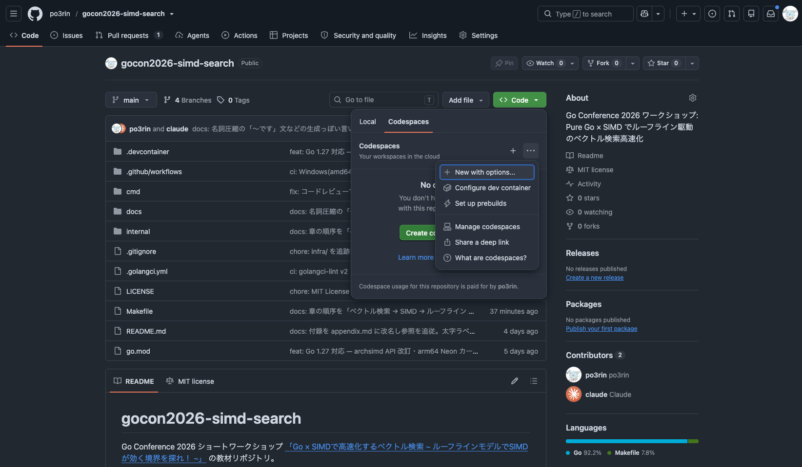
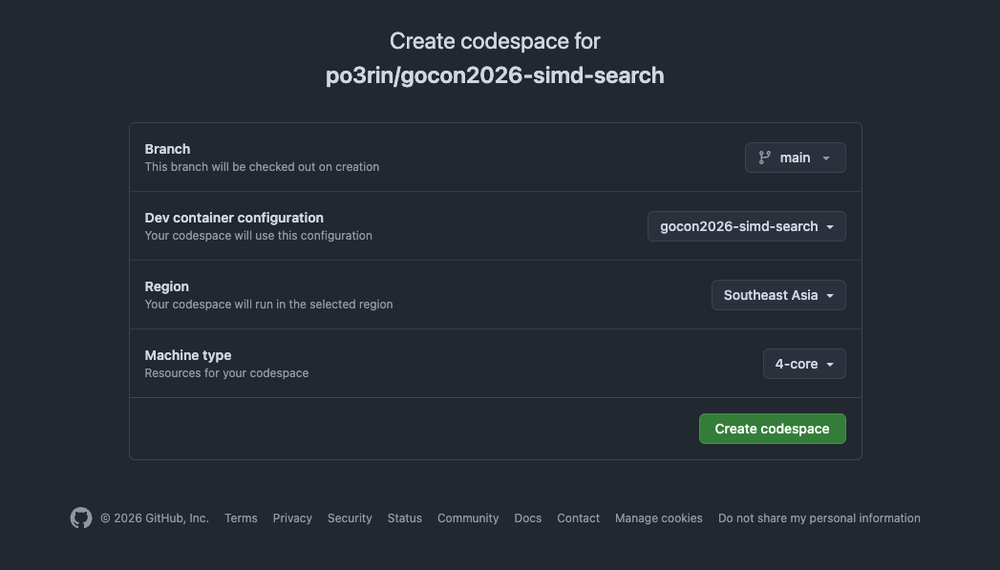
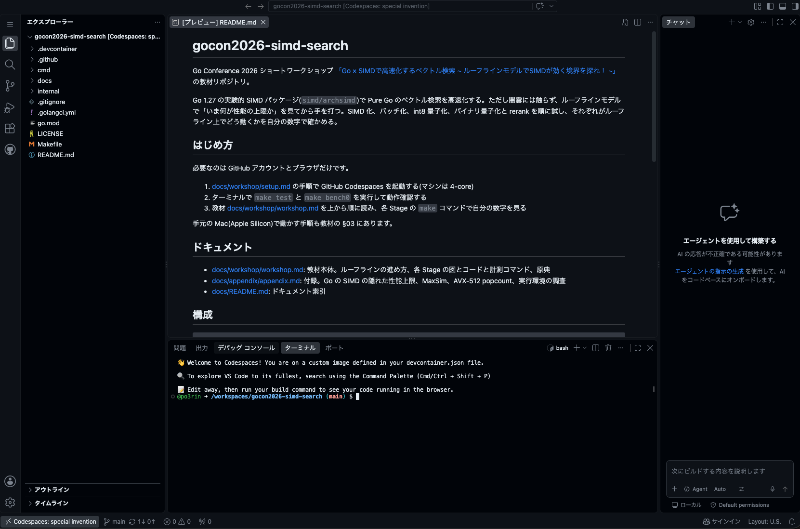

# セットアップ

ワークショップはブラウザだけで動きます。インストールは不要で、必要なのは GitHub アカウントとブラウザだけです。
(教材本体は [workshop.md](workshop.md)。このページは「動かす環境を用意する」ところまで。)

---

## 1. Codespace を起動する(30秒)

[GitHub Codespaces](https://docs.github.com/en/codespaces) は、リポジトリの開発環境をブラウザ上の VS Code で開くサービスです。

1. このリポジトリのページを開く: [https://github.com/po3rin/gocon2026-simd-search](https://github.com/po3rin/gocon2026-simd-search)
2. 緑の `Code` ボタンを押し、`Codespaces` タブの「…」から `New with options...` を選ぶ(マシンタイプを選ぶため)
  

  
3. マシンは `4-core`(16 GB RAM)を選ぶ。
  

  
4. しばらく待つ(初回はコンテナのビルドで 1〜3 分)。VS Code がブラウザで開けば準備完了
  

[`.devcontainer/`](../../.devcontainer/)([Dev Container](https://containers.dev/) の設定)に Go 1.27 + `GOEXPERIMENT=simd` が入っているので、開いたらそのまま使えます。

## 2. 動作確認(これが通れば準備OK)

下部のターミナルで:

```sh
make test     # 正しさ確認。PASS が出ればOK(初回はビルド込みで10秒ほど)
make bench0    # ベースライン(スカラ全探索)を1回測る(数秒)
```

数字が出たら [workshop.md](workshop.md) の「04. まず動かしてみる」へ進んでください。
ベンチの数字は共有 VM の揺れで実行ごとに ±5% ほど変わりますが、それで正常です。

---

## マシンサイズは `4-core` で固定

全員 `4-core`(16 GB RAM)を指定してください([マシンタイプの変え方](https://docs.github.com/en/codespaces/customizing-your-codespace/changing-the-machine-type-for-your-codespace))。起動時のマシン選択で `4-core` を選ぶだけです。
バラバラのサイズだと比較しづらくなるので、条件を揃えるために統一します。8-core 以上は無料枠を早く消費するだけで不要、2-core はベンチが不安定になりがちなので避けます。

> ただし Codespaces は当たる CPU(Intel/AMD・世代)を選べません。同じ 4-core でも CPU が違えば出る数字は変わります。さらに同じ CPU でも、個体や時間帯でメモリ帯域が 2〜3 割変わることがあります(read 天井の実測で 16〜21 GB/s)。メモリ律速の Stage の数字はそれに比例して動きますが、演算律速の数字(Stage 0 のベースラインやバッチ)はほぼ再現します。教材の数字と自分の数字が違っても、上限との「関係」が同じなら正しく動いています。

## 費用：かかりません

- 計算リソースは起動した自分の GitHub アカウントの無料枠(月 120 コア時間。[Codespaces の課金](https://docs.github.com/en/billing/managing-billing-for-your-products/about-billing-for-github-codespaces))から引かれます。
- 40 分のワークショップは 4-core でも 3 コア時間弱で、無料枠の数 % です。実質 ¥0 です。
- 終わったら Codespace は止めてOK(30分操作が無ければ[自動停止](https://docs.github.com/en/codespaces/setting-your-user-preferences/setting-your-timeout-period-for-github-codespaces)。`Code → Codespaces` から手動停止/削除も可)。

## どの CPU が当たっても本編は動きます

Codespaces は割り当てられる CPU(Intel/AMD、世代)を選べませんが、本編が使う SIMD は AVX2 + FMA だけです(Stage 1/4 と付録のバッチ化の内積。Stage 2 の int8 内積は AVX2 のみ)。過去 10 年の x86(Intel は Haswell 2013 年以降、AMD は 2015 年以降)がほぼ全て持つので、どの CPU でも全ステージ再現します。ただし出る数字は CPU で変わります。教材は各自の数字で進める作りになっているので、それで問題ありません。

AVX-512 は本編では使いません。Stage 3 で見るとおり、量子化後は popcount を SIMD 化しても速くならないためです。AVX-512 を実機で確かめたい人向けの実測は[付録](../appendix/appendix.md#3-avx-512-の-simd-popcount)にあります。

## ローカル(amd64 Linux / Windows)で動かす場合

Codespaces を使わず手元で動かす場合に必要なのは Go 1.27 と make だけです。Go の SIMD 自体は Windows ネイティブでも動きます(CI の windows-latest で確認)が、Makefile がシェル前提なので、Windows では WSL2 か Git Bash など make の使える環境で実行してください。

```bash
git clone https://github.com/po3rin/gocon2026-simd-search
cd gocon2026-simd-search
go install golang.org/dl/go1.27.1@latest && go1.27.1 download   # Go 1.27 を入れる
make GO=$(go env GOPATH)/bin/go1.27.1 test                      # GOEXPERIMENT=simd は Makefile が付与
```

## Apple Silicon で動かす場合

コマンドは上の amd64 ローカルと同じです。Go 1.27 から `archsimd` が arm64 の Neon(128bit)に対応したので、手元の Mac でも SIMD が動きます(`dot_arm64.go` と `int8_arm64.go`。上限を測るベンチも Neon 版があります)。ただし本編の数字とは別物です。レジスタ幅は 256bit から 128bit に半分になる一方、単コアのメモリ帯域は Codespaces より大きいので、ルーフライン上の点も倍率も本編とは違う位置になります。M3 Pro の実測は次のとおりです。


| 項目                | M3 Pro(Neon)            | Codespaces(AVX2)        |
| ----------------- | ----------------------- | ----------------------- |
| メモリ帯域の上限          | 約 34 GB/s               | 約 20 GB/s               |
| 全探索 naive から SIMD | 34.6 ms から 4.6 ms(7.5x) | 35.7 ms から 7.9 ms(4.5x) |
| binary            | 0.43 ms                 | 0.77 ms                 |


当日は Codespaces を使えば、手元のアーキの違いによらず全員が同じ条件で測れます。Mac の数字は自分の環境の値として持ち帰ってください。`make isa-report` でどの Neon 命令が使われているか一覧できます。

## Docker で amd64 を指定しても動かない理由

Apple Silicon でも `docker run --platform linux/amd64` を使えば x86 として測れそうに見えますが、動きません。中身は QEMU のエミュレーション(または [Rosetta](https://developer.apple.com/documentation/apple-silicon/about-the-rosetta-translation-environment))で、実際の x86 CPU ではないからです([Docker のマルチプラットフォームビルド](https://docs.docker.com/build/building/multi-platform/))。

- CPU の機能問い合わせ(CPUID)を正しく再現しないので `archsimd.X86.*()` が全て false になり、SIMD の分岐がスカラ実装に落ちます
- QEMU が不安定で、ビルド中に SIGSEGV で落ちることがあります
- Rosetta 経由でも翻訳されるのは AVX/AVX2 までで、FMA が使えません(`X86.FMA()` が false。macOS 26 + Go 1.27.1 で確認)。本編の内積は AVX2 + FMA が要るので、スカラ実装に落ちます

SIMD の数字は Codespaces(amd64 のホスト)で測ってください。詳しい調査は[付録の実行環境の調査](../appendix/appendix.md#4-実行環境の調査)にあります。

---

## 困ったとき(フォールバック)


| 状況                                 | 対処                                                                                                              |
| ---------------------------------- | --------------------------------------------------------------------------------------------------------------- |
| 会社/組織アカウントで Codespaces が無効(組織ポリシー) | 個人の GitHub アカウントで参加するか、手元の Apple Silicon (Mac) で動かす(次の行)                                                        |
| 手元が Apple Silicon (Mac)            | Go 1.27 なら `make test` も `make bench1` も Neon(128bit)版の SIMD で動きます。ただし本編の数字とは違う値になります(上の「Apple Silicon で動かす場合」) |


困ったら早めに講師に声をかけてください。当日は会場ネットワーク障害時に講師画面でのライブ進行に切り替えます。