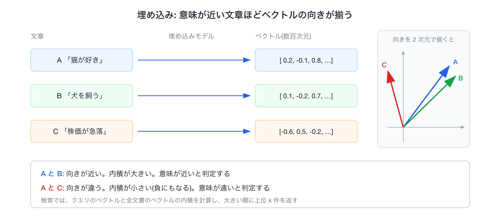
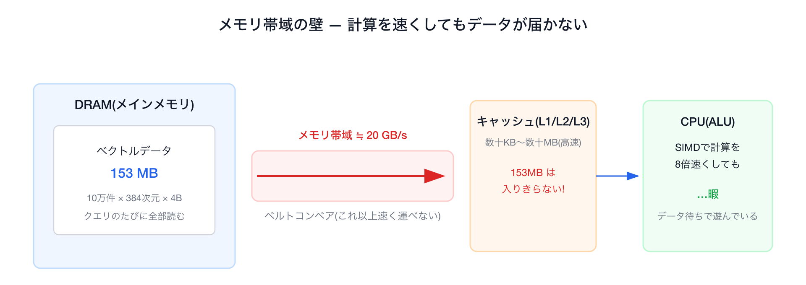

# Go × SIMDで高速化するベクトル検索 — ルーフラインモデルでSIMDが効く境界を探れ！

## はじめに

Go 1.27 の標準 SIMD(`simd/archsimd`)を使い、外部ライブラリなしの Pure Go でベクトル検索を高速化する教材です。題材は内積によるベクトル検索です。ただ速くするのではなく、ルーフラインモデルで「いま何が性能の上限になっているか」を測ってから対処を選んでいきます。

学べることは次の 5 つです。

- Go の標準 SIMD　の書き方
- ルーフラインモデルの使い方
- SIMD がどこで効くか
- 高速化の各種方法


## 01. そもそも SIMD ってなに？

SIMD を使わない内積から始めます。次の Go コードがそれです。

```go
var sum float32
for i := range a {
    sum += a[i] * b[i]   // 1個ずつ かけて 足す
}
```

このループは値を 1 個ずつ処理します。`a[i]` と `b[i]` を 1 個取り出し、1 回かけ算して、足すしています。つまり 1 命令で float32 を 1 個しか扱いません。これを**スカラ処理**と呼びます。

一方で、**SIMD**(Single Instruction, Multiple Data)は、その名のとおり「1 つの命令で複数のデータをまとめて」処理する CPU の機能です。CPU の中には普通の変数より大きなベクトルレジスタという入れ物があり、256bit のレジスタには float32(32bit)が 8 個入ります。8 個入れて掛け算命令を 1 回実行すると、8 個分の掛け算が同時に終わります。この違いを図にすると次のとおりです。


384 次元の内積なら、スカラで 384 回かかる掛け算が SIMD なら 48 回で済みます。理論上は 8 倍速くなります。

### Go の SIMD

Go 1.27 では `GOEXPERIMENT=simd` を付けてビルドすると `simd/archsimd` パッケージが使えます。Go 1.26 で導入され、1.27 で API の改訂と、arm64(Apple Silicon などの Arm CPU)と WebAssembly への対応が入っています。1.27 でもまだ「実験的」の扱いで、このフラグを付けないとパッケージ自体が存在せず、Go 1 の互換性保証の対象外です。

アセンブリも cgo も書かずにベクトル命令を直接扱え、メソッド呼び出しがほぼそのまま 1 つの CPU 命令にコンパイルされます。

```go
va := archsimd.LoadFloat32x8(a)        // float32 を8個ロード
vb := archsimd.LoadFloat32x8(b)
acc = va.MulAdd(vb, acc)               // acc += va*vb を 8 レーン同時に(FMA 命令)
```

`MulAdd` が使う **FMA**(Fused Multiply-Add)は、「掛けて、その結果を足す」を 1 命令で行う CPU 命令です。内積の `sum += a[i] * b[i]` はまさに「掛けて足す」なので、FMA 1 命令で 1 要素ぶん(SIMD なら 8 要素ぶん)が終わります。掛け算と足し算を別々の 2 命令で行うより命令数が半分で済み、途中結果の丸めも 1 回になります。x86 では AVX2 とは別の機能フラグ(FMA)として提供され、Arm の Neon には最初から入っています。

`archsimd` はアーキテクチャ固有の API です。型も命令も CPU ごとに違います。名前の対応は次のとおりです。amd64 は Intel と AMD の 64bit CPU(x86)のことで、その SIMD 命令セットが AVX2(256bit)と AVX-512(512bit)です。arm64 は Arm 系の 64bit CPU(Apple Silicon、AWS Graviton など)のことで、その SIMD 命令セットが Neon(128bit)です。Neon は arm64 の必須機能なので、どの arm64 CPU でも使えます。WebAssembly はブラウザなどで動く実行形式で、128bit の SIMD を持ちます。Go 1.27 の `archsimd` はこの 3 つに対応しています。

本編のコードと数字は amd64 の Codespaces で取ったものです。Apple Silicon の Mac でも Go 1.27 からは Neon 版の `internal/vec/dot_arm64.go` が走りますが、環境が違うため、出てくる数字は本編とは別物になります(§09)。同じ内積をアーキに依存せず書けるポータブルな `simd` パッケージも 1.27 で入りました。Stage 1 のコラムで使います。

### archsimd の API

`archsimd` は特別な構文を覚えるパッケージではありません。ベクトルレジスタを表す「型」を宣言し、その型の「メソッド」を呼ぶだけです。覚えることは次の 3 つです。

#### ① 型が「データの形」を表す

型名そのものが「何ビット幅のレジスタに、どの型の値を何個詰めるか」を意味します。詰めた 1 個ぶんの区画を**レーン**と呼びます。256bit のレジスタに float32(32bit)を詰めると 8 レーンで、1 つの命令はこの 8 レーン全部に同じ演算を同時にかけます。型を選ぶことが、使う命令幅とレーン数を選ぶことになります。

```go
var a archsimd.Float32x8    // float32 を8レーン  = 256bit(AVX2)
var b archsimd.Float32x16   // float32 を16レーン = 512bit(AVX-512)
var c archsimd.Uint64x4     // uint64 を4レーン
```

#### ② メソッドが「1 つの CPU 命令」に対応する

各メソッドはベクトル命令にほぼ 1 対 1 で変換されるので、メソッド名から出てくる機械語の見当がつきます。

```go
va := archsimd.LoadFloat32x8(xs)       // スライス → レジスタ(ロード)
va = va.MulAdd(vb, acc)                // 積和      → VFMADD
xo := vc.Xor(vd)                       // XOR       → VPXOR(vc・vd は Uint64x4。Xor は整数ベクトル専用)
po := xo.OnesCount()                   // popcount(立っている bit を数える)→ VPOPCNTQ
va.Store(xs)                           // レジスタ → スライス(ストア)
```

#### ③ 使う前に、その CPU が対応しているか確かめる

未対応の CPU で呼ぶと panic するので、実行時に機能フラグでガードします。

```go
var hasSIMD    = archsimd.X86.AVX2() && archsimd.X86.FMA()                 // MulAdd は AVX2 + FMA が要る
var hasVPOPCNT = archsimd.X86.AVX512() && archsimd.X86.AVX512VPOPCNTDQ()   // OnesCount は AVX-512 VPOPCNTDQ
```

## 02. ベクトル検索ってなに？

今回のワークショップでは SIMD の題材にベクトル検索を選びました。RAG やセマンティック検索を支える中核技術です。

仕組みは単純です。文書もクエリも「埋め込みモデル」で数百次元の数値ベクトルに変換しておき、クエリのベクトルと内積が大きい文書を意味が近い文書とみなして、上位 k 件を返します。

埋め込みモデルは、意味が近い文章ほどベクトルの向きが揃うように学習されています。向きが揃った 2 本のベクトルは内積が大きく、向きがバラバラだと小さくなります。そのため「内積が大きい」を「意味が近い」の代わりに使えます。



図: 文章を埋め込みモデルでベクトルにすると、A と B のように意味が近い文章は向きが揃い内積が大きくなる。C のように意味が遠い文章は向きが違い内積が小さくなる。

ベクトル検索の全体の流れを図にすると次のようになります。


計算の本体は「内積を 10 万回計算する」ことです。内積は掛け算と足し算の塊なので、SIMD が得意とする部分です。世のベクトル検索エンジン(Faiss、Qdrant、ClickHouse など)も、内積などの距離計算を SIMD で実装しています。本ワークショップでは、それを Pure Go で作ります。本ワークショップの題材カーネルは `acc += a[i]*d[i]`(クエリ a と DB ベクトル d の内積)で、これを 10 万本ぶん回します。

### 今回の実験の前提

今回の実験では、ルーフラインで「何で詰まっているか」をはっきり見せるため、次の前提をおいています。

| 項目 | 今回の設定 | 本番でよくある形 |
|---|---|---|
| 探索 | **全探索**(10万件すべてと内積) | HNSW・IVF など候補を絞る近似索引で一部だけ触る |
| クエリ | **1本ずつ**(最初の2段階) | 同時に多数のクエリが来る |
| スレッド | **1コア**(1クエリのレイテンシを測る。並列は §06 のコラムで実測) | マルチコアで並列処理 |
| データ | **メモリ上の配列** | ディスク・ネットワーク越し |
| 次元 | **384次元 float32** | 同程度だが量子化も多い |

## 03. まず動かしてみる

SIMD とベクトル検索の概要が分かったところで、一度動かして現状の速さを測ります。まず環境を用意し、続けてベースラインを計測します。

### 環境を用意する

本編の環境は amd64(Intel/AMD)です。一番楽なのは GitHub Codespacesでのセットアップです。Go 1.27 からは Apple Silicon 上でも Neon 版の SIMD が走りますが、幅も帯域も違う別の結果になります。必要なものは Go 1.27 と make だけです。

**① Codespaces(推奨)** リポジトリの `Code → Codespaces → Create`。`.devcontainer/` に Go 1.27 + `GOEXPERIMENT=simd` が入っているので、開いたらそのまま下の「動かす」に進めます。マシンサイズの選び方、費用、困ったときのフォールバックは [SETUP.md](SETUP.md) にまとめてあります。

**② ローカル(amd64 Linux / Windows)**

```bash
git clone https://github.com/po3rin/gocon2026-simd-search
cd gocon2026-simd-search
go install golang.org/dl/go1.27.1@latest && go1.27.1 download   # Go 1.27 を入れる
make GO=$(go env GOPATH)/bin/go1.27.1 test                      # GOEXPERIMENT=simd は Makefile が付与
```

**③ ローカル(Apple Silicon の Mac)** コマンドは②と同じです。Go 1.27 から `archsimd` が arm64 に対応したので、`make bench1` を実行すると Neon(128bit)版の SIMD が走ります。本編の数字(AVX2・256bit)とは別物なので、§09 の環境メモを読んでから自分の Mac の値として眺めてください。`make isa-report` でどの Neon 命令が使われているか一覧できます。

### 動かす

正しさの確認とベースラインの計測は、次の 2 コマンドで行います。

```bash
make test       # 正しさ確認(通ればOK)
make bench0     # スカラ実装の全探索(=ベースライン)を測る

# ↓ 出てくる数字(4コア Codespace / AMD EPYC 7763 の例):
# BenchmarkSearchNaive   35.7 ms/op
```

実際の画面には `35856977 ns/op  4283 MB/s  0.5 算術強度(flop/byte)  2.142 GFLOP/s  153.6 MB/query` のように ns 単位と指標つきで出ます(この回は約 35.9 ms。実行ごとに 35〜36 ms 程度でばらつきます。本ワークショップの例は、その中の 1 回分 35.7 ms を読みやすく整形したものです)。右側の指標(GFLOP/s・算術強度)はこのあと §04〜05 で解説するので、いまは「そういう列がある」と覚えておけば十分です。

10 万件のベクトルから上位の結果を返すのに、1 クエリ 35 ms(全探索・1 スレッドの前提)。素朴に書くとこのくらいかかります(数字は CPU によって変わります)。本ワークショップがこれからやることは 1 つ、**この全探索をどう速くするか**です。

「SIMD で並列計算すれば速くなる」と思うところですが、やみくもに SIMD を足しても、最後はメモリ帯域の上限で頭打ちになります。

そこで本ワークショップは、いきなり速くしようとせず、先に「何で詰まっているか」を測ってから対処を選びます。そのための道具がルーフラインモデルです。

## 04. ルーフラインモデルで高速化する

ルーフラインモデルは、コードの算術強度と、マシンの演算ピークおよびメモリ帯域から、そのコードが達成できる性能の上限を求める性能モデルです(原典は [Williams, Waterman, Patterson, 2009](https://dl.acm.org/doi/10.1145/1498765.1498785)。§08 に書誌情報)。上限は「演算ピーク」と「算術強度 × メモリ帯域」の小さい方で決まります。図は要りません。3 つの数字があれば計算できます(§05 で実際に計算します)。この式を横軸 算術強度、縦軸性能で描くと屋根の形になるので roofline と呼ばれ、図にすると「どちらの上限に近いか」が見やすくなるため、本ワークショップでも図で見ます。コードが遅いとき、原因は大きく 2 つに分かれます。

* 演算律速； 計算そのものが重い
* メモリ律速； データの搬送待ち

どちらで遅くなっているかが分からないまま高速化の手法を入れても、無駄に終わることがあります。まずどちらで詰まっているかを見極めるのがルーフラインモデルの役目です。

CPU がデータを置いておく場所は 3 種類あり、読み出しの速さと容量が桁で違います。

| 場所 | 容量 | 読み出しの速さ |
|---|---|---|
| レジスタ | 数百バイト | 最も速い(計算器の隣) |
| キャッシュ(L1/L2/L3 の 3 段) | 数十 KB〜数十 MB | 速い |
| DRAM(メインメモリ) | 数 GB〜 | 遅い。1 秒に運べる量(帯域)がキャッシュより桁で小さい |

CPU はまずレジスタとキャッシュにあるデータを使い、そこに無いデータだけを DRAM から取ってきます。「メモリ律速」とは、データがキャッシュに収まらず DRAM からしか届かないため、計算器がデータ待ちで止まってしまう状態のことです。



図: 本ワークショップのデータ(10 万件 = 153MB)はキャッシュに入りきらず、クエリのたびに DRAM から帯域の上限の速さで運ぶことになる。

下図は、縦軸に性能(GFLOP/s。1 秒あたりの浮動小数点演算回数)、横軸に算術強度(計算量 ÷ データ転送量)を取り、その機械の物理的な上限を線で描いたものです。この線が屋根(roofline)の形をしているのが名前の由来です。左側にメモリ帯域で決まる右上がりの斜線(メモリ律速)、右側に演算ピークで決まる水平線(演算律速)の領域があります。


ここで**算術強度**(ベンチの出力では AI と表示されます)とは「メモリから 1 バイト運ぶごとに、何回計算するか」(flop/byte)です。今回の全探索・1 クエリの前提では、内積は要素あたり mul 1 + add 1 = 2 flop で、DB ベクトルを要素あたり 4 バイト(fp32 = float32)読みます(クエリ側は 10 万件で使い回すのでキャッシュに残り、毎回は運びません)。この前提で計算すると、算術強度は 0.5 になります。

```text
算術強度 = 2 flop / 4 byte = 0.5 flop/byte
```

どんな最適化もこの線より上には行けません。ここに自分のコードの達成性能(GFLOP/s)と算術強度を当てはめると、点の位置は 3 通りに分かれ、それぞれ対処が違います。

| 点の位置 | 意味 | 対処 |
|---|---|---|
| どちらの上限からも遠い(線のずっと下) | 上限以前に、コードが CPU の能力を使い切れていない | コードの並列度を上げる。関係のない命令を同時に走らせる、SIMD でまとめて計算する |
| 斜線(メモリ帯域の上限)のすぐ下 | メモリ律速。データを運ぶ速さで頭打ち | 算術強度を上げる。同じデータで計算を増やす(再利用)か、運ぶバイトを減らす(量子化) |
| 水平線(演算ピーク)のすぐ下 | 演算律速。計算の速さで頭打ち | 実装効率を上げて演算ピークに近づける |

点がどの上限の下にあるかで、どの最適化から始めるべきかが決まる、というのが原典の Williams らの主張です。本ワークショップは、まず計算側の対処(並列度、SIMD)で点を線まで上げ、次にメモリ側の対処(算術強度)で点を右へ動かす順で進みます。

では、今回使うマシンの上限(メモリ帯域と演算ピーク)はどこにあるのかを次の章で測ります。

## 05. 性能の上限を測る

性能の上限はマシンごとに違います。理屈で決め打ちせず、実際に測るのがこの章です。

測るのは `make roofline-ceiling` です。検索のコードは走らせず、マシンの上限だけを測る小さなベンチを 3 つ実行します。

1. **演算ピーク**(`PeakFLOP_AVX2`): メモリに一切触らず、レジスタ上で FMA(積和)命令だけを回し続けて、1 秒に何回計算できるかを測る
2. **メモリ帯域の上限**(`PeakReadBW`): キャッシュに収まらない 256MB の配列を先頭から末尾まで読み、1 秒に何 GB 運べるかを測る
3. **読み書き混在の帯域**(`PeakTriadBW`): 2 つの配列を読んで計算し、結果を 3 つ目の配列に書き戻す標準ベンチ(STREAM Triad)。メモリ帯域の一般的な指標として載せている

1 と 2 がルーフラインの式に入れる 2 つの数字です。今回の検索は DB ベクトルを読むだけで、大きな配列への書き込みはしません。そのためメモリ帯域には 2 の読むだけの値を使い、3 は他の資料の数字と見比べるための参考値です。実行します。

```bash
make roofline-ceiling
# 中身: go test ./internal/vec -run - \
#         -bench 'BenchmarkPeak(FLOP_AVX2|ReadBW|TriadBW)$' -benchtime 2s

# ↓ 4コア Codespace(SETUP.md の指定サイズ・AMD EPYC 7763 / Zen3・1コア)での実際の出力:
BenchmarkPeakFLOP_AVX2     25.59 GFLOP/s     ← 演算ピーク(FMA を飽和させた値)
BenchmarkPeakReadBW        20.80 read-GB/s   ← 順次 read(SIMD で DRAM 読みを飽和)
BenchmarkPeakTriadBW       17.36 triad-GB/s  ← STREAM Triad(read+write の標準指標)
```

3 つの数字が出ました。これがこのマシンの性能の上限です(演算ピーク 約 25.5 GFLOP/s、メモリ帯域 約 20 GB/s)。この数字を出しているコードが何をしているかを、次の 2 節で説明します。測り方が分かっていれば、自分のマシンで出た数字が読めます。

### FMA をレジスタ上で連打して演算ピークを見る

演算ピークは「メモリも依存連鎖(前の計算が終わるまで次の計算を待つこと)も挟まず、FMA だけを限界まで回したら何 GFLOP/s 出るか」で測れます。

そのため、独立したアキュムレータ(途中結果をためる変数)を 12 本用意し、レジスタ上だけで FMA を連打します。

```go
// 12本の独立アキュムレータ。漸化式 a = a*m + c はメモリにも触れない
m, c := fill8(0.9999), fill8(1.0)
a0, a1, /* … */ a11 := fill8(0.5), fill8(1.5), /* … */ fill8(11.5)
for b.Loop() {
    for j := 0; j < inner; j++ {
        a0 = a0.MulAdd(m, c)   // ← FMA。互いに独立なので 12本が並んで走る
        a1 = a1.MulAdd(m, c)
        /* … a2 〜 a11 も同様 … */
    }
}
flop := float64(iters) * inner * 12 * 8 * 2  // 12acc × 8lane × 2flop/FMA
b.ReportMetric(flop/sec/1e9, "GFLOP/s")      // ← これが 25.59
```

実測は **25.5 GFLOP/s** です。試しにアキュムレータを 4 本に減らした `BenchmarkPeakFLOP_AVX2_4acc` を測ると 13.4 GFLOP/s まで落ちます(本数を減らすと遅くなる)。理論ピークは約 100 GFLOP/s で、実測はその約 1/4 です。原因は Go のコード生成にあり、下のコラムで説明します。ただし検索は算術強度 0.5 の深いメモリ律速なので、この低さは結論を変えません。

> **コラム: なぜ理論ピークの 1/4 で止まるのか(register spill)**
>
> 言葉を 2 つ定義します。**レジスタ**は CPU の中にある一番速い値の置き場で、SIMD 用は 16 本しかありません(そのうち Go が使えるのは 15 本)。**スタック**はメモリ上の作業領域で、レジスタよりずっと遅い場所です。
>
> 上のループでは、12 本のアキュムレータ a0〜a11 を FMA で更新し続けます。理想は 12 本ぜんぶをレジスタに置いたまま回すことです。ところが Go 1.26 / 1.27 のコンパイラは、このループで各アキュムレータを毎回スタックに書き出し、次の周回で読み戻すコードを出します。値をレジスタに置いておけず、メモリとの間を往復させてしまうことを **register spill** と呼びます。
>
> `make spill` を実行すると、このループの機械語(コンパイラの `-S` 出力)が見られます。amd64 向けにクロスコンパイルするだけなので mac でも動きます。a0 の 1 回分を抜き出すと次の 3 行になります。
>
> ```text
>   VMOVDQU     a0+952(SP), Y2     ← ① a0 をスタックからレジスタ Y2 に読み戻す
>   VFMADD213PS Y1, Y0, Y2         ← ② a0 = a0*m + c を計算する(本来はこの 1 行だけでよい)
>   VMOVDQU     Y2, a0+952(SP)     ← ③ 結果をスタックに書き戻す
> ```
>
> `(SP)` がスタック上の場所です。計算は②の 1 命令なのに、その前後に①③の読み書きが毎回付きます。理想と実際を並べると次のようになります。
>
> 
>
> これが a0〜a11 の 12 本ぶん、ループのたびに繰り返されるので、CPU は計算よりも読み書きに時間を使い、FMA が理論の 1/4 しか回りません。アキュムレータを 4 本に減らしても spill は消えず、待ち時間を隠せなくなるぶん遅くなります(13.4 GFLOP/s)。
>
> 本数が多すぎるわけではありません。12 本に定数の m と c を足した 14 本は、使える 15 本に収まります。レジスタが足りないのではなく、コンパイラが載せてくれないのが原因です([golang/go#76969](https://github.com/golang/go/issues/76969))。spill を消せば理論ピークに届くかは、本ワークショップでは検証していません。
>
> この事実は検索の結論を変えません。検索は算術強度 0.5 のメモリ律速なので、演算ピークが低くても当たっている上限はメモリ帯域のままです。arm64 の Neon でも同じ spill が起きます。Apple M3 Pro で 12 本の FMLA ループ(`BenchmarkPeakFLOP_NEON`)は 32 GFLOP/s に留まり、各 FMLA の前後に `FMOVQ …(SP)` が付きます。

### キャッシュに乗らない巨大配列を先頭から末尾まで順番に読んでメモリ帯域の上限を見る

メモリ帯域は「DRAM から 1 スレッドで流し読みしたら何 GB/s 出るか」で測ります。キャッシュに収まると DRAM を測れないので、256MB(最後段のキャッシュ L3 を確実に溢れる)の配列を先頭から末尾まで順番に読みます。コードは `internal/vec/ceiling_mem_simd_test.go` にあります。次はその主要部分で、Triad の実コードは 4 本に展開してあります。

```go
const memN = 1 << 26  // 67,108,864 float32 = 256 MB(L3 溢れ確実)

// read 帯域: 検索カーネルと同じ 256bit ロード(8本のアキュムレータ)で
// DRAM 読みを飽和させる。スカラ縮約だと足し算の発行律速で過小評価するため SIMD で測る
for b.Loop() {
    var a0 archsimd.Float32x8 /* … a7 まで … */
    for len(x) >= 64 {
        a0 = archsimd.LoadFloat32x8(x).Add(a0)   /* … x[8:] 〜 x[56:] も … */
        x = x[64:]
    }
}
b.ReportMetric(gb, "read-GB/s")    // ← 20.80

// Triad(STREAM 標準): a = b + s*c。read b + read c + write a で3配列ぶん(SIMD)
for len(aa) >= 8 {
    archsimd.LoadFloat32x8(cc).MulAdd(s, archsimd.LoadFloat32x8(bb)).Store(aa)
    aa, bb, cc = aa[8:], bb[8:], cc[8:]
}
b.ReportMetric(gb, "triad-GB/s")   // ← 17.36
```

帯域の 2 つの測り方を確認します。`BenchmarkPeakReadBW`(約 20 GB/s)は読み専用で、検索カーネルと同じ SIMD ロードなので DRAM の読み出し帯域をそのまま測れます。`BenchmarkPeakTriadBW`(17.4 GB/s)は業界標準の STREAM ベンチで、read+write を含むぶん少し低くなります。今回の検索は DB ベクトルを読むだけで書き戻さないので、メモリ帯域の上限には **read 帯域 約 20 GB/s** を使います。実際、SIMD 全探索(先頭から順番に読む)が 19.4 GB/s とほぼ一致するので、この数字をメモリ帯域の上限と見ます。

### マシンの上限から、全探索の上限を見積もる

さきほど測った数字を使って、「全探索はせいぜいどれくらい速くなれるか」を見積もります。

| 種類 | このマシンの上限 | 意味 |
|---|---|---|
| メモリ帯域(read) | **~20 GB/s** | DRAM からデータを読む速さの上限(1 コア) |
| 演算ピーク | **25.5 GFLOP/s** | 計算だけを回し続けたときの上限(今回の Go 実測) |

CPU チップの理論値はもっと上ですが、いま動かしている Go コードでは 25.5 が現実的な上限です。ルーフライン図には理論値も載せますが、ここではまず実測の 25.5 と 20 を使います。

**内積はどちらに引っかかるか**

内積の算術強度は、§04 で計算したとおり 0.5 でした。これは「1 バイト読むごとに、計算は 0.5 回しかない」という意味で、かなり少ない部類です。

メモリ律速と演算律速が切り替わる境目を**リッジ**と呼びます。おおよそ次で求まります。

```text
リッジ = 演算ピーク ÷ メモリ帯域 = 25.5 ÷ 20 ≈ 1.3 flop/byte
```

- 算術強度が 1.3 より小さいなら、計算が足りないのではなく、データの読み込み待ち(メモリ律速)
- 算術強度が 1.3 より大きいなら、計算の処理能力が上限(演算律速)

内積の 算術強度 0.5 は 1.3 よりずっと小さいので、メモリ律速です。

**メモリ律速のときの上限**

メモリ律速では、上限は次の式で求まります。

```text
上限 ≈ 算術強度 × メモリ帯域 = 0.5 × 20 ≈ 10 GFLOP/s
```

全探索は、どれだけ上手く書いても **10 GFLOP/s 前後**が上限という見込みが立ちます。最初のベースライン(`make bench0`)の 2.15 GFLOP/s は、この上限にすらまだ届いていなかったことになります(あとで SIMD 化すると、この上限のすぐ下 9.7 まで来て止まるのを見ます)。

これでこのマシンの上限(メモリ帯域 約 20 GB/s、演算ピーク 25.5 GFLOP/s)が求まりました。このあと、改良を 1 つ足すたびに出る数字を、この上限と突き合わせていきます。特に「SIMD 化しても約 10 GFLOP/s で止まる」という見積もりは、次章の Stage 1 で実測と突き合わせます。コードを 1 行も直す前に結果を予測できるのが、ルーフラインの価値です。

## 06. 高速化

さきほど測った上限と比べながら、改良を加えていきます。下の図は、その過程をルーフラインに重ねたものです(横軸 = 算術強度、縦軸 = 性能、斜線 = メモリ帯域の上限、水平線 = 演算ピーク)。点がどちらの上限に近いか(メモリ律速か演算律速か)を、Stage ごとに確認します。


図: スカラ、SIMD(メモリ帯域の上限)、カーネル単体(演算側)、int8(リッジの右)、1bit 量子化(右上へ)。各点の詳細は下の各節で。

ここからは検索のコードを直して、動かして出る数字を見るパートです。 `internal/vec` / `internal/index` の実コードを使っていきます。手元で追うときは、各節のあとに対応するコマンドを走らせます。

```bash
make bench0          # Stage 0: スカラ基準
make bench1          # Stage 1: SIMD 化(カーネル単体 + 全探索の2粒度)
make roofline-batch  # Stage 2: バッチ化の比較
make bench-parallel  # コラム: goroutine 並列はどの上限に効くか
make bench-int8      # Stage 3: int8 量子化(1/4)
make recall-int8     # Stage 3: int8 の精度(Recall@10)
make bench2          # Stage 4: バイナリ量子化(1/32)
make bench3          # Stage 5: 仕上げ(rerank の速度)
make recall          # Stage 4/5: 精度まとめ(binary / rerank / int8)
make roofline        # 上の結果をルーフライン図用に一覧
make roofline-plot   # 実測から対話的ルーフライン HTML を生成(点が上限に近づくのを見る)
```

各節に出てくる GFLOP/s と 算術強度は、これらのベンチが自動で計算して表示します(特別なプロファイラは不要です。算出の詳細は `internal/index/bench_test.go` にありますが、本編では検索コードに集中します)。

### Stage 0 — スカラ基準(ベースライン)

最適化はまず基準値からです。素朴に「1 要素ずつ」内積を回し、達成性能と 算術強度を測ります。以降の手が効いたかは、この基準からの変化で判断します。検索は全ベクトルと内積して上位 k 件を返すだけです。

```go
// internal/vec/dot.go
func DotNaive(a, b []float32) float32 {
    var sum float32
    for i := range a {
        sum += a[i] * b[i]        // 1個ずつ かけて 足す(前の sum に依存=直列)
    }
    return sum
}

// internal/index/index.go — 全探索
func (ix *Index) SearchNaive(q []float32, k int) []Result {
    t := newTopK(k)
    for id := 0; id < ix.N; id++ {              // 10万ベクトル全部と内積
        t.push(id, vec.DotNaive(q, ix.Vec(id)))
    }
    return t.results()
}
```


```bash
$ make bench0
BenchmarkSearchNaive   35.7 ms/op   2.15 GFLOP/s   0.5 AI(flop/byte)   153.6 MB/query
```


図: Stage 0 の位置。算術強度 0.5、2.15 GFLOP/s。メモリ帯域の上限(約 10)にすら届かない左下。


#### どうなったか

全探索 35.7 ms、**2.15 GFLOP/s**、算術強度 0.5。メモリ帯域の上限(約 10 GF)にすら届いていません。メモリ帯域より先に、別のもので詰まっています。

詰まっているのは `sum += a[i] * b[i]` の足し算です。CPU は本来、互いに関係のない命令なら同時にいくつも実行できます。ところがこのループの足し算は、前の `sum` が出来上がらないと次の足し算を始められません。384 回の足し算が 1 本の列になって、1 つずつ順番に待つ形になります。

この待ち時間で、カーネル 1 回(384 要素)の実測 348 ns がほぼ説明できます。

```text
足し算 1 回の待ち時間: 約 3 サイクル(Zen3 の float 加算。サイクルは CPU クロックの 1 拍)
384 回 × 3 サイクル = 1152 サイクル
1152 サイクル ÷ 約 3.5 GHz ≈ 330 ns   ← 実測 348 ns とほぼ同じ
```

Stage 0 は、掛け算や読み込みが遅いのではなく、足し算の順番待ちだけで時間を使い切っています。

#### 次の一手

§04 の表でいうと、点はどちらの上限からも遠い 1 番目の位置です。対処は「コードの並列度を上げる」で、その代表が同時に複数の値を計算する SIMD です。次の Stage 1 で SIMD 化します。

### Stage 1 — AVX2 で SIMD化

それでは SIMD による高速化を試していきます。まずは SIMD 化を 1a「まとめて読む」、1b「待ち時間を隠す」の順に分けて理解します。

#### Stage 1a — まとめて読む (Float32x8)

まず、1 個ずつの内積を 8 個まとめて処理する形に置き換えます。`Float32x8` でスライスから 8 要素をベクトルレジスタにロードし、`MulAdd`(FMA)でアキュムレータに足し込みます。アキュムレータ 1 本の、いちばん短い形です。

```go
// アキュムレータ 1 本で 8 個ずつ処理する
var acc archsimd.Float32x8                 // アキュムレータ1本
for len(a) >= 8 {
    va := archsimd.LoadFloat32x8(a)        // float32 を8個ロード
    vb := archsimd.LoadFloat32x8(b)
    acc = va.MulAdd(vb, acc)               // acc += va*vb を8レーン同時に
    a = a[8:]; b = b[8:]
}
// 最後に acc の8レーンを1個に足し込む(水平和)→ 端数処理
```

これで「1 命令で 8 個」は動きます。しかし、まだ理論ほど速くなりません。理由が次の 1b です。

#### Stage 1b — なぜアキュムレータを2本にするのか(待ち時間を隠す)

1a のループは、Stage 0 と同じ問題を抱えています。`acc = va.MulAdd(vb, acc)` は前の周回の `acc` を読んで新しい `acc` を書くので、前の FMA の結果が出るまで次の FMA を始められません。FMA は結果が出るまで 4 サイクル前後かかります。CPU は本来 1 サイクルに FMA を 2 つ始められるのに、アキュムレータが 1 本だと 4 サイクルに 1 つしか始められず、8 レーンになっただけで Stage 0 と同じ順番待ちが残ります。

そこでアキュムレータを `acc0` と `acc1` の 2 本にし、偶数番目の 8 要素は `acc0` に、奇数番目の 8 要素は `acc1` に足し込みます。2 本は互いの結果を待たないので、`acc0` の FMA が終わるのを待つ間に `acc1` の FMA を始められます。順番待ちの列が 2 本に分かれ、待ち時間が半分になります。ループが終わったら `acc0` と `acc1` を足して 1 本にし、その 8 レーンを足し合わせて 1 つの数にします(この最後の足し合わせを水平和と呼びます)。

もう 1 つ、コードの最後に `archsimd.ClearAVXUpperBits()` があります。Intel の CPU では、256bit の SIMD 命令を使った直後に SIMD でない浮動小数点命令(水平和のスカラの足し算など)を実行すると、モードの切り替えで大きく遅くなることがあります。境界で VZEROUPPER という 1 命令を実行するとこれを防げます。Go のコンパイラは 1.27 でもこの命令を自動では入れないので、標準 API の `ClearAVXUpperBits()` で自分で呼びます。AMD では起きない現象ですが、呼んでも害はありません。詳しくは付録の [hidden-ceilings.md](../appendix/hidden-ceilings.md) にあります。

```go
// internal/vec/dot_simd.go  (GOEXPERIMENT=simd, amd64)
import "simd/archsimd"

func Dot(a, b []float32) float32 {
    if !hasSIMD {
        return DotNaive(a, b)              // AVX2+FMA の無い amd64 はスカラに退避(arm64 は dot_arm64.go の Neon 版)
    }
    var acc0, acc1 archsimd.Float32x8      // ★ 1b: アキュムレータ2本で待ち時間を隠す
    for len(a) >= 16 {
        acc0 = archsimd.LoadFloat32x8(a).MulAdd(archsimd.LoadFloat32x8(b), acc0)
        acc1 = archsimd.LoadFloat32x8(a[8:]).MulAdd(archsimd.LoadFloat32x8(b[8:]), acc1)
        a = a[16:]; b = b[16:]             // 前進(境界計算をループ条件に吸収)
    }
    var buf [8]float32
    acc0.Add(acc1).Store(buf[:])
    archsimd.ClearAVXUpperBits()           // ★ VZEROUPPER。Intel機の遷移ペナルティ対策(AMDでは不要・無害)。Goは自動挿入しない
    sum := buf[0]+buf[1]+buf[2]+buf[3]+buf[4]+buf[5]+buf[6]+buf[7]
    for i := range a {                     // 8の倍数でない端数
        sum += a[i] * b[i]
    }
    return sum
}
```

上のコードは主要部分だけです。長さのチェックと、8 の倍数に満たない端数の処理を含む完全なコードは `internal/vec/dot_simd.go` にあります。

```bash
$ make bench1    # カーネル単体(internal/vec)と全探索(internal/index)の2粒度(表示は整形・抜粋)
BenchmarkDotNaive     348  ns/op                        ← カーネル: スカラ基準
BenchmarkDotSIMD       55.2 ns/op                       ← カーネル単体 6.3x
BenchmarkSearchSIMD     7.9 ms/op   19.4 GB/s           ← 全探索 4.5x。メモリ帯域の上限(~20)に到達
```


図: Stage 1 の位置。全探索はメモリ帯域の上限(約 20 GB/s)に達し(9.7 GFLOP/s)、カーネル単体だけ右上の別の点。

#### どうなったか

カーネル単体は 348 ns から 55 ns(6.3x)、全探索も 35.7 ms から 7.9 ms(4.5x)速くなりました。SIMD は確かに効いています。ただし見るべきは「どこで止まったか」です。全探索の達成は **9.7 GFLOP/s**。これは §05 で見積もったメモリ帯域の上限 0.5 × 約 20 ≈ 10 GFLOP/s の直下で、帯域に直すと 19.4 GB/s、メモリ帯域の上限(約 20)の約 97% です。算術強度 0.5 のまま、メモリ帯域のほぼ上限に達しました。

#### 次の一手

Stage 1 の点はメモリ帯域の上限に達しました。ここから先は、内積の実装をいくら速くしても全探索は速くなりません。SIMD の幅を 8 レーンから 16 レーン(AVX-512)に広げても、DRAM から運ぶバイト数は同じなので、かかる時間も同じです。

点を上に動かせないなら、右に動かします。つまり算術強度(運ぶ 1 バイトあたりの計算回数)を上げます。やり方は 2 つあります。

1. **再利用**: 運んだ DB ベクトル 1 本を、複数のクエリで使い回す。運ぶ量は同じで計算が増える。結果は正確なまま(Stage 2)
2. **バイト削減**: DB ベクトルを小さい型で持ち、運ぶ量そのものを減らす。結果は近似になる(Stage 3 の int8、Stage 4 の 1bit)

> **コラム: 端数はマスク付きロードでも書ける**
>
> 上のコードは 8 の倍数に満たない端数をスカラループで処理しています(384 次元は 16 で割り切れるので、実は一度も通りません)。Go 1.27 には端数専用の `LoadFloat32x8Part`(足りないレーンをゼロ埋めして読むマスク付きロード。1.26 では `LoadFloat32x8SlicePart` という名前でした)があり、端数もベクトルのまま処理できます。端数処理を標準 API だけで書けます。

> **コラム: SIMD が効く境界はデータサイズの軸にもある(`make bench-nsweep`)**
>
> カーネル単体 6.3x と全探索 4.5x の差は、データが L1 に収まるか DRAM から流れてくるかの差でした。DB 件数を変えると、SIMD の倍率がキャッシュに収まらなくなる所で落ちるのが見えます。
>
> | DB 件数 | データ量 | naive | SIMD | 倍率 |
> |---|---|---|---|---|
> | 1,000 | 1.5 MB(キャッシュ内) | 351 µs | 61 µs | **5.8x** |
> | 10,000 | 15 MB(L3) | 3.5 ms | 0.61 ms | **5.7x** |
> | 100,000 | 154 MB(DRAM) | 34.8 ms | 8.8 ms | **3.9x** |
> | 1,000,000 | 1.5 GB(DRAM) | 347 ms | 89.5 ms | **3.9x** |
>
> L3 に収まる間はカーネル並みの 5.7〜5.8x、DRAM に溢れた瞬間に 3.9x へ落ちて以後一定です(表は別インスタンスの実測なので Stage 1 本文と絶対値が少し違います。§05 のばらつきの注のとおり)。本編の 10 万件(154MB)は、意図的に DRAM から読む側に置いた設定です。

> **コラム: 同じ内積をポータブル simd で書く。レジスタ幅を半分にすると点はどこへ行くか(`make bench-portable`)**
>
> Go 1.27 には `archsimd` の上にもう 1 段、ベクトル長に依存しない `simd` パッケージが入りました。型名からレーン数が消え(`Float32x8` が `Float32s` になる)、幅は実行時に CPU が決めます(AVX-512 機なら 16 レーン、AVX2 機なら 8、Apple Silicon の Neon なら 4)。同じソースが amd64 / arm64 / Wasm で動き、命令の無い環境では純 Go でエミュレートされます。
>
> ```go
> // internal/vec/dot_portable.go(GOEXPERIMENT=simd。ビルドタグに amd64 は無い)
> var acc0, acc1, acc2, acc3 simd.Float32s   // 幅は実行時に決まる。4本で依存連鎖を短く
> n := acc0.Len()                            // このマシンのレーン数(4 / 8 / 16)
> for len(a) >= 4*n {
>     acc0 = simd.LoadFloat32s(a).MulAdd(simd.LoadFloat32s(b), acc0)
>     acc1 = simd.LoadFloat32s(a[n:]).MulAdd(simd.LoadFloat32s(b[n:]), acc1)
>     acc2 = simd.LoadFloat32s(a[2*n:]).MulAdd(simd.LoadFloat32s(b[2*n:]), acc2)
>     acc3 = simd.LoadFloat32s(a[3*n:]).MulAdd(simd.LoadFloat32s(b[3*n:]), acc3)
>     a = a[4*n:]; b = b[4*n:]
> }
> for len(a) > 0 {                           // 端数はマスク付きロードでベクトルのまま
>     va, k := simd.LoadFloat32sPart(a)
>     vb, _ := simd.LoadFloat32sPart(b)
>     acc0 = va.MulAdd(vb, acc0)
>     a = a[k:]; b = b[k:]
> }
> ```
>
> このパッケージには `GODEBUG=simd=128` のように幅を狭めて実行する仕組みがあります。同じバイナリで「256bit(8 レーン)」と「128bit(4 レーン)」の全探索を測り比べられます。Stage 1 の結論は「幅を 8 から 16 に広げても上限は動かない」でした。狭めた場合の結果です。
>
> ```bash
> $ make bench-portable   # 4コア Codespace(EPYC 7763)。表示は整形・抜粋
> BenchmarkDotSIMD          56.1 ns/op                          ← archsimd 版カーネル(Stage 1b)
> BenchmarkDotPortable      56.8 ns/op                          ← ポータブル版カーネル。同じ速さ
> BenchmarkSearchSIMD        8.6 ms/op  17.8 GB/s              ← 全探索: メモリ帯域の上限(~19)に達する
> BenchmarkSearchPortable    8.5 ms/op  18.1 GB/s  256 vec-bits ← 全探索: 同じ上限・同じ点
> BenchmarkSearchPortable   11.9 ms/op  12.9 GB/s  128 vec-bits ← GODEBUG=simd=128: 上限より下に落ちた(1.4x 遅い)
> ```
>
> 256bit では、ポータブル版の全探索(8.5 ms)は archsimd 版(8.6 ms)と同じ速さです。書き方が変わっても、ルーフライン上の点の位置は変わりません。
>
> 128bit にすると、カーネルは 57 ns から 107 ns に、全探索は 8.5 ms から 11.9 ms に遅くなりました。
>
> 理由は、DB ベクトル 1 本あたりの時間を比べると分かります。1 本は 1536 byte で、DRAM から運ぶのに 1536 byte ÷ 19 GB/s で約 80 ns かかります。1 本にかかる時間は、運ぶ時間と計算する時間のうち長い方で決まります。
>
> | 幅 | 計算する時間(カーネル 1 本) | 運ぶ時間(1 本) | 長い方 | 全探索 |
> |---|---|---|---|---|
> | 256bit | 57 ns | 約 80 ns | 運ぶ時間 | 8.5 ms |
> | 128bit | 107 ns | 約 80 ns | 計算する時間 | 11.9 ms |
>
> 256bit では計算が運ぶ時間より短いので、全体は運ぶ時間で決まり、点はメモリ帯域の上限に達します。128bit では計算の方が長くなり、全体は計算する時間で決まります。幅を狭めた結果、点はメモリ帯域の上限より下に落ちました。
>
> 逆に幅を 256bit より広げても、運ぶ時間の 80 ns は変わらないので、全探索はこれ以上速くなりません。Stage 1 の次の一手で「AVX-512 に広げても速くならない」と書いたのはこのためです。
>
> Apple Silicon は元から 128bit なので、`GODEBUG=simd=128` を付けても付けなくても同じ数字になります。
>
> ポータブル API に入っているのは、どのアーキでも共通に持てる演算だけです。Stage 3 の int8 用の命令や popcount は入っていないので、本編の量子化カーネルは `archsimd` のままです。

### Stage 2 — クエリのバッチ化

ここまでは、クエリを 1 本ずつ処理してきました。1 本のクエリのために DB ベクトル 10 万本を DRAM から順に運び、それぞれと内積を 1 回取って、捨てます。クエリが 32 本あれば、同じ 10 万本を 32 回運び直すことになります。

運ぶ回数を減らす方法があります。クエリを 32 本まとめて持っておき、DB ベクトルを 1 本運ぶたびに、32 本のクエリ全部と内積を取ってから捨てます。運ぶ量は 1 クエリのときと同じで、計算だけが 32 倍になります。

```text
1 本ずつ:   DB ベクトル 1 本を運ぶ → 内積 1 回        算術強度 0.5
32 本まとめ: DB ベクトル 1 本を運ぶ → 内積 32 回       算術強度 0.5 × 32 = 16
```

算術強度 16 はリッジ(1.3)より右なので、点は演算律速側に移ります。そこなら SIMD が効く見込みです。1 つ 1 つの内積は Stage 1 と同じ計算なので、結果は正確なままです。

なお、この形は行列と行列の掛け算そのものです(DB ベクトルを並べた行列 × クエリを並べた行列)。数値計算ライブラリや Faiss のバッチ検索が速いのも、同じ考え方で運ぶ回数を減らしているからです。

```go
// internal/index/index.go — B本のクエリを1パスで処理(d のロードを再利用)
func (ix *Index) SearchBatchSIMD(qs [][]float32, k int) [][]Result {
    tops := make([]*topK, len(qs))
    for b := range tops { tops[b] = newTopK(k) }
    for id := 0; id < ix.N; id++ {
        d := ix.Vec(id)                          // ① d を1回ロード
        for b := range qs {                      // ② B本のクエリで使い回す(d はキャッシュ常駐)
            tops[b].push(id, vec.Dot(qs[b], d))   // SIMD内積
        }
    }
    /* 各 tops[b].results() を返す */
}
```

```bash
$ make roofline-batch    # B=1(全探索) vs B=32(バッチ)、scalar vs SIMD (EPYC 7763 実測)
B=1   SearchSIMD         7.95 ms/query   9.66 GF   ← AI 0.5・メモリ帯域の上限(Stage 1)
B=32  SearchBatchNaive  34.24 ms/query   2.24 GF   ← AI 16・scalar
B=32  SearchBatchSIMD    5.79 ms/query  13.26 GF   ← AI 16・SIMD で 5.9x! 演算律速・exact
```


図: Stage 2 の位置。バッチ化で 算術強度が 0.5 から 16 と右へ動き、演算律速側に乗った(exact・精度そのまま)。

#### どうなったか

B=32 でクエリを束ねると算術強度は 0.5 から 16 になり、リッジを越えて演算律速側に移りました。そこでは **SIMD がスカラより 5.9x 速くなります**。scalar batch が 34.2 ms/query、SIMD batch が 5.79 ms/query で、GFLOP/s は 2.24 から 13.3 です。Stage 1 では 4.5x で頭打ちだった SIMD が、算術強度を上げると効きます。1 クエリあたりの時間も 7.9 ms から 5.8 ms に縮みます。

ちなみに「クエリが 32 本まとめて来る」という仮定は実際でも使われます。 ColBERT のようにクエリを複数のベクトルで表す検索方式(late interaction)では、DB ベクトル 1 本に対して複数の内積を取ることが方式そのものに含まれていて、最初から演算律速です。付録 A で実測しています(5.7x)。

なぜ律速が入れ替わるのかは、時間の内訳で分かります。1 要素を処理する時間は、運ぶ時間(バイト数 ÷ メモリ帯域)と計算する時間(flop ÷ 演算ピーク)のうち長い方でおおよそ決まります。計算する時間は要素あたり 2 flop で全 Stage 同じですが、バッチ化は運ぶ時間だけを 1/32 にします。そのため長い方が、運ぶ時間から計算する時間に入れ替わります。下の図は §05 で測った演算ピーク 25.6 GFLOP/s と read 帯域 20.8 GB/s から計算したものです。


図: Go 実測の上限から計算した時間内訳。Stage 1(算術強度 0.5)はメモリ時間が演算の約 2.5 倍でメモリ律速、Stage 2(算術強度 16)はメモリ時間が演算の約 1/13 に縮んで演算律速へ反転。`make roofline-decompose` で自分の上限から再生成できる。この「メモリ vs 演算」の内訳は CPU プロファイラ(pprof / trace)では出せず、ルーフラインが与えるもの。

#### 次の一手

バッチ化は、クエリが 32 本まとめて手元にあるときに使える方法です。クエリが 1 本ずつ来る検索では、Stage 1 のままメモリ帯域の上限に達しています。そちらを速くするには、算術強度を上げるもう 1 つの方法、運ぶバイト数そのものを減らす方向に進みます(Stage 3)。

> **コラム: goroutine で並列化すればいいのでは(`make bench-parallel`)**
>
> ここまでは全部 1 コアで測ってきました。goroutine で複数コアに分ければ速くなるのか、実測で確かめます。DB を workers 個に分けて goroutine で分担し、最後に各 goroutine の上位 k 件を 1 つにまとめます(`internal/index/parallel.go`)。
>
> ```go
> for w := 0; w < workers; w++ {
>     go func(t *topK, lo, hi int) {   // 各 worker は自分のチャンクだけ走査
>         defer wg.Done()
>         for id := lo; id < hi; id++ {
>             t.push(id, vec.Dot(q, ix.Vec(id)))
>         }
>     }(tops[w], lo, hi)
> }
> wg.Wait()
> // worker ごとの top-k をマージ(チャンクは互いに素なので重複なし)
> ```
>
> メモリ律速の全探索(B=1・Stage 1 の形)と、演算律速のバッチ(B=32・Stage 2 の形)の両方を、workers = 1/2/4 で測ります。
>
> ```bash
> $ make bench-parallel    # 4 vCPU Codespace(表示は整形。インスタンスにより ±1 割ばらつく)
> SearchParallel/workers=1        9.4 ms      16.4 GB/s   ← メモリ律速(B=1)
> SearchParallel/workers=2        5.7 ms      26.8 GB/s   ← 1.6x
> SearchParallel/workers=4        5.2 ms      29.5 GB/s   ← 1.8x で頭打ち = マシン全体の帯域の上限
> SearchBatchParallel/workers=1   6.7 ms/query            ← 演算律速(B=32)
> SearchBatchParallel/workers=2   4.5 ms/query            ← 1.5x
> SearchBatchParallel/workers=4   3.5 ms/query            ← 1.9x = 物理コア数の上限
> ```
>
> どちらも workers を 4 にしても 4 倍にはなりません。
>
> 全探索(B=1)は 1.8x で止まりました。workers を 1、2、4 と増やすと、全部の goroutine が使う帯域の合計は 16、27、30 GB/s と増えますが、2 から 4 では 10% しか伸びていません。マシン全体で DRAM から運べる量に上限があり、goroutine はそれを分け合っているだけです。メモリ律速の処理は、コアを足しても速くなりません。
>
> バッチ(B=32)は 1.9x で止まりました。この Codespace の 4 vCPU は物理コア 2 個に SMT で 2 スレッドずつ載せたもので、`lscpu` で確認できます。SMT(Simultaneous Multithreading。同時マルチスレッディング)は、1 つの物理コアを 2 つの CPU として見せる仕組みで、Intel の Hyper-Threading と同じものです。同じ物理コアの 2 スレッドは FMA の実行ユニットを共有するので、計算で詰まっている処理は物理コアの数(2)までしか速くなりません。物理コアが 4 個以上の機械なら、こちらはコア数に応じて伸びます。
>
> 並列化にも上限があります。メモリ律速ならマシン全体のメモリ帯域、演算律速なら物理コア数です。どちらも 1 コアのルーフラインには出てこない上限ですが、何律速かが分かっていれば、goroutine を足して効くかどうかは足す前に予測できます。

### Stage 3 — int8 量子化(バイトを減らす、その 1)

算術強度を上げる 2 つ目の方法は、運ぶバイト数を減らすことです。DB ベクトルの各要素を fp32(4 byte)から int8(1 byte)に変換して持ちます。値を少ないビット数で表し直すことを量子化と呼びます。運ぶ量が 1/4 になるので、算術強度は 0.5 から 2 flop/byte になり、リッジ(1.3)を越えて演算律速側に移る見込みです。距離の計算は int8 の掛けて足すで、これも SIMD 命令があります。整数の計算なので flop とは呼びませんが、回数の数え方は同じなので、図では Gop/s と表記します。

```go
// internal/vec/int8.go — 対称量子化: q = round(v/scale)、scale = maxAbs/127
func QuantizeInt8(v []float32, out []int8) (scale float32)

// internal/vec/int8_simd.go — 内積カーネル。AVX2 だけで完結(FMA 不要)
acc0 = acc0.Add(archsimd.LoadInt8x16(a).ExtendToInt16().       // VPMOVSXBW
    DotProductPairs(archsimd.LoadInt8x16(b).ExtendToInt16()))  // VPMADDWD
```

int8 同士の積は最大 127 × 127 で、int32 に余裕で収まります。そのため桁あふれの対策なしで書けます。1 命令で 16 要素を処理でき、fp32 の 8 要素の 2 倍です。arm64 の Neon には VPMADDWD にあたる命令が無いので、`int8_arm64.go` では SMULL で掛けて int16 に広げ、SXTL で int32 に広げてから足す、という 3 段で同じ計算をします。

```bash
$ make bench-int8
BenchmarkDotInt8Naive    364  ns/op                     ← カーネル: スカラ
BenchmarkDotInt8SIMD      34.6 ns/op                    ← カーネル 10.5x!(fp32 SIMD の 55ns より速い)
BenchmarkSearchInt8        4.2 ms/op   38.4 MB/query    ← 全探索: fp32 SIMD 比 ~2x
$ make recall-int8
Recall@10: int8=0.948                                   ← rerank なしで実用域
```


図: Stage 3 の位置。int8 で 算術強度 0.5 から 2 と右へ動き、リッジを越えた。ただし演算ピークの下(カーネル律速)で止まる。

#### どうなったか

カーネルは 364 ns から 34.6 ns(**10.5x**)で、fp32 の SIMD カーネル(55 ns)より速くなりました。全探索は 4.2 ms で、fp32 の SIMD 全探索の約 2 倍の速さです。精度は Recall@10 = 0.948 でした。

Recall@10 は次のように測ります。まず fp32 で正確に検索して上位 10 件を出し、これを正解とします。次に int8 で検索して上位 10 件を出し、そのうち正解に含まれていた件数を数えます。10 件中 9 件が一致すれば 0.9 です。0.948 は、平均して 10 件中 9.5 件が正解と一致したことを意味します。

精度がほとんど落ちない理由は、int8 でも 1 要素を -127 から 127 の 255 段階で持てるからです。元の値との差は小さく、内積の大小関係はほぼ変わりません。そのため int8 の検索結果は、精度を補う処理(Stage 5 で行う採点し直し)を加えなくても、そのまま使えます。

ただし、運ぶ量を 1/4 にしたのに速度は 4 倍になっていません。達成した帯域は 9.2 GB/s で、メモリ帯域の上限(約 20 GB/s)のずっと下です。算術強度 2 でリッジの右に移ったので、時間を決めているのがメモリからカーネルの計算に変わったためです。1 つの上限を越えると、次の上限が見えてきます。

#### 次の一手

バイト削減にはまだ先があります。DB 全体がキャッシュに収まるまで減らすとどうなるか。1 要素 1bit(1/32)まで減らします。

### Stage 4 — バイナリ量子化(バイト削減を極限まで・近似)

int8 で 1/4 にしても、10 万件 × 384 byte = 38.4 MB で、L3 キャッシュには収まりません。各要素を符号 1bit(正なら 1、負なら 0)だけにすると、1 ベクトルは 1536 byte から 48 byte(**1/32**)になり、全体 4.8 MB でキャッシュに全部乗ります。距離は内積の代わりに、2 つのビット列で値が違うビットの数(ハミング距離)を使います。XOR で違うビットを 1 にし、1 の数を数える(popcount)だけです。1bit にする利点は運ぶ量だけではありません。popcount は 1 命令で 64 次元ぶんを数えるので、距離の計算そのものも int8 よりずっと軽くなり、Stage 3 で見えたカーネルの上限も同時に越えられます。

```go
// internal/vec/hamming.go
func Quantize(v []float32, out []uint64) {   // float32 → 符号1bit
    for i := range out {
        out[i] = 0                           // 再利用バッファ対策のゼロクリア
    }
    for i, x := range v {
        if x > 0 {
            out[i/64] |= 1 << (i % 64)
        }
    }
}

func Hamming(a, b []uint64) int {            // XOR + popcount = 違うビット数
    var d int
    for i := range a {
        d += bits.OnesCount64(a[i] ^ b[i])   // OnesCount64 はスカラPOPCNT 1発=64次元/命令
    }
    return d
}
```

```bash
$ make bench2
BenchmarkSearchBinary  0.77 ms/op                       ← 46x。ただし…
$ make recall
Recall@10: binary=0.180 binary+rerank=0.868             ← binary 単体は 0.18。低い! このままでは使えない
```

(出力に並んでいる `binary+rerank=0.868` が、次の Stage 5 でやることの答えです)


図: Stage 4 の位置。1bit 量子化で右上へ移動し、DRAM 帯域の制約から外れた。ただし精度を犠牲にした近似(Recall 0.18)。

#### どうなったか

DB が 153MB から 4.8MB になってキャッシュに乗り、DRAM 帯域の制約から外れました。0.77 ms、**46x** です。速くなった理由は SIMD ではなく、データを 1/32 にしたことです。

距離の計算は通常の(SIMD でない)POPCNT 命令で足ります。AVX-512 の SIMD 版 popcount(VPOPCNT)を使っても速くなりません。データがキャッシュにあり、1 ベクトルが 6 語と小さいので、popcount で時間を使っていないからです。AVX-512 のある機械で測っても、SIMD 版の `SearchBinarySIMD` が 0.75 ms、通常版の `SearchBinary` が 0.68 ms でした(今回の Codespace の AMD CPU には AVX-512 の VPOPCNT が無く、この付録は動きません)。Stage 3 では SIMD が効きましたが、1bit では使う場所がありません。計算で詰まっていない所では SIMD は効きません。本編に AVX-512 の Stage を置かないのはこのためで、AVX-512 の話は付録 B にまとめてあります。

ただし、良いことばかりではありません。1bit に減らしたぶん精度が大きく落ち、Recall@10 = 0.18 です。正解 10 件のうち 2 件弱しか当たりません。46x は正確な検索が速くなったのではなく、別の近似の問題に置き換えた結果で、このままでは使えません。

#### 次の一手

int8 では保てた精度が、1bit では大きく落ちました。速さは保ったまま精度を取り戻します。ここで SIMD の内積が再び効きます(Stage 5)。

### Stage 5 — fp32 SIMD で再採点(rerank)：精度を取り戻す

Stage 4 は速いものの、Recall 0.18 では使えません。速さは量子化で確保したまま、精度だけ取り戻します。手順は 2 段です。まず 1bit のハミング距離で候補を上位 k × factor 件まで粗く絞ります(速いが不正確)。次にその少数の候補だけを、fp32 の正確な内積で採点し直します(rerank)。絞った後の候補は少ないので fp32 のデータはキャッシュに乗り、追加の時間は小さく済みます。

```go
// internal/index/index.go
func (ix *Index) SearchBinaryRerank(q []float32, k, factor int) []Result {
    cands := ix.SearchBinary(q, k*factor)        // ① 1bitで粗く k×factor 件に絞る(速い・不正確)
    t := newTopK(k)
    for _, c := range cands {
        t.push(c.ID, vec.Dot(q, ix.Vec(c.ID)))   // ② fp32 SIMD内積で採点し直す ← Stage 1 のカーネル!
    }
    return t.results()
}
```

```bash
$ make bench3    # 仕上げの速度(表示は整形・抜粋)
BenchmarkSearchBinaryRerank  0.82 ms/op                 ← ≈43x(ほぼ量子化の速さのまま)
$ make recall    # 精度
Recall@10: binary=0.180 binary+rerank=0.868             ← 0.18 → 0.87(SIMD内積で精度復元)
```


図: 速度の位置は Stage 4 と同じ。勝負は速度軸ではなく精度軸(Recall 0.18 から 0.87)で、ここで SIMD 内積が効く。

#### どうなったか

Recall@10 は 0.18 から **0.87** に戻り、速度は 0.82 ms(約 43x)と、ほぼ 1bit のままです。ここで使っている `vec.Dot` は Stage 1 で書いた SIMD カーネルそのものです。SIMD は不要になったのではなく、速さを保ったまま精度を戻す側で使われています。

これが実際のベクトル検索エンジンでよく使われる構成です。量子化で粗く絞り、精度の高い距離で採点し直す。Faiss、Qdrant、ClickHouse も同じ系統です。速度は量子化(点を右に動かす)で、精度は SIMD の内積(絞った候補を正確に採点する)で得ます。この 2 つを組み合わせて、速くて正確な検索になります。

ここまでの方式を、速度と精度で 1 つの表にまとめます。

| 方式 | 速度(1クエリ) | Recall@10 | 使いどころ |
|---|---|---|---|
| fp32 SIMD 全探索(Stage 1) | 7.9 ms | 1.000(exact) | 精度が絶対のとき |
| int8(Stage 3) | 4.2 ms | 0.948 | バランス型・rerank 不要 |
| 1bit(Stage 4) | 0.77 ms | 0.180 | 単体では使えない |
| **1bit + rerank(Stage 5)** | **0.82 ms** | **0.868** | 速さ最優先・精度は復元 |

1bit + rerank は int8 より 5 倍速く、精度は少し下です。絞り込みの段は粗くて速いほど有利で、落ちた精度は rerank が取り戻すからです。int8 を絞り込みに使う設計もあり、実際にはこの表から要件に合うものを選びます。

### 持ち帰り — この先へ進む3つの方向

本編で使った考え方(ルーフラインと、算術強度を上げる 2 つの方法)は、そのまま先へ延長できます(MaxSim は付録で実装済み)。方向は 3 つあります。

- **量子化とバッチの合成。** Stage 2(①再利用)と Stage 3/4(②バイト削減)は排他ではありません。int8 化した DB ベクトルをバッチで回せば 算術強度は掛け算で上がり(int8 × B=32 で 算術強度 ≈ 64)、さらに演算律速側へ進みます。実運用のベクトル検索エンジンが速いのはこの合成のためです。
- **アルゴリズムの軸(HNSW・IVF)。** ここまでの対処は全て「10 万件全部に触る」前提でした。そもそも触る件数を減らすのが第 3 の軸で、全探索の O(N) を下回る唯一の方法です。ただし飛び飛びのメモリアクセスになるため、今度は帯域ではなくレイテンシが上限になります。ルーフラインとは別の性能モデルが要る領域で、実運用は「候補を絞る(HNSW/IVF)」と「絞った中を本ワークショップの技で速く走る」の合成です。
- **Go の SIMD はまだ動いている。** Go 1.27 で、ベクトル長に依存しないポータブルな `simd` パッケージ([golang/go#78902](https://github.com/golang/go/issues/78902)。Stage 1 のコラムで使いました)と、`archsimd` の arm64 と WebAssembly 対応が入りました。本ワークショップの `dot_arm64.go` と `int8_arm64.go` はその arm64 対応を使っています。どちらもまだ `GOEXPERIMENT=simd` が要る実験的 API です。amd64 版をデフォルト有効にする提案([golang/go#78979](https://github.com/golang/go/issues/78979))は保留中で、arm64 の可変長ベクトル SVE も未着手です。§05 で見た register spill も 1.27 で残っています。API 名は変わり続けます。1.26 から 1.27 では `LoadFloat32x8Slice` が `LoadFloat32x8` になりました。それでもルーフラインの読み方は、どのアーキテクチャでもどのバージョンでもそのまま使えます。

## 07. まとめ

本ワークショップは、性能の上限に当たり、対処して越え、次の上限に当たる、を繰り返してきました。その変遷と、各段で SIMD が効いたかどうかを表にまとめます。

| 遷移 | 当たっていた上限 | 対処 | SIMD は効いたか | 結果 |
|---|---|---|---|---|
| Stage 0→1 | **依存連鎖**(加算レイテンシ) | SIMD 化 + アキュムレータ2本 | 効いた(速さの主因) | 35.7→7.9 ms(4.5x) |
| Stage 1→2 | **メモリ帯域**(DRAM) | バッチで 算術強度 0.5→16(再利用) | 効いた(演算側でスカラの 5.9x) | 5.8 ms/query・exact |
| コラム(並列) | 帯域 / 物理コア | goroutine 並列 | —(並列でも上限は同じ) | 1.8x / 1.9x で頭打ち |
| Stage 1→3 | **メモリ帯域**(DRAM) | バイト削減 1/4(int8) | 効いた(整数カーネル 10.5x) | 4.2 ms・Recall 0.948 |
| Stage 3→4 | (int8 では)**カーネル演算** | バイト削減を極限 1/32(1bit) | 効かない(popcount はスカラで足りる) | 0.77 ms(46x)…Recall 0.18 |
| Stage 4→5 | **精度**(Recall 0.18) | fp32 rerank | 効いた(SIMD 内積で精度を回復) | 0.82 ms・Recall 0.87 |

6 つの遷移のうち 4 つで SIMD が速さの主因でした。効かない場所(メモリ帯域の上限に達したあと、量子化後の popcount)もはっきりあり、どちらになるかを事前に教えてくれるのがルーフラインでした。実装効率を上げる(SIMD、アキュムレータ)ことと、算術強度を上げる(バッチ化、量子化)ことは別の軸です。Stage 1 でメモリ帯域に達した時点で「次は実装効率ではなく 算術強度」と手が決まり、算術強度を上げた先でまた SIMD が効きました。速度と精度も別の軸で、1bit 量子化で落ちた精度は fp32 SIMD の rerank で取り戻しました。

本ワークショップで使った進め方をまとめると、次の 6 つです。

1.  **ルーフラインで先に上限を見る。** 算術強度 0.5 はリッジ(約 1.3)を大きく下回る。1 行も書く前から「メモリ律速で、本命は 算術強度を上げること」と分かる
2.  **ベースラインなしに最適化を始めない。** Stage 0 で最初の数字を測っておく
3.  **カーネル単体と全体の 2 粒度で測る。** 2 つを別々に測って、当たる上限を見比べる
4.  **SIMD はデータが届いてこそ。** メモリ帯域が上限のときは、幅を広げても伸びない
5.  **速度と精度を最初から 2 軸で測る。** 量子化と rerank で両立する(Recall 0.18 から 0.87)
6.  **並列もまた上限に当たる。** メモリ律速にコアを足しても帯域で 1.8x に頭打ちになり、演算律速は物理コア数まで。コアを足す前に何律速かを見る

## 付録 — 本編の先へ(実装済み・当日は扱わない)

本編で学んだ読み方を、そのまま別の対処と別の検索方式に適用します。すべて実装・実測済みで、コマンド 1 つで再現できます。

### 付録A: MaxSim(late interaction) — 最初から演算律速な検索方式

Stage 2 のバッチは「クエリが B 本まとめて来る」状況を利用しました。MaxSim(ColBERT 系)は、クエリを複数のトークンベクトルで表し、score = Σ(クエリトークンごとに文書トークンとの最大内積)を取る検索方式です。文書ベクトル 1 ロードに対し複数の内積、という Stage 2 と同じ構造が検索方式そのものに内在します。

```go
// internal/index/maxsim.go — 文書トークン dt はキャッシュ常駐でクエリ Tq 本と内積
score(q, d) = Σ_{qt∈q} max_{dt∈d} dot(qt, dt)
```

#### どうなったか

1 万文書 × 4 トークン、クエリ 16 トークンで測ります。

```bash
$ make bench-maxsim
BenchmarkSearchMaxSimNaive   239 ms/op    2.06 GFLOP/s   8.0 AI(flop/byte)
BenchmarkSearchMaxSimSIMD     42 ms/op   11.7  GFLOP/s   8.0 AI(flop/byte)  ← 5.7x
```

算術強度は Tq/2 = 8 flop/byte で、タスクの仕様として最初からリッジの右にあり、SIMD が最初から 5.7x 効きます。「算術強度を上げる工夫(Stage 2)」が、モダンな検索方式では仕様として組み込まれています。

### 付録B: AVX-512 VPOPCNT — 「効かない SIMD」の確認用

Stage 4 で述べたとおり、量子化後の Hamming 距離を AVX-512 VPOPCNT(`Uint64x4.OnesCount`)で SIMD 化しても速くなりません(キャッシュ律速 + 小ブロック)。`make bench-bonus` で AVX-512 機(AWS c7i 等。`infra/` に Terraform あり)なら再現できます。VPOPCNT の無い CPU ではフォールバック分岐のぶんスカラ版よりむしろ遅くなる(実測 1.0 ms 対 0.77 ms)ことも含めて、「計算で詰まっていない所に SIMD を足しても効かない」の証拠として残してあります。

## 08. 原典・参照

- 原典: Williams, Waterman, Patterson, *"Roofline: An Insightful Visual Performance Model for Multicore Architectures"*, CACM 52(4), 2009. [[論文 (ACM)]](https://dl.acm.org/doi/10.1145/1498765.1498785)
- STREAM(メモリ帯域ベンチの定番), J. McCalpin. [cs.virginia.edu/stream](https://www.cs.virginia.edu/stream/)
- Empirical Roofline Toolkit / NERSC ルーフライン解説. [docs.nersc.gov](https://docs.nersc.gov/tools/performance/roofline/)
- Intel Advisor(自動ルーフライン作図). [intel.com](https://www.intel.com/content/www/us/en/developer/articles/technical/intel-advisor-roofline.html)
- Go × 内積 × SIMD の先行事例(archsimd 以前・アセンブリ実装): Sourcegraph, *"From slow to SIMD: A Go optimization story"*. [sourcegraph.com/blog/slow-to-simd](https://sourcegraph.com/blog/slow-to-simd)

## 09. 環境メモ

### Apple Silicon で動かす場合

Go 1.27 から `archsimd` が arm64 の Neon(128bit)に対応したので、手元の Mac でも SIMD パスが走ります。`//go:build arm64` の `dot_arm64.go` と `int8_arm64.go` がそれで、上限を測るベンチも Neon 版があります。ただし本編の数字とは別物です。レジスタ幅は 256 から 128bit に半分になる一方、単コアのメモリ帯域は Codespaces より大きいので、点も倍率も本編とは違う位置に打たれます。M3 Pro の実測は次のとおりです。

| 項目 | M3 Pro(Neon) | Codespaces(AVX2) |
|---|---|---|
| メモリ帯域の上限 | 約 34 GB/s | 約 20 GB/s |
| 全探索 naive から SIMD | 34.6 ms から 4.6 ms(7.5x) | 35.7 ms から 7.9 ms(4.5x) |
| binary | 0.43 ms | 0.77 ms |

当日は GitHub Codespaces を共有環境にすれば、手元のアーキの違いによらず全員が同じ条件で達成性能と 算術強度を測れます。Mac の数字は自分の値として持ち帰ってください。

### 本編が使う SIMD 命令と CPU

本編で使う SIMD は AVX2 + FMA だけです(Stage 1/2/5 の内積。Stage 3 の int8 カーネルは AVX2 のみ)。過去 10 年の x86(Intel Haswell 2013 以降、AMD 2015 以降)がほぼ全て持つため、Codespaces にどの CPU に割り当てられても本編は再現します。AVX-512 の VPOPCNT は本編では使いません。Stage 4 で見たとおり量子化後は速くならないためです。 Faiss も同じ理由で AVX2 と Neon を主に使い、AVX-512 のカーネルは原則持っていません(ダウンクロックで AVX2 より遅くなることがあり、開発とコンパイルのコストも高いため)。AVX-512 を実機で確かめたい人だけ、`infra/` の AWS c7i(Sapphire Rapids)を使ってください。

> **コラム: なぜ Docker で「amd64」を指定してもダメか**  
Apple Silicon でも `docker run --platform linux/amd64` を使えば実際の x86 で測れる、と思いがちですが、これは落とし穴です。中身は QEMU エミュレーション(または Rosetta 経由)で、実際の x86 CPU ではありません。具体的には:  
① CPU の機能問い合わせ(CPUID)を正しく真似ないので archsimd.X86.\*() がすべて false になり、SIMD ガードがスカラ実装にフォールバックして、SIMD パスがそもそも走りません。  
② QEMU が不安定で、ビルド中に SIGSEGV で落ちることもあります。  
③ Rosetta 経由にしても翻訳されるのは AVX/AVX2 までで、FMA が使えません(`X86.FMA()=false`。macOS 26 + Go 1.27.1 でも同じ)。本編の内積 SIMD は AVX2 + FMA が要るので、ここで落ちてスカラにフォールバックします。  
linux/amd64 コンテナは実際の amd64 ではありません。SIMD のベンチは GitHub Codespaces(amd64 ホスト)で測ってください。本編は AVX2+FMA だけなのでこれで全ステージ足ります。詳細は [付録の実行環境の調査](../appendix/environment-survey.md)。
