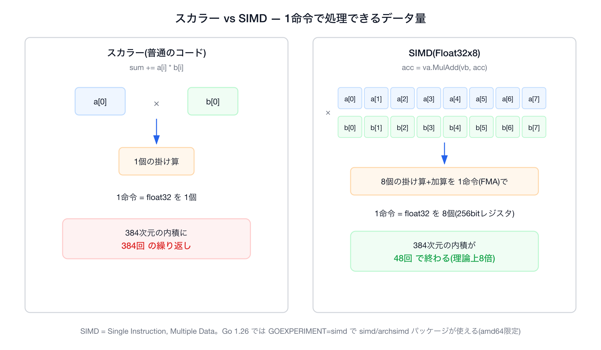
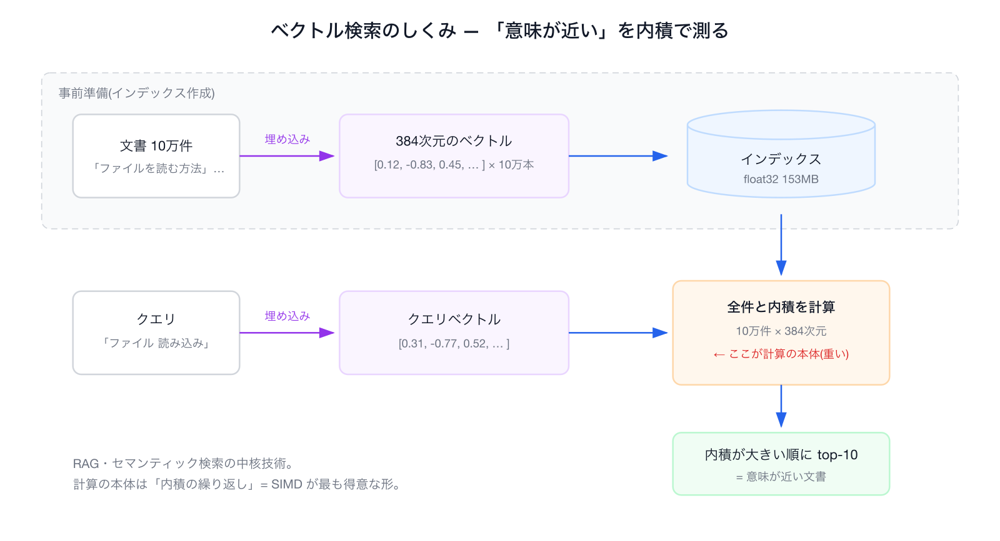
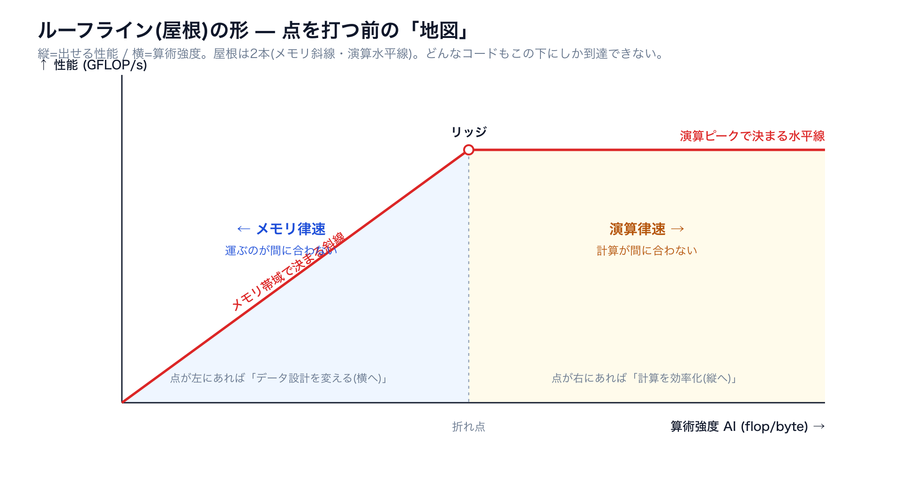
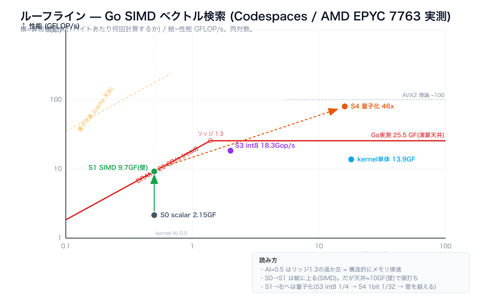
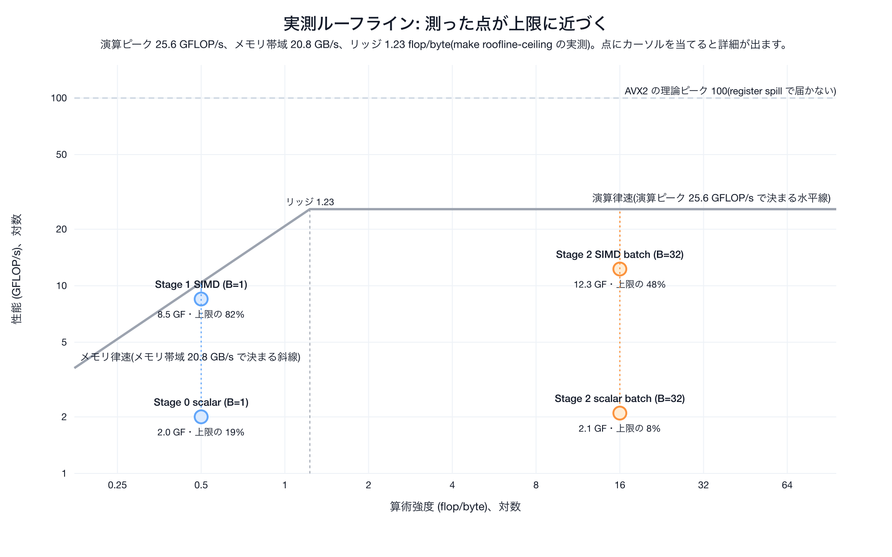
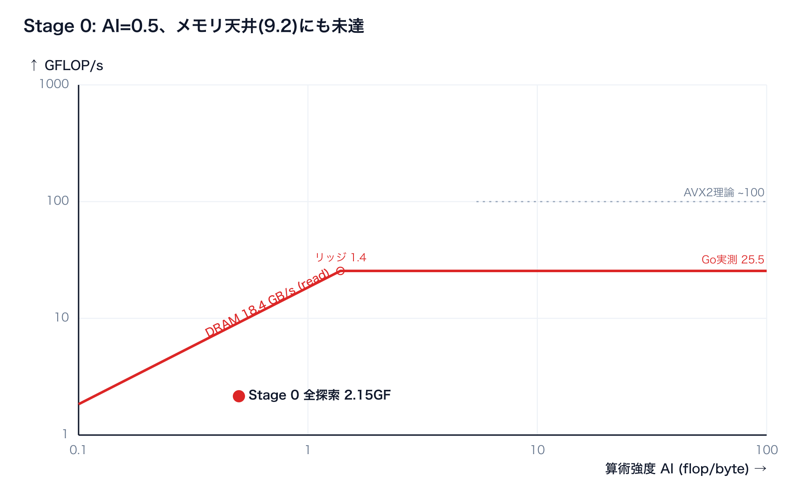
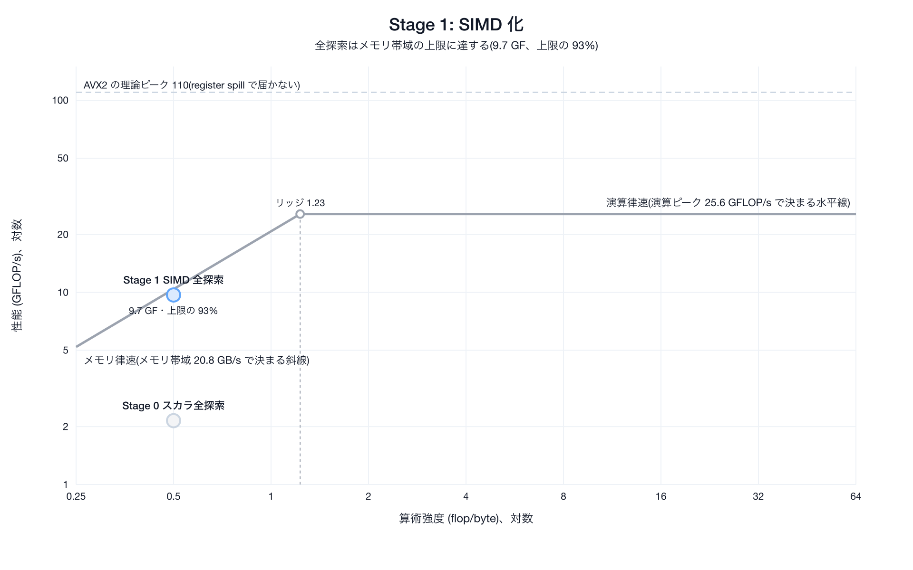
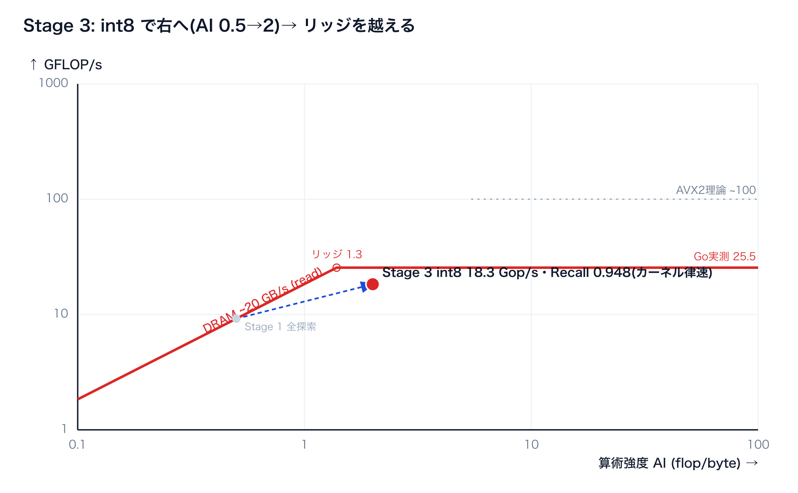
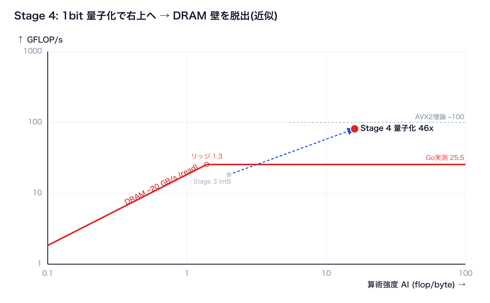
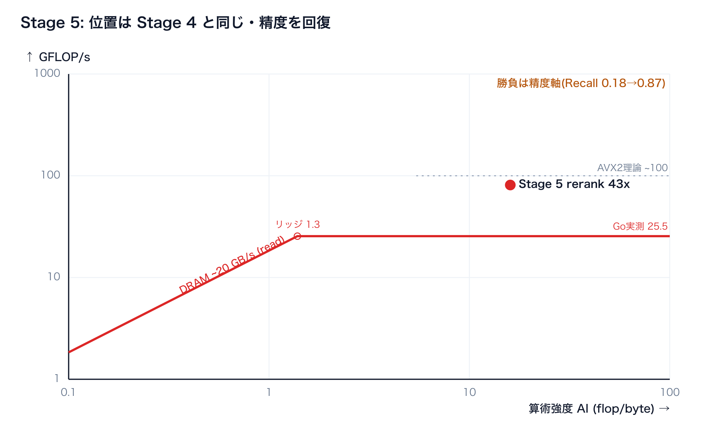

# Go × SIMDで高速化するベクトル検索 — ルーフラインモデルでSIMDが効く境界を探れ！
Go 1.26 の実験的 SIMD で、外部ライブラリなしの Pure Go ベクトル検索を高速化します。ただし闇雲には触りません — **ルーフライン**という1枚の地図の上で「測る → 算術強度(AI)を出す → 当たっている天井を見る → その天井を狙う手だけ打つ」を繰り返します。

## はじめに

**これは何か:** Go 1.26 の標準 SIMD(`simd/archsimd`)を使い、外部ライブラリなしの Pure Go でベクトル検索を高速化する、**読みながら手元で動かせる**教材です(Go Conference 2026・40分ワークショップ)。題材は内積によるベクトル検索。ただ速くするのではなく、**ルーフライン**という地図の上で「いまどこが詰まっているか」を測り、打つ手を選ぶのが軸です。構成は「**律速(壁)が現れる → 手を打って突破する → 次の律速が現れる**」の連鎖で、各段の突破で SIMD がどの役割(主役/脇役/効かない)を果たすかを実測で確かめていきます。

**何が学べるか:**

- Go の標準 SIMD(archsimd)の**書き方** — `Float32x8` + FMA でアセンブリも cgo も書かずにベクトル命令を叩く
- **ルーフラインモデルとは** — 何で詰まっているか(演算律速/メモリ律速)を1枚で見極め、測る → 算術強度(AI)を出す → 当たっている天井を見る → その天井を狙う手だけ打つ
- **SIMD が「どこで効くか」** — 演算律速なら効き(カーネル・バッチ化)、メモリ律速では頭打ち。それを測って見極められるようになる
- **高速化の二本柱** — SIMD(実装効率)× データ表現(再利用＝バッチ / バイト削減＝量子化)。そして速度と精度の両立(rerank)
- **実測の作法** — 2粒度で測る・天井をマイクロベンチで実測・Recall で精度を測る

**対象と前提:** Go の基礎が読めれば十分で、CPU アーキの予備知識は要りません(専門用語は初出のところで補足します)。**読み方:** 上から順に通読でき、各節は「なぜ → コード → どうなったか」を実行コマンドつきで追えます。引用ブロックのコラムと「持ち帰り」「付録」は発展的な内容なので、当日の40分に収まらなくても後から読めます。

## 01. そもそも SIMD ってなに？

まず SIMD が無い世界から始めましょう。次の Go コードはベクトルの**内積**(かけ算の合計)です。

```go
var sum float32
for i := range a {
    sum += a[i] * b[i]   // 1個ずつ かけて 足す
}
```

このループは「**1個ずつ**」処理します。`a[i]` と `b[i]` を1個取り出し、1回かけ算して、足す。CPU の命令レベルでも本当にそうで、1命令で float32 を1個しか扱いません。これを**スカラ処理**と呼びます。

**SIMD** — (Single Instruction, Multiple Data)は、その名のとおり「**1つの命令で複数のデータをまとめて**」処理する CPU の機能です。CPU の中には普通の変数より大きな**ベクトルレジスタ**という入れ物があり、256bit のレジスタには float32(32bit)が **8個**入ります。8個入れて掛け算命令を1回実行すると、8個分の掛け算が**同時に**終わります。この違いを図にすると次のとおりです。



384次元の内積なら、スカラで384回かかる掛け算が SIMD なら48回で済みます。**理論上は8倍速い**わけです。

Go 1.26 では `GOEXPERIMENT=simd` を付けてビルドすると `simd/archsimd` パッケージが使え、**アセンブリも cgo も書かずに**ベクトル命令を直接叩けます。メソッド呼び出しがほぼそのまま1つの CPU 命令にコンパイルされます:

```go
va := archsimd.LoadFloat32x8Slice(a)   // float32 を8個ロード
vb := archsimd.LoadFloat32x8Slice(b)
acc = va.MulAdd(vb, acc)               // acc += va*vb (FMA という1命令)
```

注意点として、`archsimd` は今のところ **amd64(Intel/AMD)専用**です。Apple Silicon の Mac(arm64)ではパッケージ自体が無く、スカラ処理にフォールバックします(Go 1.27 では arm64(Neon)対応が予定されています — 最後の「持ち帰り」で触れます)。

### archsimd の API の読み方

`archsimd` は特別な構文を覚えるパッケージではなく、**ベクトルレジスタを表す「型」を宣言し、その型の「メソッド」を呼ぶ**だけです。押さえるべきは次の3点です。

**① 型が「データの形」を表す。** 型名そのものが「何ビット幅に、何を何個(レーン)詰めるか」を意味し、**型を選ぶことが使う命令幅を選ぶこと**になります。

```go
var a archsimd.Float32x8    // float32 を8レーン  = 256bit(AVX2)
var b archsimd.Float32x16   // float32 を16レーン = 512bit(AVX-512)
var c archsimd.Uint64x4     // uint64 を4レーン
```

**② メソッドが「1つの CPU 命令」に対応する。** 各メソッドはベクトル命令(イントリンシック)にほぼ1対1で変換され、**メソッド名から出てくる機械語の見当がつきます**。

```go
va := archsimd.LoadFloat32x8Slice(xs)  // スライス → レジスタ(ロード)
va = va.MulAdd(vb, acc)                // 積和      → VFMADD
xo := vc.Xor(vd)                       // XOR       → VPXOR(vc・vd は Uint64x4。Xor は整数ベクトル専用)
po := xo.OnesCount()                   // popcount  → VPOPCNTQ
va.StoreSlice(xs)                      // レジスタ → スライス(ストア)
```

**③ 使う前に、その CPU が対応しているか確かめる。** 未対応の CPU で呼ぶと panic するので、実行時に機能フラグでガードします。

```go
var hasSIMD    = archsimd.X86.AVX2() && archsimd.X86.FMA()                 // MulAdd は AVX2 + FMA が要る
var hasVPOPCNT = archsimd.X86.AVX512() && archsimd.X86.AVX512VPOPCNTDQ()   // OnesCount は AVX-512 VPOPCNTDQ
```

## 02. ベクトル検索ってなに？

今回のワークショップでは SIMD の題材に**ベクトル検索**を選びました。RAG やセマンティック検索を支える中核技術です。

仕組みはシンプルで、文書もクエリも「埋め込みモデル」で**数百次元の数値ベクトル**に変換しておき、「クエリのベクトルと**内積が大きい**文書 = 意味が近い文書」として上位 k 件を返します。

埋め込みモデルは、意味が近い文章ほどベクトルの向きが揃うように学習されています。向きが揃った2本のベクトルは内積が大きく、向きがバラバラだと小さくなります。だから「内積が大きい ≒ 意味が近い」になります:

```text
文章A 「猫が好き」   --embedding-->  [ 0.2, -0.1,  0.8, ...]  ┐
                                                            ├─ 向きが近い → 内積が大きい ≒ 似ている
文章B 「犬を飼う」   --embedding-->  [ 0.1, -0.2,  0.7, ...]  ┘

文章C 「株価が急落」 --embedding-->  [-0.6,  0.5, -0.2, ...]  ─ 向きが違う → 内積が小さい ≒ 似ていない
```

ベクトル検索の全体の流れを図にすると次のようになります。



つまり計算の本体は「**内積を10万回計算する**」こと。内積は掛け算と足し算の塊なので、SIMD が得意とする部分です。だから世のベクトル検索エンジン(Faiss、Qdrant、ClickHouse…)はみんな内部で SIMD を徹底的に使っています。それを Pure Go で追体験しよう、というのが今回のワークショップの趣旨です。本資料の題材カーネルは `acc += a[i]*d[i]`(クエリ a と DB ベクトル d の内積)で、これを10万本ぶん回します。

### 今回の実験の前提

上の「10万回内積」は、**本番のベクトル検索をそのまま再現したものではありません**。ルーフラインで「何で詰まっているか」をはっきり見せるため、あえて次の形に**簡略化**しています。

| 項目 | 今回の設定 | 本番でよくある形 |
|---|---|---|
| 探索 | **全探索**(10万件すべてと内積) | HNSW・IVF などで候補だけ触る |
| クエリ | **1本ずつ**(最初の2段階) | 同時に多数のクエリが来る |
| スレッド | **1コア**(1クエリのレイテンシを測る。並列は§06の寄り道で実測) | マルチコアで並列処理 |
| データ | **メモリ上の配列** | ディスク・ネットワーク越し |
| 次元 | **384次元 float32** | 同程度だが量子化も多い |

**なぜわざと素朴にするか:** 全探索・1クエリ・1スレッドだと、DB ベクトルを**先頭から順番に読む**処理になり、ボトルネックが演算ではなく**メモリ帯域**に寄りやすい。ここから「SIMD を入れても思ったほど速くならない」というあるあるを、数字で体感します。

**本番との関係:** 実運用は上の表の右列に近いです。ただしこのあとバッチ化・量子化・rerank も扱い、Faiss / Qdrant / ClickHouse QBit と同じ設計の**縮図**として読めます。「1クエリ全探索はメモリ律速になりやすい」「SIMD だけでは足りないことがある」という教訓は、本番でもそのまま効きます。

## 03. まず動かす

SIMDとベクトル検索の概要が分かったところで、一度動かして現状の速さを測ります。まず環境を用意し、続けてベースラインを計測します。

### 環境を用意する

SIMD が走るのは **amd64(Intel/AMD)実機**。一番楽なのは **GitHub Codespaces**(amd64・ゼロインストール)で、手元が Apple Silicon でもこれなら同じ数字が出ます。必要なものは **Go 1.26** と **make** だけです(`GOEXPERIMENT=simd` は Makefile が自動で付きます)。

**① Codespaces(推奨)** — リポジトリの `Code → Codespaces → Create`。`.devcontainer/` に Go 1.26 + `GOEXPERIMENT=simd` が入っているので、開いたらそのまま下の「動かす」に進めます。**手順の詳細（マシンサイズの選び方・費用・困ったときのフォールバック）は [SETUP.md](SETUP.md) にまとめてあります。**

**② ローカル(amd64 Linux / Windows)**

```bash
git clone https://github.com/po3rin/gocon2026-simd-search
cd gocon2026-simd-search
go install golang.org/dl/go1.26.4@latest && go1.26.4 download   # Go 1.26 を入れる
make GO=$(go env GOPATH)/bin/go1.26.4 test                      # GOEXPERIMENT=simd は Makefile が付与
```

### 動かす

正しさの確認とベースライン計測はコマンド2つです:

```bash
make test       # 正しさ確認(通ればOK)
make bench0     # スカラ実装の全探索(=ベースライン)を測る

# ↓ 出てくる数字(4コア Codespace / AMD EPYC 7763 の例):
# BenchmarkSearchNaive   35.7 ms/op
```

※ 実際の画面には `35856977 ns/op  4283 MB/s  0.5 AI(flop/byte)  2.142 GFLOP/s  153.6 MB/query` のように **ns 単位+指標つき**で出ます(35,856,977 ns ≒ 35.9 ms)。本資料の出力例は読みやすさのため ms に整形してあります。右側の指標(GFLOP/s・AI)はこのあと §04〜05 で使う主役なので、いまは「そういう列がある」だけ覚えておけば十分です。

10万件のベクトルから上位を返すのに **1クエリ 35ms**(全探索・1スレッドの前提)。素朴に書くとこのくらいかかります(数字は当たった CPU 次第)。本資料がこれからやることは、たったひとつ — **この全探索をどう速くするか**です。

ここで皆さんは「SIMD で並列計算すれば爆速になるはず」と思うでしょう。しかし、やみくもに SIMD を足しても、**最後はメモリの壁で頭打ち**になります。

そこで本資料は、速くする手をいきなり打たず、先に「何で詰まっているか」を測って見極めてから打ち手を選びます。その地図になるのが **ルーフラインモデル**です。

## 04. ルーフラインモデルとは

**ルーフラインモデル** は、「このコードは何で遅いのか」を1枚の図で診断する性能モデルです(原典は Williams ら 2009)。コードが遅いとき、原因は大きく2つに分かれます。

* 計算そのものが重い(演算律速)
* データの搬送待ち(メモリ律速)

この2つのどちらで遅くなっているかがわからないまま高速化の手法を入れても無駄に終わる可能性があります。まずどちらで詰まっているかを見極めるのがルーフラインモデルの役目です。

下図は、縦軸に**性能**(GFLOP/s＝1秒あたりの浮動小数点演算回数)・横軸に**算術強度**(AI ＝ 計算量 ÷ データ転送量)を取り、その機械の物理的な上限を屋根(ルーフ)として描きます。左側のメモリ帯域で決まる右上がりの斜線(メモリ律速)と、右側の演算ピークで決まる水平線(演算律速)の領域があります。




ここで**算術強度 (AI)** とは **「メモリから1バイト運ぶごとに、何回 計算するか」**(flop/byte)です。今回の全探索・1クエリの前提では、内積は要素あたり mul 1 + add 1 = 2 flop で、DB ベクトルを要素あたり 4 バイト(fp32)読みます(クエリ側は10万件で使い回すのでキャッシュに残り、毎回は運びません)。この前提で計算をすると算術強度(AI)は次のように0.5と計算できます。

```text
AI = 2 flop / 4 byte = 0.5 flop/byte
```

どんな最適化もこの屋根より上には行けません。ここに自分のコードの達成性能(GFLOP/s)と算術強度(AI)を当てはめれば、**2つの天井のどちらに当たっているか ＝ メモリ律速か演算律速か**がわかります。メモリ律速なら「算術強度を上げる」、演算律速なら「実装効率を上げて演算性能を稼ぐ」というように打つ手が決まります。

では、今回使うマシンの天井はどこなのでしょう。それを測っていきます。

## 05. 屋根の位置を測る

屋根は当然機械ごとに違います。理屈で決め打ちせず、**自分の手で測る**のがこの章です。まずは1コマンド走らせましょう:

```bash
make roofline-ceiling
# 中身: go test ./internal/vec -run - \
#         -bench 'BenchmarkPeak(FLOP_AVX2|ReadBW|TriadBW)$' -benchtime 2s

# ↓ 4コア Codespace(SETUP.md の指定サイズ・AMD EPYC 7763 / Zen3・1コア)での実際の出力:
BenchmarkPeakFLOP_AVX2     25.59 GFLOP/s     ← 演算天井(FMA を飽和させた値)
BenchmarkPeakReadBW        20.80 read-GB/s   ← 順次 read(SIMD で DRAM 読みを飽和)
BenchmarkPeakTriadBW       17.36 triad-GB/s  ← STREAM Triad(read+write の標準指標)
```

3つの数字が出ました。これが**このマシンの屋根の高さ**(演算天井 ≒ 25.5 GFLOP/s、メモリ帯域 ≒ 20 GB/s)です。では、この数字を出しているコードが何をしているのかを順に見ます。**測り方を知って初めて、数字を信用できる**からです。

> 数値は**この Codespace(EPYC 7763)での一例**です。Codespaces はどの CPU(Intel/AMD・世代)が当たるか選べないため、**あなたの数字は違って当然**。さらに共有VMなので、**同じマシンでも実行ごとに±5%ほど揺れます**(read 帯域はこの日 19〜21 GB/s の間で変動)。本ワークショップは絶対値を約束せず、**各自のベンチで点を打って形を確かめる**のが狙いです。

### FMA をレジスタ上で連打して演算天井を見る

演算ピークは「**メモリも依存連鎖(前の計算が終わるまで次の計算を待つ)も挟まず、FMA だけを限界まで回したら何 GFLOP/s 出るか**」で測れる。

そのため、独立したアキュムレータ(途中結果をためる変数)を**12本**用意し、レジスタ上だけで FMA を連打します。

```go
// 12本の独立アキュムレータ。漸化式 a = a*m + c はメモリにも触れない
m, c := fill8(0.9999), fill8(1.0)
a0, a1, /* … */ a11 := fill8(0.5), fill8(1.5), /* … */ fill8(11.5)
for b.Loop() {
    for j := 0; j < inner; j++ {
        a0 = a0.MulAdd(m, c)   // ← FMA。互いに独立なので 12本が並んで走る
        a1 = a1.MulAdd(m, c)
        /* … a2 〜 a11 も同様 … */
    }
}
flop := float64(iters) * inner * 12 * 8 * 2  // 12acc × 8lane × 2flop/FMA
b.ReportMetric(flop/sec/1e9, "GFLOP/s")      // ← これが 25.59
```

実測 **25.5 GFLOP/s**。試しにアキュムレータを4本に減らした `BenchmarkPeakFLOP_AVX2_4acc` を測ると **13.4 GFLOP/s** まで落ちます(本数を減らすと**遅くなる**)。理論ピークは ~100 GFLOP/s で、実測はその約 1/4 — Go 1.26 のコード生成がこのループのアキュムレータを毎回スタックへ退避する(register spill)ためですが、AI=0.5 の深いメモリ律速なのでこの低さは検索の結論を変えません。

> **コラム: register spill を“見る”(任意・理解用):** 上の「実測 25.5 ≪ 理論 ~100」は、**Go 1.26 のコード生成がこのループでは SIMD 値をレジスタに保てず**、12本のアキュムレータを毎回スタックへ退避(register spill)するため(本数圧ではありません — 12本 + m + c = 14 は、使える15本の Y レジスタに収まる数です。Y15 は Go 内部 ABI の予約ゼロレジスタで割り当てられません: [golang/go#76969](https://github.com/golang/go/issues/76969))。本当に起きているかは `make spill` で演算ピークループ(`BenchmarkPeakFLOP_AVX2`)の機械語を見れば分かります(コンパイラの `-S` 出力。amd64 クロスコンパイルなので mac でも可)。各アキュムレータ `aN` が **ロード→FMA→ストアの三つ組**を毎回踏んでいる = レジスタに居続けられていない証拠です:
>
> ```text
>   VMOVDQU     a0+952(SP), Y2     ← ① a0 をスタックから戻す(本当はレジスタに置きっぱなしにしたい)
>   VFMADD213PS Y1, Y0, Y2         ← ② a0 = a0*m + c(FMA 本体。理想はこの1命令だけ)
>   VMOVDQU     Y2, a0+952(SP)     ← ③ a0 をまたスタックへ退避  ← これが spill
>   VMOVDQU     a1+920(SP), Y2     ←   a1 も…(12本ぶん ①②③ を繰り返す)
>   VFMADD213PS Y1, Y0, Y2
>   VMOVDQU     Y2, a1+920(SP)
> ```
>
> レジスタに収まっていれば本体は**裸の `VFMADD` だけ**になるはず。その前後に必ず付く `VMOVDQU …(SP)` が spill です。この spill が、演算天井が理論ピーク(~100)に届かず 25.5 GFLOP/s に留まる主因とみられます(§05 本文の説明。ただし「spill を消せば理論ピークに届く」かは本資料では未検証)。**それでも打ち手は変わりません** — 検索は AI=0.5 のメモリ律速なので、天井がこの低さでも結論は変わらない(roofline が「ここは演算で詰まっていない」と言っている)。ポート圧(なぜ 0.65 FMA/cyc か)まで踏み込むなら llvm-mca / uiCA(本編 40 分外)。

### キャッシュに乗らない巨大配列を先頭から末尾まで順番に読んでメモリ天井を見る

メモリ帯域は「**DRAM から1スレッドで流し読みしたら何 GB/s 出るか**」で測ります。キャッシュに収まると DRAM を測れないので、**256MB**(LLC を確実に溢れる)の配列を先頭から末尾まで順番に読みます。`internal/vec/ceiling_mem_simd_test.go`(要点のみ・Triad の実コードは4本展開):

```go
const memN = 1 << 26  // 67,108,864 float32 = 256 MB(LLC 溢れ確実)

// read 帯域: 検索カーネルと同じ 256bit ロード(8本のアキュムレータ)で
// DRAM 読みを飽和させる。スカラ縮約だと足し算の発行律速で過小評価するため SIMD で測る
for b.Loop() {
    var a0 archsimd.Float32x8 /* … a7 まで … */
    for len(x) >= 64 {
        a0 = archsimd.LoadFloat32x8Slice(x).Add(a0)   /* … x[8:] 〜 x[56:] も … */
        x = x[64:]
    }
}
b.ReportMetric(gb, "read-GB/s")    // ← 20.80

// Triad(STREAM 標準): a = b + s*c。read b + read c + write a で3配列ぶん(SIMD)
for len(aa) >= 8 {
    archsimd.LoadFloat32x8Slice(cc).MulAdd(s, archsimd.LoadFloat32x8Slice(bb)).StoreSlice(aa)
    aa, bb, cc = aa[8:], bb[8:], cc[8:]
}
b.ReportMetric(gb, "triad-GB/s")   // ← 17.36
```

帯域の2つの測り方を確認します。`BenchmarkPeakReadBW`(**~20 GB/s**)は読み専用で、検索カーネルと同じ SIMD ロードなので **DRAM の読み出し帯域をそのまま測れます**。`BenchmarkPeakTriadBW`(17.4 GB/s)は業界標準の STREAM ベンチで read+write を含むぶん少し低い。**今回の検索は DB ベクトルを「読むだけ」(書き戻さない)** なので、メモリ天井には **read 帯域 ~20 GB/s** を使います。実際、SIMD 全探索(先頭から順番に読む)が **19.4 GB/s** とほぼ一致するので、この数字を壁と見ます。

> ⚠️ スカラ縮約(`a0 += memB[i]`)で read を測ると足し算の発行/レイテンシで律速し、**SIMD 全探索が達成する帯域すら下回って**しまいます(特に単コア帯域の高い AMD で顕著 → ルーフライン上で点が屋根の上に来てしまう)。だから天井ベンチも検索と同じ SIMD ロードで測ります。詳細は [`../dev/OPTIMIZATION_LOG.md`](../dev/OPTIMIZATION_LOG.md)。

**比較ルール:** 検索は 1クエリ・1スレッドで測るので、天井も**1コア**の帯域(~20 GB/s)と突き合わせます。CPU 全体・全コア合計の帯域(数百 GB/s 級)は使いません。

### 測った天井から上限を出す

さきほど測った数字を使って、「全探索はせいぜいどれくらい速くなれるか」を見積もります。

**覚えるのは2つで十分です。**

| 種類 | このマシンの上限 | 意味 |
|---|---|---|
| メモリ帯域(read) | **~20 GB/s** | DRAM からデータを読む速さの限界(1コア) |
| 演算ピーク | **25.5 GFLOP/s** | 計算だけを限界まで回したときの限界(今回の Go 実測) |

※ CPU チップの理論値はもっと上(この機で AVX2 ~100、AVX-512 はこの CPU には無い)ですが、**いま動かしている Go コードでは 25.5 が現実的な天井**です。ルーフライン図には理論値も載せますが、ここではまず実測の 25.5 と 20 を使います。

**内積はどちらに引っかかるか**

内積の算術強度は **AI = 0.5** でした。これは「1バイト読むごとに、計算は 0.5回しかない」という意味で、かなり少ない部類です。

メモリ律速と演算律速が切り替わる境目を**リッジ**と呼びます。ざっくり次で求まります。

```text
リッジ = 演算ピーク ÷ メモリ帯域 = 25.5 ÷ 20 ≈ 1.3 flop/byte
```

- AI が **1.3 より小さい** → 計算が足りないのではなく、**データの読み込み待ち**(メモリ律速)
- AI が **1.3 より大きい** → **計算の処理能力**(演算律速)が限界

内積の AI=0.5 は 1.3 よりずっと小さいので、**メモリ律速**です。

**メモリ律速のときの上限**

メモリ律速では、上限は次の式で求まります。

```text
上限 ≈ AI × メモリ帯域 = 0.5 × 20 ≈ 10 GFLOP/s
```

つまり全探索は、どれだけ上手く書いてもだいたい **10 GFLOP/s 前後**が天井、という見込みが立ちます。実際に最初のベースライン(`make bench0`)が 2.15 GFLOP/s だったのは、この天井にすらまだ届いていなかった、ということです(あとで SIMD 化すると、この天井のすぐ下 9.7 まで来て止まるのを見ます)。

これでこのマシンの天井(メモリ帯域 ~20 GB/s、演算ピーク 25.5 GFLOP/s)が出そろいました。このあと、改良を1つ足すたびに出る数字を、この上限と突き合わせていきます。特に「SIMD 化しても ~10 GFLOP/s で止まる」という見積もりは、次章の Stage 1 で実測と突き合わせます — **コードを1行も直す前に結果を言い当てられる**のが、ルーフラインの価値です。

## 06. 手を打って速くする

さきほど測った天井と比べながら、**改良を1つずつ足して速さを確かめていきます**。下の図は、その過程をルーフラインに重ねたものです(横軸=AI・縦軸=性能・斜線=メモリ天井・水平線=演算天井)。点がどの天井に当たっているか — メモリ律速か演算律速か — を、これから1つずつ見ていきます。



図: スカラ → SIMD(メモリ壁)→ カーネル単体(演算側)→ 量子化(右上へ)。各点の詳細は下の各節で。

> **この図を自分の実測で動かす(任意):** `make roofline-plot` を叩くと、**いま測った数字**から下のような対話ルーフライン(`/tmp/roofline.html`)が出ます。各点から天井へ点線を引いて「天井の何%か」を出すので、Stage 1 がメモリ壁に張り付き、バッチ化でリッジを越えて演算側へ動くのが一目で分かります(点にカーソルで AI・GFLOP/s・達成率)。
>
> 
>
> **この図の読み方=次の一手**(点がどちらの天井に当たっているかで、打つ手が決まる):
>
> - **壁に張り付いた点(≒100%)** → メモリ律速。実装を磨いても動かない(Stage 1 の結論)。打つ手は **AI を上げる**(再利用＝バッチ / バイト削減＝量子化。Stage 2・3 で実測した道)。
> - **リッジを越えて演算側に乗った点(例:SIMD batch)** → ここで**初めて SIMD がスカラを引き離す**(Stage 2 で 5.9x を実測)。
>
> どちらの軸を攻めるかをこの1枚が決める — それが §05 の codegen ビュー(spill 等)との決定的な違いです。
>
> ※ 細かいこと:天井は `make roofline-plot PEAK=<GF> BW=<GB/s>`(`make roofline-ceiling` の値)、理論ピーク線は `TPEAK=100`。作図も解析も依存ゼロの Pure Go。**Stage 4(1bit 量子化)は点として出ません** — popcount で flop が無くなり縦軸 GFLOP/s も横軸 flop/byte も定義できないため(効果は Stage 4 静止図と `make roofline-decompose` で見る)。Stage 3(int8)は AI=2 の点として置けます(静止図参照)。「52% から天井へ詰める手」は未測定なので触れません(天井自体が spill で 25.5 止まり)。

ここからは**検索のコードを直して、動かして出る数字を見る**パートです。掲載は擬似コードではなく `internal/vec` / `internal/index` の**実コードそのまま**です。

手元で追うときは、各節のあとに対応するコマンドを走らせれば同じ数字が出ます。

```bash
make bench0          # Stage 0: スカラ基準
make bench1          # Stage 1: SIMD 化(カーネル単体 + 全探索の2粒度)
make roofline-batch  # Stage 2: バッチ化の比較
make bench-parallel  # 寄り道: goroutine 並列はどの天井に効くか
make bench-int8      # Stage 3: int8 量子化(1/4)
make bench2          # Stage 4: バイナリ量子化(1/32)
make bench3          # Stage 5: 仕上げ(rerank の速度)
make recall          # 精度(binary / rerank / int8 の Recall@10)
make roofline        # 上の結果をルーフライン図用に一覧
make roofline-plot   # 実測から対話的ルーフライン HTML を生成(点が天井に当たるのを見る)
```

各節に出てくる **GFLOP/s** と **AI** は、これらのベンチが自動で計算して表示します(特別なプロファイラは不要。算出の詳細は `internal/index/bench_test.go` にありますが、本編では検索コードに集中します)。

### Stage 0 — スカラ基準(ベースライン)

**なぜ:** 最適化はまず**基準値**から。素朴に「1要素ずつ」内積を回し、達成性能と算術強度を測ります。以降の手が効いたかは、この基準からの変化で判断します。検索は全ベクトルと内積して上位 k 件を返すだけ。

```go
// internal/vec/dot.go
func DotNaive(a, b []float32) float32 {
    var sum float32
    for i := range a {
        sum += a[i] * b[i]        // 1個ずつ かけて 足す(前の sum に依存=直列)
    }
    return sum
}

// internal/index/index.go — 全探索
func (ix *Index) SearchNaive(q []float32, k int) []Result {
    t := newTopK(k)
    for id := 0; id < ix.N; id++ {              // 10万ベクトル全部と内積
        t.push(id, vec.DotNaive(q, ix.Vec(id)))
    }
    return t.results()
}
```

**どうなったか:** 全探索 35.7 ms = **2.15 GFLOP/s**、AI=0.5。達成 2.15 GFLOP/s は、メモリ天井(≈10 GF)にすら届きません。なぜ天井未満か? **依存連鎖律速** — `sum += ...` は前の足し算が終わるまで次へ進めず、待ち時間(レイテンシ)がそのまま表に出ます。加算の依存連鎖が直列で、**命令レベルの並列性がほぼ活かせません**(384要素 × 加算レイテンシ(Zen3 で約3サイクル)÷ 周波数 ≒ 実測のカーネル 348ns とほぼ一致します)。  
**→ 次の一手:** ルーフラインの「どの天井にも未達なら命令並列性を上げる」に従い、**同時に複数(SIMD)**で命令並列性を上げ、達成性能を引き上げます。

```bash
$ make bench0
BenchmarkSearchNaive   35.7 ms/op   2.15 GFLOP/s   0.5 AI(flop/byte)   153.6 MB/query
```



図: いまルーフラインのここ — AI=0.5・2.15 GFLOP/s。メモリ天井(≈10)にすら届かない左下。

### Stage 1 — AVX2 で SIMD化(2段階で理解する)

**なぜ:** Stage 0 は命令並列性ゼロで天井にも未達でした。ルーフラインの指示は「**命令並列性を上げて達成性能を上げろ**」。SIMD 化はここで実は2つの工夫を一度にやりがちです。混乱しないよう、**1a「8個まとめて読む」→ 1b「待ち時間を隠す」**の順に分けて理解します。

#### Stage 1a — まず「8個まとめて読む」(Float32x8)

最初の一歩は、1個ずつの内積を **8個まとめて**に置き換えるだけです。`Float32x8` でスライスから8要素をベクトルレジスタにロードし、`MulAdd`(FMA＝掛けて足す)でアキュムレータに足し込みます。「1命令で8個」を体験するための最小形:

```go
// まず最小形:アキュムレータ1本で「8個まとめて」
var acc archsimd.Float32x8                 // アキュムレータ1本
for len(a) >= 8 {
    va := archsimd.LoadFloat32x8Slice(a)   // float32 を8個ロード
    vb := archsimd.LoadFloat32x8Slice(b)
    acc = va.MulAdd(vb, acc)               // acc += va*vb を8レーン同時に(FMA)
    a = a[8:]; b = b[8:]
}
// 最後に acc の8レーンを1個に足し込む(水平和)→ 端数処理
```

これで「1命令で8個」は動きます。ところが**まだ理論ほど速くなりません**。理由が次の 1b です。

#### Stage 1b — なぜアキュムレータを2本にするのか(待ち時間を隠す)

1a の `acc = va.MulAdd(vb, acc)` は、**前の acc が出来上がるまで次の MulAdd を始められません**(acc を読んで acc に書く=依存連鎖)。FMA は結果が出るまで数サイクルかかる(レイテンシ)ので、1本だとその待ち時間が毎回そのまま出ます — Stage 0 の `sum += ...` と同じ直列化です。

そこで**独立したアキュムレータを2本**(acc0 / acc1)に分けます。互いに依存しないので、acc0 の FMA が計算中でも acc1 の FMA を走らせられる＝待ち時間を隠せます(命令レベル並列性)。最後に2本を足してから水平和します。仕上げに境界の `archsimd.ClearAVXUpperBits()`(中身は VZEROUPPER という1命令)— SIMD→スカラ計算へ戻る前に呼ぶ、Intel 機での遷移ペナルティ対策です(AMD では不要だが無害)。Go は自動挿入しないので、標準 API で自分で呼びます。

```go
// internal/vec/dot_simd.go  (GOEXPERIMENT=simd, amd64)
import "simd/archsimd"

func Dot(a, b []float32) float32 {
    if !hasSIMD {
        return DotNaive(a, b)              // arm64 等はスカラに退避
    }
    var acc0, acc1 archsimd.Float32x8      // ★ 1b: アキュムレータ2本で待ち時間を隠す
    for len(a) >= 16 {
        acc0 = archsimd.LoadFloat32x8Slice(a).MulAdd(archsimd.LoadFloat32x8Slice(b), acc0)
        acc1 = archsimd.LoadFloat32x8Slice(a[8:]).MulAdd(archsimd.LoadFloat32x8Slice(b[8:]), acc1)
        a = a[16:]; b = b[16:]             // 前進(境界計算をループ条件に吸収)
    }
    var buf [8]float32
    acc0.Add(acc1).StoreSlice(buf[:])
    archsimd.ClearAVXUpperBits()           // ★ VZEROUPPER。Intel機の遷移ペナルティ対策(AMDでは不要・無害)。Goは自動挿入しない
    sum := buf[0]+buf[1]+buf[2]+buf[3]+buf[4]+buf[5]+buf[6]+buf[7]
    for i := range a {                     // 8の倍数でない端数
        sum += a[i] * b[i]
    }
    return sum
}
```

**どうなったか:** カーネル単体は **348→55 ns = 6.3x**、全探索も **35.7→7.9 ms = 4.5x** 速くなりました。SIMD は確かに効いています。**でも大事なのは「どこで止まったか」**です。全探索の達成は **9.7 GFLOP/s**。これは §05 で見積もったメモリ天井 **0.5 × ~20 ≈ 10 GFLOP/s** のすぐ真下 — 帯域に直すと **19.4 GB/s で read 天井(~20)の約 97%**。AI=0.5 のまま**点がメモリ壁に張り付いた**わけです(共有VMの揺れで天井もベンチも±5%動くので、**9割を超えていれば「壁に到達」**と読みます)。  
※ ここの倍率 **4.5x** は「naive が壁からどれだけ遠かったか」で決まる量で、**CPU によって変わります**(naive が既に壁の近くにいる機械なら 1.x 止まり、遠い機械なら数倍)。**変わらないのは「最後はメモリ壁で頭打ち」という事実**のほう。あなたの Codespace では何倍か、`make bench1` で確かめてください。  
**→ 結論:** もう実装効率では伸びません。幅を 8→16(AVX-512)に広げても壁は動かず、キャッシュブロッキングも効きません — DB ベクトルは各1回しか読まれず再利用が無いので、タイリングしても DRAM 読み出し総量は変わらないからです。**次は実装効率ではなく、算術強度(AI)を上げる番。**AI を上げる道は2つ — **①再利用(クエリのバッチ化・exact)** と **②バイト削減(量子化・近似)**。まず①を Stage 2 で、続いて②を Stage 3(int8)→ Stage 4(1bit)の2段で。  
※ 上は要点。長さガードと「8幅の端数処理」を含む完全版は `internal/vec/dot_simd.go`。

> **コラム: 端数はマスク付きロードでも書ける(任意):** 上のコードは 8 の倍数に満たない端数をスカラループで処理しています(384次元は 16 で割り切れるので、実は一度も通りません)。Go 1.26 には端数専用の **`LoadFloat32x8SlicePart`**(足りないレーンをゼロ埋めして読むマスク付きロード)があり、端数もベクトルのまま処理できます。SIMD の面倒どころ筆頭の端数処理が標準 API で完結する、覚えておくと便利な道具です。

> **コラム: 「SIMD が効く境界」はデータサイズの軸にもある(`make bench-nsweep`):** カーネル単体 6.3x と全探索 4.5x の差は、データが L1 に収まるか DRAM から流れてくるかの差でした。なら DB 件数を振れば、SIMD の倍率が**キャッシュ境界で崩れる瞬間**が見えるはずです:
>
> | DB 件数 | データ量 | naive | SIMD | 倍率 |
> |---|---|---|---|---|
> | 1,000 | 1.5 MB(キャッシュ内) | 351 µs | 61 µs | **5.8x** |
> | 10,000 | 15 MB(L3) | 3.5 ms | 0.61 ms | **5.7x** |
> | 100,000 | 154 MB(DRAM) | 34.8 ms | 8.8 ms | **3.9x** |
> | 1,000,000 | 1.5 GB(DRAM) | 347 ms | 89.5 ms | **3.9x** |
>
> L3 に収まる間はカーネル並みの 5.7〜5.8x、DRAM に溢れた瞬間に 3.9x へ落ちて以後一定(表は別インスタンスの実測なので Stage 1 本文と絶対値が少し違います — §05 の揺れの注のとおり)。本編の10万件(154MB)は、**意図的に壁の向こう側**に置いた設定です。

```bash
$ make bench1    # カーネル単体(internal/vec)と全探索(internal/index)の2粒度(表示は整形・抜粋)
BenchmarkDotNaive     348  ns/op                        ← カーネル: スカラ基準
BenchmarkDotSIMD       55.2 ns/op                       ← カーネル単体 6.3x
BenchmarkSearchSIMD     7.9 ms/op   19.4 GB/s           ← 全探索 4.5x。read 天井(~20)に到達=壁
```



図: いまルーフラインのここ — 全探索はメモリ壁(~20 GB/s)に張り付き(9.7 GFLOP/s)、カーネル単体だけ右上の別の点。

### Stage 2 — クエリのバッチ化：演算律速にして SIMD を効かせる(exact)

**なぜ:** 全探索が メモリ律速なのは、DB ベクトル d を読んでも内積1回(2flop / 4byte)しかしないから。なら**d を1回ロードして B 本のクエリ全部と内積**すれば、同じ転送で計算が B 倍 → **AI ≈ 0.5×B**。B=32 で AI=16 となり**リッジを越えて演算律速側**へ。そこなら SIMD が効くはず — しかも**精度はそのまま(exact)**。事実上の GEMM(行列×行列)化(BLAS や Faiss のバッチ検索が速い理由)。

```go
// internal/index/index.go — B本のクエリを1パスで処理(d のロードを再利用)
func (ix *Index) SearchBatchSIMD(qs [][]float32, k int) [][]Result {
    tops := make([]*topK, len(qs))
    for b := range tops { tops[b] = newTopK(k) }
    for id := 0; id < ix.N; id++ {
        d := ix.Vec(id)                          // ① d を1回ロード
        for b := range qs {                      // ② B本のクエリで使い回す(d はキャッシュ常駐)
            tops[b].push(id, vec.Dot(qs[b], d))   // SIMD内積
        }
    }
    /* 各 tops[b].results() を返す */
}
```

**どうなったか:** B=32 でクエリを束ねると AI=0.5→16 でリッジを越え**演算律速側**へ。そこでは **SIMD が exact のままスカラを 5.9x 引き離します**(scalar batch 34.2ms/query ↔ **SIMD batch 5.79ms/query**、GFLOP/s **2.24 → 13.3**)。Stage 1 では壁に張り付いて伸びなかった SIMD が、**AI を上げた途端に効く** — まさにルーフラインの「横(再利用)→縦(SIMD)が効く」。1クエリあたりも 7.9→5.8ms と速くなります(B=1 比 1.4x)。**精度は一切犠牲にしていません(exact)。**  
(spill の 25.5GF 天井で 13GF 止まりだが、それでもスカラを 5.9x 引き離す。ここの倍率も CPU 次第)  
※ 「クエリが B 本まとめて来る」は人工的な仮定ではありません。クエリを複数のトークンベクトルで表す **late interaction(ColBERT 系)** では、文書ベクトル1ロードに対して複数トークンとの内積を取ることが**検索方式そのものに内在**します — つまり最初から演算律速で、SIMD が最初から効く(付録Aで実測: 5.7x)。

```bash
$ make roofline-batch    # B=1(全探索) vs B=32(バッチ)、scalar vs SIMD (EPYC 7763 実測)
B=1   SearchSIMD         7.95 ms/query   9.66 GF   ← AI 0.5・メモリ壁(Stage 1)
B=32  SearchBatchNaive  34.24 ms/query   2.24 GF   ← AI 16・scalar
B=32  SearchBatchSIMD    5.79 ms/query  13.26 GF   ← AI 16・SIMD で 5.9x! 演算律速・exact
```

なぜ反転するのかを「時間の内訳」で見ると分かりやすい。ルーフラインは1要素あたりの時間を **メモリ時間(運ぶbyte ÷ 帯域)** と **演算時間(flop ÷ 演算ピーク)** に分けて考えます(実時間 ≈ 長い方=max)。**演算時間は全 Stage 共通**(2 flop 固定)で、バッチ化は **メモリ時間だけを 1/32 に縮める** — だから律速がメモリから演算へ反転します。下は §05 で実測した天井(演算 25.6 GFLOP/s・read 帯域 20.8 GB/s)から計算したものです。


図: go 実測の天井から計算した時間内訳。Stage 1(AI=0.5)はメモリ時間が演算の約 2.5 倍で**メモリ律速**、Stage 2(AI=16)はメモリ時間が演算の約 1/13 に縮んで**演算律速**へ反転。`make roofline-decompose` で自分の天井から再生成できる。なおこの「メモリ vs 演算」の内訳は CPU プロファイラ(pprof / trace)では出せず、ルーフラインが与えるもの。


図: いまルーフラインのここ — バッチ化で AI が 0.5→16 と右へ動き、演算律速側に乗った(exact・精度そのまま)。

### 寄り道 — 「goroutine で並列化すればいいのでは？」

Go を書く人なら当然この疑問が浮かびます。ここまで全部1コアで測ってきましたが、コアに分ければ速くなるのでは？ — 実測で答えます。DB を workers 個のチャンクに分けて goroutine で分担し、最後に top-k をマージします(`internal/index/parallel.go`):

```go
for w := 0; w < workers; w++ {
    go func(t *topK, lo, hi int) {   // 各 worker は自分のチャンクだけ走査
        defer wg.Done()
        for id := lo; id < hi; id++ {
            t.push(id, vec.Dot(q, ix.Vec(id)))
        }
    }(tops[w], lo, hi)
}
wg.Wait()
// worker ごとの top-k をマージ(チャンクは互いに素なので重複なし)
```

メモリ律速の全探索(B=1・Stage 1 の形)と、演算律速のバッチ(B=32・Stage 2 の形)の両方を、workers = 1/2/4 で測ります:

```bash
$ make bench-parallel    # 4 vCPU Codespace(表示は整形。インスタンスにより±1割揺れる)
SearchParallel/workers=1        9.4 ms      16.4 GB/s   ← メモリ律速(B=1)
SearchParallel/workers=2        5.7 ms      26.8 GB/s   ← 1.6x
SearchParallel/workers=4        5.2 ms      29.5 GB/s   ← 1.8x で頭打ち = 帯域の壁
SearchBatchParallel/workers=1   6.7 ms/query            ← 演算律速(B=32)
SearchBatchParallel/workers=2   4.5 ms/query            ← 1.5x
SearchBatchParallel/workers=4   3.5 ms/query            ← 1.9x = 物理コアの壁
```

**どうなったか:** どちらも 4 workers で 4x には**なりません**。しかも止まる理由が違います。

- **メモリ律速(B=1)は「帯域の壁」で止まる。** 合算帯域が 16→27→30 GB/s と飽和し、2→4 workers ではもう +10% しか伸びません。1コアの壁(~20 GB/s)の少し先に**マシン全体の DRAM 帯域**というさらに硬い天井があり、コアはそれを取り合うだけ。**メモリ律速にコアを足しても壁は動きません。**
- **演算律速(バッチ)は「物理コアの壁」で止まる。** この Codespace の 4 vCPU は実は**物理2コア × SMT(2スレッド/コア)**です(`lscpu` で確認できます)。SMT の兄弟スレッドは FMA などの実行ユニットを共有するので、演算律速の仕事は物理コア数(2)ぶんまでしか増えず 1.9x で止まる。**物理4コア以上の機械なら、こちらはコア数なりに伸びます**(メモリ律速側は伸びない)。

つまり並列化は万能の追加ブーストではなく、**メモリ律速なら「マシン全体の帯域」、演算律速なら「物理コア数」**という、1コアのルーフラインの外側にある別の天井に当たります。「何律速か」を先に知っていれば、**goroutine を足して効くかどうかは、足す前に予測できる**わけです。

### Stage 3 — int8 量子化(もう一つの道：バイトを削る・その1)

**なぜ:** Stage 1 の壁からの脱出路は2つありました — **①再利用**(Stage 2 で実測済み)と、ここから入る**②バイト削減**です。ルーフラインの指示は同じく「**算術強度(AI)を上げる＝1バイトあたりの仕事を増やす**」。ただし今度は再利用ではなく、**データ表現そのもの**を変えてバイトを削ります。まず穏当な一歩から — fp32(4 byte)を **int8(1 byte)** に量子化すれば転送が 1/4、AI は 0.5→**2 flop/byte** でリッジ(1.3)を越えて**演算律速側**に乗るはずです。しかも距離カーネルは**整数の積和**なので、量子化しても **SIMD が主役のまま**です。

```go
// internal/vec/int8.go — 対称量子化: q = round(v/scale)、scale = maxAbs/127
func QuantizeInt8(v []float32, out []int8) (scale float32)

// internal/vec/int8_simd.go — 内積カーネル。AVX2 だけで完結(FMA 不要)
acc0 = acc0.Add(archsimd.LoadInt8x16Slice(a).ExtendToInt16().            // VPMOVSXBW
    DotProductPairs(archsimd.LoadInt8x16Slice(b).ExtendToInt16()))       // VPMADDWD
```

int8 同士(signed×signed)なら積は最大 127×127 で int32 に余裕で収まり、飽和対策なしの素直なコードで済みます。1命令で **16要素** — fp32(8要素)の2倍幅です。

**どうなったか:** カーネル 364→**34.6 ns = 10.5x**。**fp32 SIMD カーネル(55 ns)より速い**内積が Pure Go で出ました。検索全体は **4.2 ms**(fp32 SIMD 全探索比 ~2x)、精度は **Recall@10 = 0.948** — 1バイトでも大きさの情報が残るので、rerank なしで実用域です。  
ただしここで面白いことが起きています。**転送を 1/4 にしたのに速度は 4x になっていません**(達成 9.2 GB/s は壁のずっと下)。AI=2 でリッジの右へ移った、つまり**律速がメモリからカーネルの演算へ移動した**からです — 壁を1つ越えると、次の壁が現れる。ルーフラインの点の位置がそのまま説明になります。  
**→ 次の一手:** ②バイト削減には、まだ先があります。**キャッシュに乗り切るまで削ったらどうなるか** — 極限の1bit(1/32)へ。

```bash
$ make bench-int8
BenchmarkDotInt8Naive    364  ns/op                     ← カーネル: スカラ
BenchmarkDotInt8SIMD      34.6 ns/op                    ← カーネル 10.5x!(fp32 SIMD の 55ns より速い)
BenchmarkSearchInt8        4.2 ms/op   38.4 MB/query    ← 全探索: fp32 SIMD 比 ~2x
$ make recall
Recall@10: int8=0.948                                   ← rerank なしで実用域
```



図: いまルーフラインのここ — int8 で AI 0.5→2 と右へ動き、リッジを越えた。ただし演算天井の下(カーネル律速)で止まる。

### Stage 4 — バイナリ量子化(バイト削減を極限まで・近似)

**なぜ:** int8 で 1/4 にしても、10万件 × 384 byte = **38.4 MB は L3 に収まりません**。②バイト削減の極限 — **符号1bit** まで潰せば 1ベクトル 1536→48 byte(**1/32**)、全体 4.8 MB で**キャッシュに丸ごと乗ります**。距離は内積をやめ、XOR+popcount の**ハミング距離**(違うビット数)へ。

```go
// internal/vec/hamming.go
func Quantize(v []float32, out []uint64) {   // float32 → 符号1bit
    for i := range out {
        out[i] = 0                           // 再利用バッファ対策のゼロクリア
    }
    for i, x := range v {
        if x > 0 {
            out[i/64] |= 1 << (i % 64)
        }
    }
}

func Hamming(a, b []uint64) int {            // XOR + popcount = 違うビット数
    var d int
    for i := range a {
        d += bits.OnesCount64(a[i] ^ b[i])   // OnesCount64 はスカラPOPCNT 1発=64次元/命令
    }
    return d
}
```

**どうなったか:** 153MB→4.8MB で**キャッシュに乗り、DRAM の壁から脱出**。0.77 ms = **46x**。**速さの源泉は SIMD ではなく「データを 1/32 にした」こと**です。距離計算はスカラ POPCNT(64次元/命令)で足り、**ここで AVX-512 の VPOPCNT を使っても速くなりません** — 量子化後はキャッシュ常駐で popcount 律速ではなく、1ベクトルも6語と小さいから(AVX-512 機で計測済み: AVX-512 版 `SearchBinarySIMD` 0.75ms ≧ スカラ `SearchBinary` 0.68ms。なお今回の Codespace の AMD CPU に AVX-512 VPOPCNT は無く、この付録は動きません)。Stage 3(int8)では SIMD が主役だったのに、1bit では出番がない — 「**計算で詰まっていない所では SIMD は効かない**」というルーフラインの一貫した教訓です。**だから本編に AVX-512 ステージは置きません** — 速くならないうえ全 CPU にあるとも限らないので、本編は AVX2+FMA だけで完結させ、AVX-512 機向けの付録(付録B)に回します。  
**しかも、これは無条件の勝利ではありません。** 1bit に潰した代償で精度が大きく落ち、**Recall@10 = 0.18**(正解10件のうち2件弱しか当たらない)。46x は「正確な検索」を速くしたのではなく、**近似**に問題をすり替えた数字で、**このままでは実用になりません**(exact な Stage 0/1/2 とは別タスク)。  
**→ 次の一手:** int8(0.948)では保てた精度が、1bit では崩壊しました。速さは保ったまま**精度を取り戻す**。そこで **SIMD が主役として戻ってきます**(Stage 5)。

```bash
$ make bench2
BenchmarkSearchBinary  0.77 ms/op                       ← 46x。ただし…
$ make recall
Recall@10: binary=0.180 binary+rerank=0.868             ← binary 単体は 0.18。低い! このままでは使えない
```

(出力に並んでいる `binary+rerank=0.868` が、次の Stage 5 でやることの答えです)



図: いまルーフラインのここ — 1bit 量子化で右上へ移動し DRAM 壁を脱出。ただし精度を犠牲にした近似(Recall 0.18)。

### Stage 5 — fp32 SIMD で再採点(rerank)：精度を取り戻す

**なぜ:** Stage 4(1bit 量子化)は速いが Recall 0.18 では使い物になりません。**速さは量子化で確保したまま、精度だけ取り戻したい**。作戦は2段構え — 1bit のハミング距離で**粗く候補を絞り**(速い)、その**少数の候補だけ**を fp32 の正確な内積で**採点し直す**(正確)。絞った後なので fp32 はキャッシュに乗り、追加コストは小さい。

```go
// internal/index/index.go
func (ix *Index) SearchBinaryRerank(q []float32, k, factor int) []Result {
    cands := ix.SearchBinary(q, k*factor)        // ① 1bitで粗く k×factor 件に絞る(速い・不正確)
    t := newTopK(k)
    for _, c := range cands {
        t.push(c.ID, vec.Dot(q, ix.Vec(c.ID)))   // ② fp32 SIMD内積で採点し直す ← Stage 1 のカーネル!
    }
    return t.results()
}
```

**どうなったか:** **Recall@10 0.18 → 0.87**、速度は **0.82 ms ≈ 43x**(ほぼ量子化のまま)。ここで効いている `vec.Dot` は**Stage 1 で書いた SIMD カーネルそのもの**。つまり **SIMD は「不要」だったのではなく、「速くて正確」を成立させる精度側の主役**でした。  
これが実運用のベクトル検索の定石(量子化で粗く絞る → 高精度な距離で rerank。Faiss / Qdrant / ClickHouse QBit と同系統)。**速度(量子化＝横) × 精度(SIMD内積＝縦)の二本柱**で、はじめて「速くて正確」に届きます。

```bash
$ make bench3    # 仕上げの速度(表示は整形・抜粋)
BenchmarkSearchBinaryRerank  0.82 ms/op                 ← ≈43x(ほぼ量子化の速さのまま)
$ make recall    # 精度
Recall@10: binary=0.180 binary+rerank=0.868             ← 0.18 → 0.87(SIMD内積で精度復元)
```

これで量子化の戦略が出そろいました。**速度×精度の設計空間**として1枚に並べます:

| 方式 | 速度(1クエリ) | Recall@10 | 使いどころ |
|---|---|---|---|
| fp32 SIMD 全探索(Stage 1) | 7.9 ms | 1.000(exact) | 精度が絶対のとき |
| int8(Stage 3) | 4.2 ms | 0.948 | バランス型・rerank 不要 |
| 1bit(Stage 4) | 0.77 ms | 0.180 | 単体では使えない |
| **1bit + rerank(Stage 5)** | **0.82 ms** | **0.868** | 速さ最優先・精度は復元 |

1bit+rerank は int8 より**5倍速くて精度は少し下**。絞り込み段は「粗くて速い」ほど有利で、精度は rerank が取り戻してくれるからです(int8 を絞り込みに使う設計もあります。実運用ではこの空間から要件で選びます)。



図: 速度の位置は Stage 4 と同じ。勝負は速度軸ではなく精度軸(Recall 0.18→0.87)で、ここで SIMD 内積が効く。

### 持ち帰り — この先へ進む3つの扉

本編の道具立て(ルーフライン × 「AI を上げる2つの道」)は、そのまま先へ延長できます(MaxSim は付録で実装済み)。扉はここから3つ:

- **量子化 × バッチの合成** — Stage 2(①再利用)と Stage 3/4(②バイト削減)は排他ではありません。int8 化した DB ベクトルをバッチで回せば AI は掛け算で上がり(int8 × B=32 で AI ≈ 64)、さらに演算律速側へ。実運用のベクトル検索エンジンが速いのはこの合成のためです。
- **アルゴリズムの軸(HNSW・IVF)** — ここまでの手は全て「10万件全部に触る」前提でした。そもそも**触る件数を減らす**のが第3の軸で、全探索の O(N) を割る唯一の道です。ただし飛び飛びのメモリアクセスになるため今度は**帯域ではなくレイテンシ**が敵になる — ルーフラインとはまた別の地図が要る領域で、実運用は「候補を絞る(HNSW/IVF)× 絞った中を本資料の技で速く走る」の合成です。
- **Go 1.27 の SIMD** — 次のリリースでは、ベクトル長に依存しないポータブルな `simd` パッケージ([golang/go#78902](https://github.com/golang/go/issues/78902))が加わり、`archsimd` も arm64(Neon)・WebAssembly 対応と amd64 API の改訂が予定されています。本資料の「amd64 専用」という制約は早晩なくなります — そして**ルーフラインの読み方は、どのアーキテクチャでもそのまま使えます**。

## 07. まとめ

本資料がたどったのは「律速が現れる → 突破する → 次の律速が現れる」の連鎖でした。まずその変遷と、各段での SIMD の役割を1枚で振り返ります:

| 遷移 | 当たっていた律速(壁) | 打った手 | SIMD の役割 | 結果 |
|---|---|---|---|---|
| Stage 0→1 | **依存連鎖**(加算レイテンシ) | SIMD 化 + アキュムレータ2本 | **主役**(突破の実行者) | 35.7→7.9 ms(4.5x) |
| Stage 1→2 | **メモリ帯域**(DRAM) | バッチで AI 0.5→16(再利用) | **主役**(演算側でスカラを 5.9x) | 5.8 ms/query・exact |
| 寄り道 | 帯域 / 物理コア | goroutine 並列 | —(並列でも壁は同じ) | 1.8x / 1.9x 止まり |
| Stage 1→3 | **メモリ帯域**(DRAM) | バイト削減 1/4(int8) | **主役**(整数カーネル 10.5x) | 4.2 ms・Recall 0.948 |
| Stage 3→4 | (int8 では)**カーネル演算** | バイト削減を極限 1/32(1bit) | 脇役(popcount はスカラで足りる) | 0.77 ms(46x)…Recall 0.18 |
| Stage 4→5 | **精度**(Recall 0.18) | fp32 rerank | **主役**(SIMD 内積で精度復元) | 0.82 ms・Recall 0.87 |

6つの遷移のうち**4つで SIMD が突破の実行者**です。効かない場所(メモリ壁の正面・量子化後の popcount)がはっきりあるからこそ、効く場所の4回が際立つ — その見極めを与えるのがルーフラインでした。**実装効率を上げる**(SIMD・アキュムレータ)と**算術強度(AI)を上げる**(データ表現: 量子化)は別軸で、Stage 1 でメモリ帯域に達した時点で「次は実装効率ではなく AI」と手が決まりました。個別の学びは:

1.  **ルーフラインで先に天井を見る** — AI=0.5 はリッジ(~1.3)を大きく下回る。1行も書く前から「メモリ律速・本命は量子化」が分かっていた
2.  **ベースラインなしに最適化を始めない** — Stage 0 で素朴な数字をまず押さえる
3.  **カーネル単体と全体の2粒度で測る** — 問題の切り分けはここから(= 2つを別々に測って当たる天井を見比べる)
4.  **SIMD はデータが届いてこそ** — メモリの壁の前では、幅を広げても無力
5.  **速度と精度を最初から2軸で測る** — 量子化 + rerank で両立(Recall 0.18→0.87)
6.  **「差が出ない」は2通り** — 仮説が違うのか、介入が届いていないのか。効いたかを別ベンチや生成コードで確かめてから結論を出す
7.  **同じ指標で測り直す** — ボトルネックは層状。1枚剥がすと次が出てくる(§05 の「スカラ read ベンチの偽の壁 → SIMD で真の壁」がその例)
8.  **並列もまた天井に当たる** — メモリ律速にコアを足しても帯域の壁で 1.8x 止まり、演算律速は物理コア数まで(寄り道)。コアを足す前に「何律速か」

そして核心 — SIMD は「だけ」でも「不要」でもなく、**“どこで効くか”が全て**。ルーフラインがその場所を当ててくれます:

- **演算律速なら SIMD は強い** — カーネル単体 6.3x。さらに**クエリをバッチ化して exact 全探索を演算律速(AI 0.5→16)にすれば、精度そのままで SIMD がスカラを 5.9x 引き離す**(Stage 2)。**これが「Go+SIMD で速くなった」の本命。**
- **メモリ律速では、SIMD の伸びは「壁までの距離」で決まる** — 全探索 B=1 の倍率(この機で 4.5x)は naive が壁からどれだけ遠かったかで決まり、**CPU によって変わる**。だが**最後は必ずメモリ壁で頭打ち**(達成 9.7 GFLOP/s ≒ read 天井に張り付き)。打つ手は SIMD を磨くことではなく **AI を上げる**こと(=再利用 or バイト削減)。
- **データ表現を変える(量子化)は2段階** — int8(1/4)なら **SIMD が整数カーネルの主役のまま**(10.5x)AI=2 でリッジを越え、Recall 0.948。極限の 1bit(1/32)なら 46x だが、速いのは**データ削減**のおかげで SIMD(VPOPCNT)を足しても速くならず、**Recall 0.18 = 単体では使えない**。その精度を **fp32 SIMD の rerank** で 0.87 に戻して初めて実用になる。

まとめると速度は **「AI を上げて演算律速にして SIMD を効かせる」(再利用＝バッチ / バイト削減＝量子化)× 「精度は SIMD 内積」** の二本柱。実運用のベクトル検索エンジン(Faiss / Qdrant / ClickHouse QBit)と同じ設計で、ルーフラインがどちらの軸を攻めるべきかを教えてくれます。**SIMD 抜きでは「速いが使えない(Recall 0.18)」止まり** — 「速くて正確」は、exact なバッチ(Stage 2)・int8 カーネル(Stage 3)・rerank(Stage 5)の **SIMD があって初めて成立**します。

## 付録 — 本編の先へ(実装済み・当日は扱わない)

本編で学んだ読み方を、そのまま別の打ち手・別の検索方式に適用します。すべて実装・実測済みで、コマンド1つで再現できます。

### 付録A: MaxSim(late interaction) — 最初から演算律速な検索方式

**なぜ:** Stage 2 のバッチは「クエリが B 本まとめて来る」状況を利用しました。**MaxSim(ColBERT 系)** は、クエリを複数のトークンベクトルで表し score = Σ(クエリトークンごとに文書トークンとの最大内積)を取る検索方式で、**文書ベクトル1ロードに対し複数の内積**という Stage 2 と同じ構造が**検索方式そのものに内在**します。

```go
// internal/index/maxsim.go — 文書トークン dt はキャッシュ常駐でクエリ Tq 本と内積
score(q, d) = Σ_{qt∈q} max_{dt∈d} dot(qt, dt)
```

**どうなったか(1万文書 × 4トークン、クエリ16トークン):**

```bash
$ make bench-maxsim
BenchmarkSearchMaxSimNaive   239 ms/op    2.06 GFLOP/s   8.0 AI(flop/byte)
BenchmarkSearchMaxSimSIMD     42 ms/op   11.7  GFLOP/s   8.0 AI(flop/byte)  ← 5.7x
```

AI = Tq/2 = **8 flop/byte** がタスク仕様として最初からリッジの右にあり、SIMD が**最初から** 5.7x 効きます。「AI を上げる工夫(Stage 2)」が、モダンな検索方式では**仕様として組み込まれている**わけです。

### 付録B: AVX-512 VPOPCNT — 「効かない SIMD」の確認用

Stage 4 で述べたとおり、量子化後の Hamming 距離を AVX-512 VPOPCNT(`Uint64x4.OnesCount`)で SIMD 化しても**速くなりません**(キャッシュ律速 + 小ブロック)。`make bench-bonus` で AVX-512 機(AWS c7i 等。`infra/` に Terraform あり)なら再現できます。なお VPOPCNT の無い CPU ではフォールバック分岐のぶん**スカラ版よりむしろ遅くなる**(実測 1.0ms ≧ 0.77ms)ことも含めて、「計算で詰まっていない所に SIMD を足しても効かない」の証拠として残してあります。

## 08. 原典・参照

- 原典: Williams, Waterman, Patterson, *"Roofline: An Insightful Visual Performance Model for Multicore Architectures"*, CACM 52(4), 2009. [[論文 (ACM)]](https://dl.acm.org/doi/10.1145/1498765.1498785)
- STREAM(メモリ帯域ベンチの定番), J. McCalpin. [cs.virginia.edu/stream](https://www.cs.virginia.edu/stream/)
- Empirical Roofline Toolkit / NERSC ルーフライン解説. [docs.nersc.gov](https://docs.nersc.gov/tools/performance/roofline/)
- Intel Advisor(自動ルーフライン作図). [intel.com](https://www.intel.com/content/www/us/en/developer/articles/technical/intel-advisor-roofline.html)
- Go × 内積 × SIMD の先行事例(archsimd 以前・アセンブリ実装): Sourcegraph, *"From slow to SIMD: A Go optimization story"*. [sourcegraph.com/blog/slow-to-simd](https://sourcegraph.com/blog/slow-to-simd)

## 09. 環境メモ

**Apple Silicon 参加者向け：** Go 1.26 の `archsimd` は AMD64 専用(Go 1.27 で arm64 Neon / Wasm 対応が予定されています)。ARM64 では `//go:build amd64` でSIMD実装を分け、スカラ版へフォールバックさせる構成にします。当日は **GitHub Codespaces** を共有環境にすれば、手元のアーキ差を気にせず全員が同じ条件で達成性能と AI を測れます。**本編で使う SIMD は AVX2 + FMA だけ**(Stage 1 と仕上げの内積)で、これは過去10年の x86(Intel Haswell 2013+ / AMD 2015+)がほぼ全て持つため、**Codespaces にどの CPU が当たっても本編は再現します**。AVX-512(VPOPCNT)は本編では使いません(Stage 2 で見たとおり量子化後は速くならないため)。AVX-512 を実機で確かめたい人だけ、`infra/` の AWS c7i(Sapphire Rapids)を使ってください。

> **コラム: なぜ Docker で「amd64」を指定してもダメか**  
Apple Silicon でも `docker run --platform linux/amd64` を使えば実際の x86 で測れる——と思いがちですが、これは落とし穴です。中身は **QEMU エミュレーション**(または Rosetta 経由)で、**実際の x86 CPU ではありません**。具体的には:  
① CPU の機能問い合わせ(CPUID)を正しく真似ないので archsimd.X86.\*() が**すべて false** → SIMD ガードがスカラ実装にフォールバックして、SIMD パスがそもそも走りません。  
② QEMU が不安定で、ビルド中に SIGSEGV で落ちることもあります。  
③ Rosetta 経由にしても翻訳されるのは AVX/AVX2 まで。**FMA が使えません**(`X86.FMA()=false`)。本編の内積 SIMD は AVX2 + FMA が要るので、ここで落ちてスカラにフォールバックします。  
つまり **linux/amd64 コンテナ ≠ 実際の amd64**。SIMD のベンチは **GitHub Codespaces(amd64 ホスト)** で測りましょう — 本編は AVX2+FMA だけなのでこれで全ステージ足ります。詳細は [`../dev/ENVIRONMENT_SURVEY.md`](../dev/ENVIRONMENT_SURVEY.md)。
