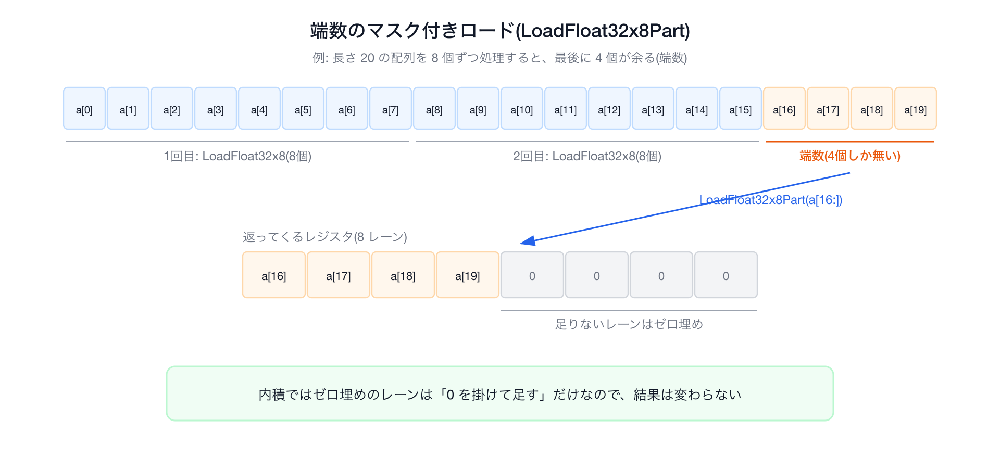
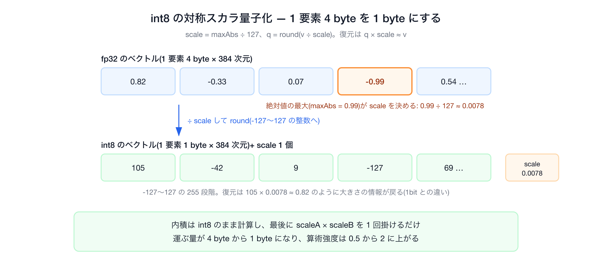
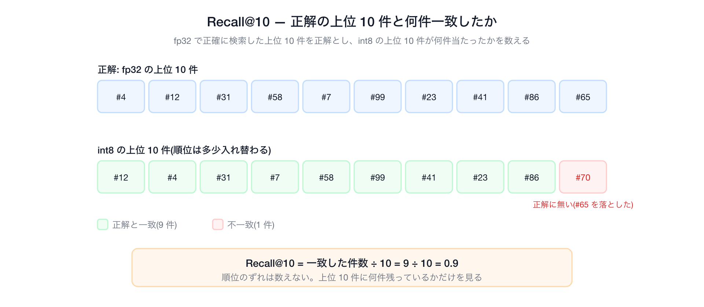
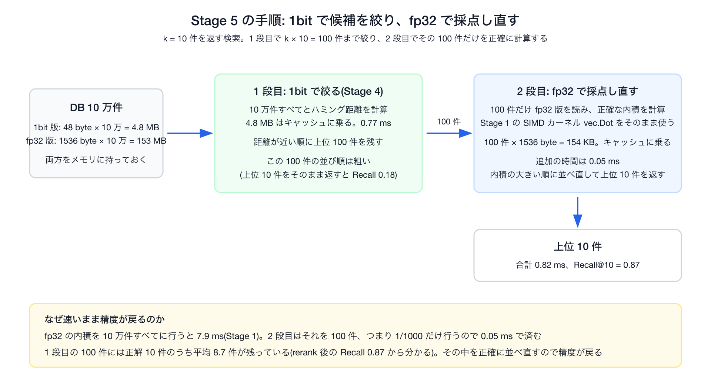

# Go × SIMDで高速化するベクトル検索 — ルーフラインモデルでSIMDが効く境界を探れ！

## はじめに

Go 1.27 の SIMD パッケージ([`simd/archsimd`](https://pkg.go.dev/simd/archsimd))を使い、ベクトル検索を高速化するワークショップ教材です。題材は内積によるベクトル検索です。ただ速くするのではなく、ルーフラインモデルで「いま何が性能の上限になっているか」を測ってから対処を選んでいきます。

学べることは次の 4 つです。

- Go の SIMD パッケージの書き方
- ルーフラインモデルの使い方
- SIMD がどこで効くか
- 高速化の各種方法

手元で動かしながら読む場合は、先に [setup.md](setup.md) の手順で GitHub Codespaces を起動してください。GitHub アカウントとブラウザだけで済みます。

## 01. ベクトル検索ってなに？

今回のワークショップでは SIMD の題材にベクトル検索を選びました。RAG やセマンティック検索を支える中核技術でもあります。

文書もクエリも「埋め込みモデル」で数百次元のベクトルに変換しておき、クエリのベクトルと内積が大きい文書を意味が近い文書とみなして、上位 k 件を返します。

埋め込みモデルは、意味が近い文章ほどベクトルの向きが揃うように学習されています。向きが揃った 2 本のベクトルは内積が大きく、向きがバラバラだと小さくなります。そのため「内積が大きい」を「意味が近い」の代わりに使えます。


図: 文章を埋め込みモデルでベクトルにすると、A と B のように意味が近い文章は向きが揃い内積が大きくなる。C のように意味が遠い文章は向きが違い内積が小さくなる。

ベクトル検索の全体の流れを図にすると次のようになります。


内積は掛け算と足し算の塊なので、SIMD が得意とする部分です。世のベクトル検索エンジン([Faiss](https://github.com/facebookresearch/faiss)、[Qdrant](https://qdrant.tech/documentation/guides/quantization/) など)も、内積などの距離計算を SIMD で実装しています。

### 今回の実験の前提

今回の実験では、ルーフラインで「何で詰まっているか」をはっきり見せるため、次の前提をおいています。


| 項目   | 今回の設定                                                                                                              | 本番でよくある形             |
| ---- | ------------------------------------------------------------------------------------------------------------------ | -------------------- |
| 探索   | 全探索(10万件すべてと内積)                                                                                                    | HNSW・IVF など候補を絞る近似検索 |
| クエリ  | 1本ずつ(まとめて処理するバッチ化は付録で実測)                                                                                           | 同時に多数のクエリが来る         |
| スレッド | 1コア(1クエリのレイテンシを測る。並列は付録で実測)                                                                                        | マルチコアで並列処理           |
| データ  | メモリ上の配列                                                                                                            | ディスク・ネットワーク越し        |
| 次元   | 384次元 float32([all-MiniLM-L6-v2](https://huggingface.co/sentence-transformers/all-MiniLM-L6-v2) など小型の埋め込みモデルの出力次元) | 同程度だが量子化も多い          |


## 02. そもそも SIMD ってなに？

SIMD を理解するために、まずは SIMD を使わない内積から始めます。

```go
var sum float32
for i := range a {
    sum += a[i] * b[i]   // 1個ずつ かけて 足す
}
```

このループは値を 1 個ずつ処理します。`a[i]` と `b[i]` を 1 個取り出し、1 回かけ算して、足しています。つまり 1 命令で float32 を 1 個しか扱いません。これを**スカラ処理**と呼びます。

一方で、**SIMD**(Single Instruction, Multiple Data)は、「1 つの命令で複数のデータをまとめて」処理する CPU の機能です。CPU の中には普通の変数より大きなレジスタという入れ物があり、256bit のレジスタには float32(32bit)が 8 個入ります。8 個入れて掛け算命令を 1 回実行すると、8 個分の掛け算が同時に走ります。この違いを図にすると次のとおりです。


384 次元の内積なら、スカラで 384 回かかる掛け算が SIMD なら 48 回で済みます。理論上は 8 倍速くなります。

### Go の SIMD

Go 1.27 では `GOEXPERIMENT=simd` を付けてビルドすると `simd/archsimd` パッケージが使えます。Go 1.26 で導入され、1.27 で API の改訂と、arm64(Apple Silicon などの Arm CPU)と WebAssembly への対応が入っています([Go 1.27 リリースノート](https://go.dev/doc/go1.27#archsimd))。1.27 でもまだ「実験的」の扱いで、このフラグを付けないとパッケージ自体が存在せず、Go 1 の互換性保証の対象外です。

アセンブリも cgo も書かずにベクトル命令を直接扱え、メソッド呼び出しがほぼそのまま 1 つの CPU 命令にコンパイルされます。

```go
va := archsimd.LoadFloat32x8(a)        // float32 を8個ロード
vb := archsimd.LoadFloat32x8(b)
acc = va.MulAdd(vb, acc)               // acc += va*vb を 8 レーン同時に(FMA 命令)
```

`MulAdd` は FMA(Fused Multiply-Add)という CPU 命令を使います。「a × b を計算して c に足す」を 1 命令で行う命令です。内積の `sum += a[i] * b[i]` はちょうどこの形なので、SIMD の FMA 1 命令で 8 要素ぶんの処理ができます。

`archsimd` はアーキテクチャごとに型も命令も違う API で、Go 1.27 時点で対応するアーキテクチャは次の 3 つです。


| 呼び名         | どの CPU か                                        | SIMD 命令セットの例(レジスタ幅)          |
| ----------- | ----------------------------------------------- | ---------------------------- |
| amd64       | Intel と AMD の 64bit CPU                         | AVX2(256bit)、AVX-512(512bit) |
| arm64       | Arm 系の 64bit CPU(Apple Silicon、AWS Graviton など) | Neon(128bit)                 |
| WebAssembly | ブラウザなどで動く実行形式                                   | 128bit の SIMD                |


3 列目は本編に出てくるものだけ挙げています。SIMD 命令セットはほかにもあり、x86 には AVX より古い SSE 系(128bit)、Arm にはレジスタ幅が実装依存の SVE などがあります。

本編は amd64(Codespaces)で進め、使うのは AVX2 と FMA だけです。Apple Silicon の Mac で動かす場合は [setup.md](setup.md) の「Apple Silicon で動かす場合」を見てください。WebAssembly は扱いません。

### archsimd の API

`archsimd` はベクトルレジスタを表す「型」を宣言し、その型の「メソッド」を呼ぶだけです。覚えることは次の 3 つです。

#### ① 型が「データの形」を表す

型名そのものが「何ビット幅のレジスタに、どの型の値を何個詰めるか」を意味します。詰めた 1 個ぶんの区画を**レーン**と呼びます。256bit のレジスタに float32(32bit)を詰めると 8 レーンになり、1 つの命令はこの 8 レーン全部に同じ演算を同時にかけます。型を選ぶことが、使う命令幅とレーン数を選ぶことになります。

```go
var a archsimd.Float32x8    // float32 を8レーン  = 256bit(AVX2)
var b archsimd.Float32x16   // float32 を16レーン = 512bit(AVX-512)
var c archsimd.Uint64x4     // uint64 を4レーン
```

#### ② メソッドが「1 つの CPU 命令」に対応する

各メソッドはベクトル命令にほぼ 1 対 1 で変換されるので、メソッド名から出てくる機械語の見当がつきます。

```go
va := archsimd.LoadFloat32x8(xs)       // スライス → レジスタ(ロード)
va = va.MulAdd(vb, acc)                // 積和      → VFMADD
xo := vc.Xor(vd)                       // XOR       → VPXOR(vc・vd は Uint64x4。Xor は整数ベクトル専用)
po := xo.OnesCount()                   // popcount(立っている bit を数える)→ VPOPCNTQ
va.Store(xs)                           // レジスタ → スライス(ストア)
```

#### ③ 使う前に、その CPU が対応しているか確かめる

未対応の CPU でメソッドを呼ぶと、不正な命令(SIGILL)でプロセスごと落ちます。recover できる panic にもならないので、実行時に機能フラグでガードします。x86 系の機能フラグは `archsimd.X86` にまとまっています。

```go
var hasSIMD    = archsimd.X86.AVX2() && archsimd.X86.FMA()                 // MulAdd の FMA を確認(AVX2 は安全側)
var hasVPOPCNT = archsimd.X86.AVX512() && archsimd.X86.AVX512VPOPCNTDQ()   // OnesCount は AVX-512 VPOPCNTDQ
```

1 行目で AVX2 と FMA の 2 つを確認しているのは、x86 では `MulAdd` が使う FMA 命令が AVX2 に含まれておらず、別の拡張として提供されているためです。MulAdd 自体に必要なのは FMA だけですが、FMA を持つ実在の CPU はほぼ AVX2 も持っているので、ここでは安全側に AVX2 も合わせて確認しています。arm64 では FMA 相当の命令が Neon 自体に含まれるため、この区別はありません。

### ポータブルな simd パッケージ

`archsimd` とは別に、アーキテクチャに依存しない書き方ができる [`simd`](https://pkg.go.dev/simd) パッケージが 1.27 で入りました。型名からレーン数が消え(`Float32x8` ではなく `Float32s`)、幅は実行時に CPU が決めます(AVX-512 機なら 16 レーン、AVX2 機なら 8、Apple Silicon の Neon なら 4)。命令の無い環境では SIMD を使わない Go でエミュレートされます。さきほどの内積はこう書けます。

```go
var acc simd.Float32s                  // レーン数を型に書かない
n := acc.Len()                         // このマシンのレーン数(4 / 8 / 16)
for len(a) >= n {
    acc = simd.LoadFloat32s(a).MulAdd(simd.LoadFloat32s(b), acc)
    a, b = a[n:], b[n:]
}
```

コード: [`internal/vec/dot_portable.go#L24-L59`](../../internal/vec/dot_portable.go#L24-L59)

一方で、本ワークショップでは `archsimd` で進めます。simd パッケージにはどのアーキテクチャでも共通に持てる演算しかサポートされておらず、この後に使う int8 用の命令や popcount が入っていないためです。

これで SIMD の書き方は分かりました。しかし、SIMD を使えばすぐに速くなるわけではありません。SIMD 効くかどうかは何が性能を抑えているかで決まります。次章でそれを見極める道具である**ルーフラインモデル**を導入します。

## 03. ルーフラインモデルってなに？

ルーフラインモデルは、そのコードが達成できる性能の上限を求める性能モデルです(元論文は [Williams, Waterman, Patterson, 2009](https://dl.acm.org/doi/10.1145/1498765.1498785))。まず、ルーフラインモデルでは次の数値を使います。

- コードの算術強度(メモリから 1 バイト運ぶごとに何回計算するか)
- マシンの演算ピーク(1 秒に何回計算できるか)
- マシンのメモリ帯域(1 秒に何バイト運べるか)

そして性能の上限は次で決まります。

```text
性能の上限 = 「演算ピーク」と「算術強度 × メモリ帯域」の小さい方
```

縦軸に性能(GFLOP/s。1 秒あたりの浮動小数点演算回数)、横軸に算術強度(計算量 ÷ データ転送量)を取り、そのマシンの性能上限を線で描いたものがルーフラインモデルです。この線が屋根(roofline)の形をしているのが名前の由来です。左側にメモリ帯域で決まる右上がりの斜線(メモリ律速)、右側に演算ピークで決まる水平線(演算律速)の領域があります。


どちらで遅くなっているかが分からないまま高速化の手法を入れても、無駄に終わることがあります。まずどちらで詰まっているかを見極めるのがルーフラインモデルの役目です。

CPU がデータを置いておく場所は 3 種類あり、読み出しの速さと容量が桁で違います。


| 場所                    | 容量          | 読み出しの速さ                      |
| --------------------- | ----------- | ---------------------------- |
| レジスタ                  | 数百バイト       | 最も速い(計算器の隣)                  |
| キャッシュ(L1/L2/L3 の 3 段) | 数十 KB〜数十 MB | 速い                           |
| DRAM(メインメモリ)          | 数 GB〜       | 遅い。1 秒に運べる量(帯域)がキャッシュより桁で小さい |


CPU はまずレジスタとキャッシュにあるデータを使い、そこに無いデータだけを DRAM から取ってきます。「メモリ律速」とは、データがキャッシュに収まらず DRAM からしか届かないため、計算器がデータ待ちで止まってしまう状態のことです。


図: 本ワークショップのデータ(10 万件 = 153.6MB)はキャッシュに入りきらず、クエリのたびに DRAM から帯域の上限の速さで運ぶことになる。


**算術強度**(ベンチの出力では AI と表示されます)は、メモリから 1 バイト運ぶごとに何回計算するかで、単位は flop/byte です。今回の全探索では次のように数えます。

- 計算: 内積は要素ごとに掛け算 1 回と足し算 1 回で、2 flop
- 運ぶ量: DRAM から運ぶのは DB にあるベクトルで、要素ごとに float32 の 4 byte。クエリは 1 本 1.5 KB しかないので、最初に読んだあとは 10 万件の DB ベクトルと比較し終わるまでキャッシュに載ったままになり、運ぶ量には数えない

よって今回は算術強度は次になります。

```text
算術強度 = 2 flop / 4 byte = 0.5 flop/byte
```

次はルーフラインモデルの性能上限を得るために、このマシンの演算ピークとメモリ帯域を測ります。

## 04. 性能の上限を測る

性能の上限はマシンごとに違います。理屈で決め打ちせず、実際に測るのがこの章です。

測るのは `make roofline-ceiling` です。検索のコードは走らせず、マシンの上限だけを測る小さなベンチを 3 つ実行します。

1. 演算ピーク(`PeakFLOP_AVX2`)。メモリに一切触らず、レジスタ上で FMA(積和)命令だけを回し続けて、1 秒に何回計算できるかを測る
2. メモリ帯域の上限(`PeakReadBW`)。キャッシュに収まらない 256MB の配列を先頭から末尾まで読み、1 秒に何 GB 運べるかを測る
3. 読み書き混在の帯域(`PeakTriadBW`)。2 つの配列を読んで計算し、結果を 3 つ目の配列に書き戻す標準ベンチ([STREAM](https://www.cs.virginia.edu/stream/) Triad)。メモリ帯域の一般的な指標として載せている

1 と 2 がルーフラインの式に入れる 2 つの数字です。今回の検索は DB ベクトルを読むだけで、大きな配列への書き込みはしません。そのためメモリ帯域には 2 の読むだけの値を使い、3 は他の資料の数字と見比べるための参考値です。

実行すると次の結果を得ます。

```bash
make roofline-ceiling
# 中身: go test ./internal/vec -run - \
#         -bench 'BenchmarkPeak(FLOP_AVX2|FLOP_NEON|ReadBW|TriadBW)$' -benchtime 2s
#         (FLOP_NEON は arm64 用。amd64 では走らない)

# ↓ 4コア Codespace(setup.md の指定サイズ・AMD EPYC 7763(Zen3 世代)・1コア)での実際の出力:
BenchmarkPeakFLOP_AVX2     25.59 GFLOP/s     ← 演算ピーク(FMA を飽和させた値)
BenchmarkPeakReadBW        20.80 read-GB/s   ← 順次 read(SIMD で DRAM 読みを飽和)
BenchmarkPeakTriadBW       17.36 triad-GB/s  ← STREAM Triad(read+write の標準指標)
```

3 つの数字が出ました。これがこのマシンの性能の上限です(演算ピーク 約 25.6 GFLOP/s、メモリ帯域 約 20 GB/s)。3 つのベンチが具体的にどんなコードで数字を出しているかは[付録の「2. 演算ピークとメモリ帯域の測り方」](../appendix/appendix.md#2-演算ピークとメモリ帯域の測り方)にまとめてあります。測り方が気になったら、ワークショップ本編のあとに読んでみてください。


> **コラム(上級者向け): 演算ピークがマシンの理論値の 1/4 なのはなぜか**
>
> 演算ピーク 25.6 GFLOP/s は、この CPU の理論値(約 110 GFLOP/s)の 1/4 に留まります。ハードの限界ではなく、Go のコンパイラがアキュムレータ(途中結果をためる変数)の値をレジスタに置いたままにできず、FMA のたびにメモリ上の作業領域(スタック)と往復させてしまうためです。これを **register spill** と呼びます。機械語を見ながらの説明は[付録の「隠れた上限②: なぜ FMA は理論ピークの 1/3〜1/4 で止まるか(register spill)」](../appendix/appendix.md#隠れた上限②-なぜ-fma-は理論ピークの-1314-で止まるかregister-spill)にあります。本編の検索はメモリ律速なので、この低さが結論を変えることはありません。

### マシンの上限から、全探索の上限を見積もる

さきほど測った数字を使って、「全探索はせいぜいどれくらい速くなれるか」を見積もります。


| 種類          | このマシンの上限         | 意味                         |
| ----------- | ---------------- | -------------------------- |
| メモリ帯域(read) | **~20 GB/s**     | DRAM からデータを読む速さの上限(1 コア)   |
| 演算ピーク       | **25.6 GFLOP/s** | 計算だけを回し続けたときの上限(今回の Go 実測) |


#### 内積はどちらに引っかかるか

内積の算術強度は、§03 で計算したとおり 0.5 でした。これは「1 バイト読むごとに、計算は 0.5 回しかない」という意味で、かなり少ない部類です。

メモリ律速と演算律速が切り替わる境目を**リッジ**と呼びます。おおよそ次で求まります。

```text
リッジ = 演算ピーク ÷ メモリ帯域 = 25.6 ÷ 20.8 ≈ 1.2 flop/byte
```

- 算術強度が 1.2 より小さいなら、計算が足りないのではなく、データの読み込み待ち(メモリ律速)
- 算術強度が 1.2 より大きいなら、計算の処理能力が上限(演算律速)

内積の算術強度 0.5 は 1.2 よりずっと小さいので、メモリ律速です。

#### メモリ律速のときの上限

メモリ律速内では、上限は次の式で求まります。

```text
上限 ≈ 算術強度 × メモリ帯域 = 0.5 × 20 ≈ 10 GFLOP/s
```

算術強度 0.5 の内積計算では **10 GFLOP/s 前後**が上限という見込みが立ちます。

## 05. 高速化

さきほど測った上限と比べながら、改良を加えていきます。下の図は、その過程をルーフラインに重ねたものです。横軸が算術強度、縦軸が性能で、斜線がメモリ帯域の上限、水平線が演算ピークです。点がどちらの上限に近いか(メモリ律速か演算律速か)を、Stage ごとに確認します。


図: スカラ、SIMD(メモリ帯域の上限)、int8(リッジの右)、1bit 量子化(右上へ)。各点の詳細は下の各節で。

ここからは実際にコードを動かして出る数字を見るパートです。 `internal/vec` / `internal/index` の実コードを使っていきます。 GFLOP/s や 算術強度などは、これらのベンチが自動で計算して表示します(特別なプロファイラは不要です。算出の詳細は [`internal/index/bench_test.go`](../../internal/index/bench_test.go) にあります)。

### Stage 0: スカラ基準(ベースライン)

最適化はまず基準値からです。素朴に「1 要素ずつ」内積を回し、達成性能と算術強度を測ります。検索は全ベクトルと内積して上位 k 件を返すだけです。

```go
// internal/vec/dot.go
func DotNaive(a, b []float32) float32 {
    var sum float32
    for i := range a {
        sum += a[i] * b[i]        // 1個ずつ かけて 足す(前の sum に依存=直列)
    }
    return sum
}

// internal/index/index.go — 全探索
func (ix *Index) SearchNaive(q []float32, k int) []Result {
    t := newTopK(k)
    for id := 0; id < ix.N; id++ {              // 10万ベクトル全部と内積
        t.push(id, vec.DotNaive(q, ix.Vec(id)))
    }
    return t.results()
}
```

コード: [`internal/vec/dot.go#L7-L13`](../../internal/vec/dot.go#L7-L13)、[`internal/index/index.go#L62-L68`](../../internal/index/index.go#L62-L68)

```bash
$ make bench0
BenchmarkSearchNaive   35.7 ms/op   2.15 GFLOP/s   0.5 AI(flop/byte)   153.6 MB/query
```

AI(算術強度)と GFLOP/s は §03 で導入した指標で、ベンチが自動で計算して表示します。実行ごとに ±5% ほどばらつきますが、それで正常です。


図: Stage 0 の位置。算術強度 0.5、2.15 GFLOP/s。メモリ帯域の上限(約 10)にすら届かない左下。

#### どうなったか

全探索 35.7 ms、**2.15 GFLOP/s**、算術強度 0.5。メモリ帯域の上限(約 10 GF)にすら届いていません。メモリ帯域より先に、 `sum += a[i] * b[i]` の足し算で詰まっています。このループの足し算は、前の `sum` が出来上がらないと次の足し算を始められません。

#### 次の一手

上の表でいうと、点はどちらの上限からも遠い位置です。改善策の1つが同時に複数の値を計算する SIMD です。次の Stage 1 で SIMD 化します。

### Stage 1: AVX2 で SIMD 化

ここから SIMD 化します。

#### Stage 1a: まとめて読む(Float32x8)

まず、1 個ずつの内積を 8 個まとめて処理するように置き換えます。`Float32x8` でスライスから 8 要素をベクトルレジスタにロードし、`MulAdd`(FMA)でアキュムレータに足し込みます。

```go
// アキュムレータ 1 本で 8 個ずつ処理する
var acc archsimd.Float32x8                 // アキュムレータ1本
for len(a) >= 8 {
    va := archsimd.LoadFloat32x8(a)        // float32 を8個ロード
    vb := archsimd.LoadFloat32x8(b)
    acc = va.MulAdd(vb, acc)               // acc += va*vb を8レーン同時に
    a = a[8:]; b = b[8:]
}
```

これで「1 命令で 8 個」は動きます。しかし、まだ理論ほど速くなりません。理由が次の 1b です。

#### Stage 1b: アキュムレータを 2 本にして待ち時間を隠す

1a のループは、Stage 0 と同じ問題を抱えています。`acc = va.MulAdd(vb, acc)` は前のループの `acc` を読んで新しい `acc` を書くので、前の FMA の結果が出るまで次の FMA を始められません。そこでアキュムレータを `acc0` と `acc1` の 2 本にし、偶数番目の 8 要素は `acc0` に、奇数番目の 8 要素は `acc1` に足し込みます。2 本は互いの結果を待たないので、`acc0` の FMA が終わるのを待つ間に `acc1` の FMA を始められます。ループが終わったら `acc0` と `acc1` を足して 1 本にし、その 8 レーンを足し合わせて 1 つの値にします。


```go
// internal/vec/dot_simd.go  (GOEXPERIMENT=simd, amd64)
import "simd/archsimd"

func Dot(a, b []float32) float32 {
    if !hasSIMD {
        return DotNaive(a, b)              // AVX2+FMA の無い amd64 はスカラに退避(arm64 は dot_arm64.go の Neon 版)
    }
    var acc0, acc1 archsimd.Float32x8      // ★ 1b: アキュムレータ2本で待ち時間を隠す
    for len(a) >= 16 {
        acc0 = archsimd.LoadFloat32x8(a).MulAdd(archsimd.LoadFloat32x8(b), acc0)
        acc1 = archsimd.LoadFloat32x8(a[8:]).MulAdd(archsimd.LoadFloat32x8(b[8:]), acc1)
        a = a[16:]; b = b[16:]             // 前進(境界計算をループ条件に吸収)
    }
    var buf [8]float32
    acc0.Add(acc1).Store(buf[:])
    archsimd.ClearAVXUpperBits()           // ★ VZEROUPPER。Intel機の遷移ペナルティ対策(AMDでは不要・無害)。Goは自動挿入しない
    sum := buf[0]+buf[1]+buf[2]+buf[3]+buf[4]+buf[5]+buf[6]+buf[7]
    for i := range a {                     // レーンを埋めなかった残り
        sum += a[i] * b[i]
    }
    return sum
}
```

`archsimd.ClearAVXUpperBits()` は、Intel の CPU 向けの後始末です。少し上級向けなので、このワークショップでは解説しませんが、詳しくは[付録](../appendix/appendix.md#1-go-の-simd-の性能上限に関する調査)で説明しています。

上のコードは主要部分だけです。完全なコードは [`internal/vec/dot_simd.go#L22-L52`](../../internal/vec/dot_simd.go#L22-L52) にあります。

```bash
$ make bench1    # 内積単体(internal/vec)と全探索(internal/index)の2粒度(表示は整形・抜粋)
BenchmarkDotNaive     348  ns/op                        ← 内積単体: スカラ基準
BenchmarkDotSIMD       55.2 ns/op                       ← 内積単体 6.3x
BenchmarkSearchSIMD     7.9 ms/op   19.4 GB/s           ← 全探索 4.5x。メモリ帯域の上限(~20)に到達
```


図: Stage 1 の位置。全探索はメモリ帯域の上限(約 20 GB/s)に達した(9.7 GFLOP/s)。

#### どうなったか

全探索は **9.7 GFLOP/s** で、これは §04 で見積もったメモリ帯域の上限  10 GFLOP/s の直下で、帯域に直すと 19.4 GB/s で、メモリ帯域の上限 20.8 GB/s の約 93% です。算術強度 0.5 のまま、メモリ帯域のほぼ上限に達しました。

#### 次の一手

Stage 1 の改善ではメモリ帯域の上限に達しました。ここから先は、内積の実装をいくら速くしても全探索は速くなりません。SIMD の幅を 8 レーンから 16 レーン(AVX-512)に広げても、DRAM から運ぶバイト数は同じなので、かかる時間も同じです。

点を上に動かせないなら、右に動かします。つまり算術強度(運ぶ 1 バイトあたりの計算回数)を上げます。やり方は 2 つあります。

1. ベクトルを小さい型で持ち、運ぶ量そのものを減らす。
2. 運んだ ベクトル 1 本を、複数のクエリで使い回す。

2 つ目の方法の 1 つがクエリのバッチ化です。ただしバッチ化は、クエリが 32 本まとめて手元にあるときに使える方法です。クエリが 1 本ずつ来る本編の設定では使えないので、実測は[付録の「3. クエリのバッチ化」](../appendix/appendix.md#3-クエリのバッチ化再利用で算術強度を上げる)に置き、本編はもう 1 つの方法、運ぶ量そのものを減らす方向で進みます。

> **コラム: 端数はマスク付きロードでも書ける**
>
> 8 個ずつ処理するループは、配列の長さが 8 で割り切れないと最後に 8 個未満の要素が余ります。この余りを端数と呼びます。Stage 1 のコードは端数をスカラループで処理しています(本編は 384 次元で割り切れるため、実は一度も通りません)。Go 1.27 には端数専用の `LoadFloat32x8Part` があり、足りないレーンをゼロで埋めた 8 レーンのレジスタと読めた要素数を返してくれる(マスク付きロード)ので、端数もベクトルのまま処理できます(1.26 では `LoadFloat32x8SlicePart` という名前でした)。
>
> 

### Stage 2: int8 量子化

ベクトルの各要素を fp32(4 byte)から int8(1 byte)に変換します。このように、値を少ないビット数で表し直すことを量子化と呼びます。運ぶ量が 1/4 になるので、算術強度は 0.5 から 2 flop/byte になり、リッジを越えて演算律速に移ります。整数の計算なので flop とは呼びませんが、回数の数え方は同じなので、図では Gop/s と表記します。なお図の水平線(演算側の天井)は §04 で fp32 の FMA を飽和させて実測した値をそのまま使っています。int8 の演算は使う命令が違うので天井も厳密には別の高さですが、ここでは目安として fp32 の実測を流用しています。

量子化の手法はいくつかありますが、今回は最も単純なスカラ量子化を採用します(ゼロ点を持たない対称型)。ベクトルごとに絶対値の最大値 (maxAbs)を測り、scale = maxAbs ÷ 127 とscaleを計算し、各要素を round(v ÷ scale) で整数(-127〜127)に丸めます。復元も簡単で q × scale で計算できます。他の量子化手法は[付録の「いろんなベクトル量子化」](../appendix/appendix.md#5-いろんなベクトル量子化)で整理しています。



```go
// internal/vec/int8.go — 対称量子化: q = round(v/scale)、scale = maxAbs/127
func QuantizeInt8(v []float32, out []int8) (scale float32)

// internal/vec/int8_simd.go — int8 版の内積。AVX2 だけで完結(FMA 不要)
acc0 = acc0.Add(archsimd.LoadInt8x16(a).ExtendToInt16().       // VPMOVSXBW
    DotProductPairs(archsimd.LoadInt8x16(b).ExtendToInt16()))  // VPMADDWD
```

コード: [`internal/vec/int8.go#L10-L40`](../../internal/vec/int8.go#L10-L40)、[`internal/vec/int8_simd.go#L23-L50`](../../internal/vec/int8_simd.go#L23-L50)、全探索は [`internal/index/int8.go#L25-L36`](../../internal/index/int8.go#L25-L36)

int8 同士の積は最大 127 × 127 で、int32 に余裕で収まります。そのため桁あふれの心配もありません。1 命令で 16 要素を処理でき、fp32 の 8 要素の 2 倍です。Go 1.27 の archsimd の arm64 API には VPMADDWD にあたるメソッドが無いので、[`int8_arm64.go`](../../internal/vec/int8_arm64.go) では SMULL で掛けて int16 に広げ、SXTL で int32 に広げてから足す、という 3 段で同じ計算をします。

```go
// internal/vec/int8_arm64.go — 3 段の中心部分
lo := va.MulWidenLo(vb)                   // SMULL: int8 同士を掛けて int16 に広げる
hi := va.HiToLo().MulWidenLo(vb.HiToLo()) // SMULL2 相当: 上位 8 要素も同様に
acc0 = acc0.Add(lo.ExtendLo4ToInt32())    // SXTL: int16 → int32 に広げてから足す
```

コード: [`internal/vec/int8_arm64.go#L26-L45`](../../internal/vec/int8_arm64.go#L26-L45)

```bash
$ make bench-int8
BenchmarkDotInt8Naive    364  ns/op                     ← 内積単体: スカラ
BenchmarkDotInt8SIMD      34.6 ns/op                    ← 内積単体 10.5x(fp32 SIMD の 55ns より速い)
BenchmarkSearchInt8        4.2 ms/op   18.3 Gop/s   38.4 MB/query   ← 全探索: fp32 SIMD 比 ~2x
$ make recall-int8
Recall@10: int8=0.948                                   ← rerank なしで実用域
```


図: Stage 2 の位置。int8 で 算術強度 0.5 から 2 と右へ動き、リッジを越えた。ただし演算ピークの下(内積の実装の速さで頭打ち)で止まる。

#### どうなったか

内積単体は 364 ns から 34.6 ns(**10.5x**)で、fp32 の SIMD 内積(55 ns)より速くなりました。全探索は 4.2 ms で、fp32 の SIMD 全探索の約 2 倍の速さです。精度は Recall@10 = 0.948 でした。

ここで初めて精度の数字が出てきました。ここまでの高速化は正確な数値を使った全探索だったので、検索結果は正確なままでした。しかし、量子化は値そのものを変えるので、全探索をしても、検索結果が正解とずれる可能性があります。速くなっても間違った文書を返すのでは意味が無いので、速度と並べて「正解とどれだけ一致しているか」を測ります。

その指標が Recall@10 で、次のように測ります。まず fp32 で正確に検索して上位 10 件を出し、これを正解とします。次に int8 で検索して上位 10 件を出し、そのうち正解に含まれていた件数を数えます。10 件中 9 件が一致すれば 0.9 です。0.948 は、平均して 10 件中 9.5 件が正解と一致したことを意味します。正解の取り逃しを測るので Recall と呼びます(正解も取得も同じ 10 件なので、Precision@10 と数値は一致します)。



今回の計測では Recall@10 = 0.948 でした。精度がほとんど落ちないのは、int8 でも 1 要素を -127 から 127 の 255 段階で持てて、内積の大小関係が大きくは変わらないためです。

ただし、運ぶ量を 1/4 にしたのに速度は 4 倍になっていません。達成した帯域は 9.2 GB/s で、メモリ帯域の上限の下です。算術強度 2 でリッジの右に移ったので、時間を決めているのがメモリから内積の計算に変わったためです。

#### 次の一手

バイト削減にはまだ先があります。DB 全体がキャッシュに収まるまで減らすとどうなるか。1 要素 1bit(1/32)まで減らします。

### Stage 3: バイナリ量子化

int8 で 1/4 にしても、10 万件 × 384 byte = 38.4 MB で、L3 キャッシュには収まりません。そこで各要素を符号 1bit(正なら 1、負なら 0)だけにしてみます。


| 表現   | 1 ベクトル    | 10 万件    | キャッシュに |
| ---- | --------- | -------- | ------ |
| fp32 | 1536 byte | 153.6 MB | 乗らない   |
| int8 | 384 byte  | 38.4 MB  | 乗らない   |
| 1bit | 48 byte   | 4.8 MB   | 乗る     |


距離には、内積の代わりにハミング距離を使います。2 つのビット列で値が違うビットの数のことで、XOR で違うビットを 1 にし、1 の数を数える(popcount)だけで求まります。popcount は 1 命令で 64 次元ぶんを数えるので、距離の計算も int8 よりずっと軽くなり、内積計算の上限も越えられます。

```go
// internal/vec/hamming.go
func Quantize(v []float32, out []uint64) {   // float32 → 符号1bit
    for i := range out {
        out[i] = 0                           // 再利用バッファ対策のゼロクリア
    }
    for i, x := range v {
        if x > 0 {
            out[i/64] |= 1 << (i % 64)
        }
    }
}

func Hamming(a, b []uint64) int {            // XOR + popcount = 違うビット数
    var d int
    for i := range a {
        d += bits.OnesCount64(a[i] ^ b[i])   // OnesCount64 はスカラPOPCNT 1発=64次元/命令
    }
    return d
}
```

コード: [`internal/vec/hamming.go#L10-L32`](../../internal/vec/hamming.go#L10-L32)、全探索は [`internal/index/index.go#L92-L100`](../../internal/index/index.go#L92-L100)

```bash
$ make bench2
BenchmarkSearchBinary  0.77 ms/op                       ← 46x。ただし…
$ make recall
Recall@10: binary=0.180 binary+rerank=0.868             ← binary 単体は 0.18。このままでは使えない
```


図: Stage 3 の位置。1bit 量子化で右上へ移動し、DRAM 帯域の制約から外れた。ただし精度を犠牲にした近似(Recall 0.18)。

#### どうなったか

データが 153.6MB から 4.8MB になってキャッシュに乗り、DRAM 帯域の制約から外れました。0.77 ms、**46x** です。速くなった理由は SIMD ではなく、データを 1/32 にしたことです。

ちなみに、SIMD 版の popcount(AVX-512 の VPOPCNT)に変えても速くなりません。データがキャッシュに乗っていて、1 ベクトルも uint64 6 個ぶん(384bit)と短く、popcount の計算で時間を使っていないからです。AVX-512 のあるマシンで測ると、SIMD 版が 0.75 ms、通常版が 0.68 ms でした。実測は[付録](../appendix/appendix.md#6-avx-512-の-simd-popcount)にあります(今回の Codespace の AMD CPU には VPOPCNT が無いので、手元では再現できません)。

ただし、良いことばかりではありません。1bit に減らしたぶん精度が大きく落ち、**Recall@10 = 0.18** です。正解 10 件のうち 2 件弱しか当たりません。

#### 次の一手

int8 では保てた Recall@10 が、1bit では大きく落ちました。速さは保ったまま精度を取り戻します。

### Stage 4: fp32 SIMD で rerank

Stage 3 は速いものの、Recall 0.18 では使えません。このStageでは速さは 1bit のまま、精度を取り戻します。検索を 2 段に分けます。

1. 1bit のハミング距離で 10 万件すべてを比べ、近い順に上位 100 件(返したい 10 件の 10 倍)を残す。Stage 3 と同じ処理で、0.77 ms
2. その 100 件だけ fp32 のベクトルを読み、Stage 1 の SIMD 内積で正確に採点し直して、上位 10 件を返す

2 段目で読む fp32 のデータは 100 件 × 1536 byte = 154 KB で、キャッシュに乗ります。10 万件すべてに fp32 の内積を行うと 7.9 ms かかりますが、100 件なら 1/1000 なので 0.01 ms 程度で済みます。実測でも 1bit 単体の 0.77 ms に対して 0.82 ms と、0.05 ms しか増えていません。見積りとの差は、内積以外の仕事(上位 100 件の選び出しや、飛び飛びの場所からの読み出し)のぶんです。この採点し直しを rerank と呼びます。



```go
// internal/index/index.go
func (ix *Index) SearchBinaryRerank(q []float32, k, factor int) []Result {
    cands := ix.SearchBinary(q, k*factor)        // ① 1bitで粗く k×factor 件に絞る(速い・不正確)
    t := newTopK(k)
    for _, c := range cands {
        t.push(c.ID, vec.Dot(q, ix.Vec(c.ID)))   // ② fp32 SIMD 内積で採点し直す(Stage 1 の vec.Dot)
    }
    return t.results()
}
```

コード: [`internal/index/index.go#L120-L127`](../../internal/index/index.go#L120-L127)

```bash
$ make bench3    # 仕上げの速度(表示は整形・抜粋)
BenchmarkSearchBinaryRerank  0.82 ms/op                 ← ≈43x(ほぼ量子化の速さのまま)
$ make recall    # 精度
Recall@10: binary=0.180 binary+rerank=0.868             ← 0.18 → 0.87(SIMD内積で精度復元)
```


図: 速度の位置は Stage 3 と同じ。勝負は速度軸ではなく精度軸(Recall 0.18 から 0.87)で、ここで SIMD 内積が効く。

#### どうなったか

Recall@10 は 0.18 から **0.87** に戻り、速度は 0.82 ms(約 43x)と、ほぼ 1bit のままです。ここで使っている `vec.Dot` は Stage 1 で書いた SIMD 内積そのものです。

これが実際のベクトル検索エンジンでもよく使われる構成です。量子化で粗く絞り、精度の高い距離で採点し直す。この 2 段階の検索は実践でも使われます。

ここまでの方式を、速度と精度で 1 つの表にまとめます。


| 方式                     | 速度(1クエリ) | Recall@10    | 使いどころ                |
| ---------------------- | -------- | ------------ | -------------------- |
| fp32 SIMD 全探索(Stage 1) | 7.9 ms   | 1.000(exact) | 精度が絶対のとき             |
| int8(Stage 2)          | 4.2 ms   | 0.948        | バランス型・rerank 不要      |
| 1bit(Stage 3)          | 0.77 ms  | 0.180        | 単体では使えない             |
| 1bit + rerank(Stage 4) | 0.82 ms  | 0.868        | 速さ最優先。精度は rerank で復元 |


※ 速度は 10 万件のベンチ、Recall@10 は 2 万件の合成データ([`internal/index/index_test.go`](../../internal/index/index_test.go))で測った値です。

1bit + rerank は int8 より 5 倍速く、精度は少し下です。絞り込みの段は粗くて速いほど有利で、落ちた精度は rerank が取り戻すからです。int8 を絞り込みに使う設計もあり、実際にはこの表から要件に合うものを選びます。

### さらに追求するなら

- 今回の実験では全探索でしたが、そもそも触る件数を減らすのが、全探索の O(N) を下回る唯一の方法です。実運用では [HNSW](https://arxiv.org/abs/1603.09320) や [IVF](https://github.com/facebookresearch/faiss/wiki/Faiss-indexes) などのアルゴリズムが採用されることが多いです。
- 量子化にも色々な手法があります。PQ、ScaNN、RaBitQ、TurboQuant といった手法を[付録の「いろんなベクトル量子化」](../appendix/appendix.md#5-いろんなベクトル量子化)で簡単に紹介しています。

## 06. まとめ

本ワークショップは、性能の上限に当たり、対処して越え、次の上限に当たる、を繰り返してきました。その変遷と、各段で SIMD が効いたかどうかを表にまとめます。


| 遷移        | 当たっていた上限        | 対処                    | SIMD は効いたか              | 結果                       |
| --------- | --------------- | --------------------- | ----------------------- | ------------------------ |
| Stage 0→1 | 依存連鎖(加算レイテンシ)   | SIMD 化 + アキュムレータ2本    | 効いた(速さの主因)              | 35.7→7.9 ms(4.5x)        |
| バッチ化(付録)  | メモリ帯域(DRAM)     | バッチで 算術強度 0.5→16(再利用) | 効いた(演算側でスカラの 5.9x)      | 5.8 ms/query・exact       |
| 並列(付録)    | 帯域 / 物理コア       | goroutine 並列          | 対象外(SIMD とは別の軸)         | 1.8x / 1.9x で頭打ち         |
| Stage 1→2 | メモリ帯域(DRAM)     | バイト削減 1/4(int8)       | 効いた(int8 内積 10.5x)      | 4.2 ms・Recall 0.948      |
| Stage 2→3 | (int8 では)内積の計算  | バイト削減を極限 1/32(1bit)   | 効かない(popcount はスカラで足りる) | 0.77 ms(46x)…Recall 0.18 |
| Stage 3→4 | 精度(Recall 0.18) | fp32 rerank           | 効いた(SIMD 内積で精度を回復)      | 0.82 ms・Recall 0.87      |


上限を越える対処は 2 種類に分かれます。実装効率を上げる(SIMD、アキュムレータ)ことと、算術強度を上げる(バッチ化、量子化)ことです。Stage 1 でメモリ帯域の上限に達した時点で後者に切り替え、算術強度を上げた先でまた SIMD が効きました。速度と精度も別の軸で、1bit 量子化で落ちた精度は fp32 の SIMD による rerank で取り戻しました。

「SIMDを使ってるのに早くならない！」と諦めるのではなく、計測によってSIMDが効くポイントを理解した上で、SIMDと仲良くしていきましょう。

## 07. 参考文献

- Williams, Waterman, Patterson, *"Roofline: An Insightful Visual Performance Model for Multicore Architectures"*, CACM 52(4), 2009. [論文 (ACM)](https://dl.acm.org/doi/10.1145/1498765.1498785)
- STREAM(メモリ帯域ベンチの定番), J. McCalpin. [cs.virginia.edu/stream](https://www.cs.virginia.edu/stream/)
- Empirical Roofline Toolkit / NERSC ルーフライン解説. [docs.nersc.gov](https://docs.nersc.gov/tools/performance/roofline/)
- Intel Advisor(自動ルーフライン作図). [intel.com](https://www.intel.com/content/www/us/en/developer/articles/technical/intel-advisor-roofline.html)
- Go × 内積 × SIMD の先行事例(archsimd 以前・アセンブリ実装): Sourcegraph, *"From slow to SIMD: A Go optimization story"*. [sourcegraph.com/blog/slow-to-simd](https://sourcegraph.com/blog/slow-to-simd)
- Go の SIMD パッケージ: [Go 1.27 リリースノート(simd)](https://go.dev/doc/go1.27#simd)、[pkg.go.dev/simd](https://pkg.go.dev/simd)(ポータブル API)、[pkg.go.dev/simd/archsimd](https://pkg.go.dev/simd/archsimd)(アーキ固有 API。CPU 機能の表もここ)
- CPU の命令ごとの待ち時間(レイテンシ)と発行数の表: Agner Fog, [Instruction tables](https://www.agner.org/optimize/instruction_tables.pdf)、[uops.info](https://uops.info/)
- AVX と SSE を混ぜたときのペナルティ(付録 1 節): Agner Fog, [The microarchitecture of Intel, AMD and VIA CPUs](https://www.agner.org/optimize/microarchitecture.pdf)
- 近似最近傍探索の索引: HNSW は Malkov, Yashunin, [arXiv:1603.09320](https://arxiv.org/abs/1603.09320)。IVF などの索引の種類は [Faiss wiki](https://github.com/facebookresearch/faiss/wiki/Faiss-indexes)

